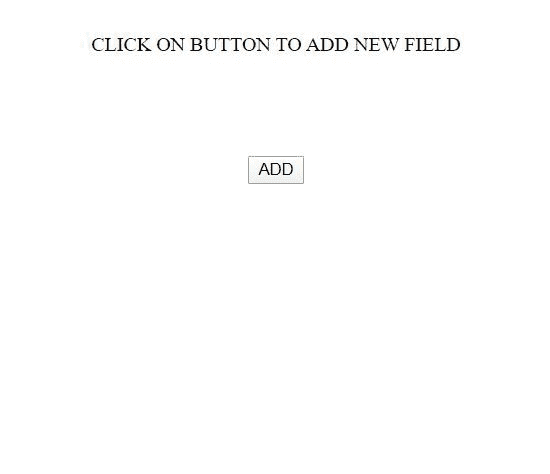
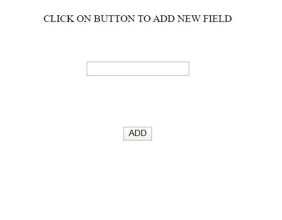

# 如何在 AngularJS 中的按钮点击上动态添加输入字段？

> 原文:[https://www . geesforgeks . org/how-add-input-field-dynamic-on-button-click-in-angularjs/](https://www.geeksforgeeks.org/how-to-add-input-fields-dynamically-on-button-click-in-angularjs/)

任务是当用户使用 AngularJs 点击按钮时，在页面上添加一个输入字段。

**步骤:**

*   创建操作所需的组件**(添加-输入组件)**。
*   在该组件中，编写了 html 文件**(add-input.component.html)**所需的 html。
*   在那个 HTML 中，输入字段的主 **div** 在那里，并且**按钮**被创建。
*   在**添加-输入.组件. ts** 中，在**添加**按钮上有一个(点击)事件重定向到正在工作的用户定义功能。
*   在用户自定义函数中， **createElement()** 方法用于在用户每次点击按钮时创建一个分部， **innerHTML()** 属性用于制作一个输入字段。
*   然后通过 **appendChild()** 方法将创建的元素 div 追加到**add-input.component.html**的主 div 中。

以下是以上步骤的实现:
**app.module.ts**

```ts
// Necessary imports of component is done
import { BrowserModule } from '@angular/platform-browser';
import { NgModule } from '@angular/core';

import { AppRoutingModule } from './app-routing.module';
import { AppComponent } from './app.component';
import { AddInputComponent } from './add-input/add-input.component';

@NgModule({
  declarations: [
    AppComponent,
    AddInputComponent
  ],
  imports: [
    BrowserModule,
    AppRoutingModule,
  ],
  providers: [],
  bootstrap: [AppComponent]
})
export class AppModule { }
```

**add-input.component.html**

```ts
<!-- Main div and ADD button is created -->
<center>
  CLICK ON BUTTON TO ADD NEW FIELD
  <div class="showInputField"></div>

  <!-- The add() function is called -->
  <button (click)="add()">ADD</button>
</center>
```

**add-input.component.ts**

```ts
// The class function add() is made that contains
// the necessary code for the action
import { Component, OnInit } from '@angular/core';

@Component({
  selector: 'app-add-input',
  templateUrl: './add-input.component.html',
  styleUrls: ['./add-input.component.css']
})
export class AddInputComponent implements OnInit {

  constructor() { }

  ngOnInit(): void {
  }
  add(){
    let row = document.createElement('div');  
      row.className = 'row';
      row.innerHTML = `
      <br>
      <input type="text">`;
      document.querySelector('.showInputField').appendChild(row);
  }
}
```

**输出:**

*   **点击按钮前:**
    
*   **点击按钮后:**
    