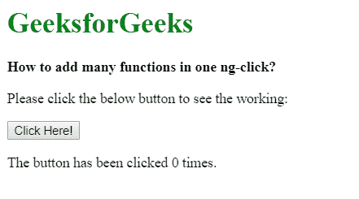
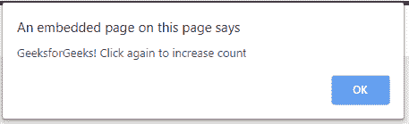
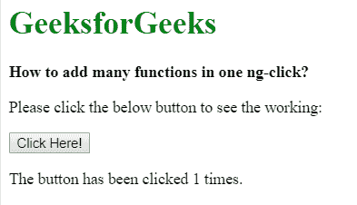

# 如何在一个 ng-click 指令中添加多个功能？

> 原文:[https://www . geeksforgeeks . org/如何一键添加多种功能指令/](https://www.geeksforgeeks.org/how-to-add-many-functions-in-one-ng-click-directive/)

AngluarJS 中的 **ng-click Directiv** e 用于在单击元素时应用自定义行为。它可以用来显示/隐藏某些元素，也可以在点击按钮时弹出警告。 **ng-click 指令**是 AngularJS 中使用的一个非常方便的工具。当点击一个 HTML 时， **ng-click** 指令告诉 AngularJS 脚本该做什么。
在本文中，我们将学习如何在一次点击中让 ng-click 指令通过多个函数。

**语法:**

```ts
<element ng-click="expression1(), expression2(), expression3()"> </element>
```

关键是要加一个分号(；)或逗号(，)。所有的函数必须用一个(；)或 a(，)。HTML 中的所有元素都支持这种语法。它基本上是一个表达式，当被点击时，就会被执行。

**示例:**本示例展示了如何在一次 ng 点击中添加多个功能。

```ts
<!DOCTYPE html>
<html>

<head>
    <title>
        How to add many functions in one ng-click?
    </title>
    <script src=
"https://ajax.googleapis.com/ajax/libs/angularjs/1.6.9/angular.min.js">
    </script>

<body ng-app="myApp">

    <h1 style = "color:green;" > 
        GeeksforGeeks 
    </h1> 

    <strong> 
        How to add many functions in one ng-click? 
    </strong>

    <div ng-controller="myCtrl">

        <p>Please click the below button to see the working:</p>

        <!-- To write multiple functions - write the functions
        and separate them by the semicolon (;) -->
        <button ng-click="myFunc(); popper();">
            Click Here!
        </button>

        <p>The button has been clicked {{count}} times.</p>
    </div>

    <script>
        angular.module('myApp', [])

        .controller('myCtrl', ['$scope', function($scope) {
            $scope.count = 0;

            // first function
            $scope.myFunc = function() {
                $scope.count++;

                // Second function
                $scope.popper = function() {
                    alert('GeeksforGeeks! Click again to increase count');
                };
            };
      }]);
    </script>
</body>

</html>
```

**输出:**

*   **点击按钮前:**
    
*   **点击按钮后:**
    
    