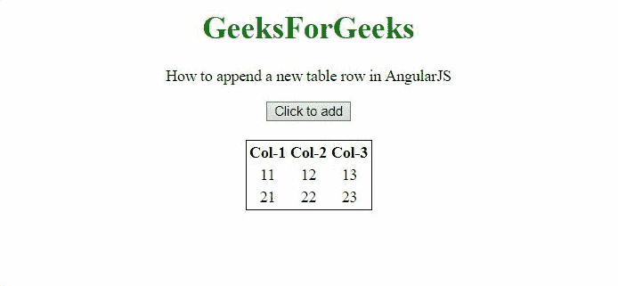

# 如何在 AngularJS 中追加新的表行？

> 原文:[https://www . geesforgeks . org/how-to-append-a-new-table-in-row-angularjs/](https://www.geeksforgeeks.org/how-to-append-a-new-table-row-in-angularjs/)

这里的任务是在 AngularJS 的帮助下在表中插入一个新行。

**方法:**方法是使用 **push()方法**将新行插入数组。该数组将作为内容提供给 **< tr >元素。**使用 **ng-repeat** 将数组的内容提供给表格单元格。

**示例 1:** 在第一个示例中，使用了 a **单列**表，内容以其元素的形式存储在**数组**中。

```
<!DOCTYPE html>
<html>

<head>
    <script src=
"//ajax.googleapis.com/ajax/libs/angularjs/1.2.13/angular.min.js">
    </script>

    <script>
        var myApp = angular.module("app", []);
        myApp.controller("controller",
            function ($scope) {
                $scope.rows = ['row-1', 'row-2'];
                $scope.c = 2;
                $scope.addRow = function () {
                    $scope.c++;
                    $scope.rows.push('row-' + $scope.c);
                };
            });
    </script>
</head>

<body style="text-align:center;">
    <h1 style="color:green;">
        GeeksForGeeks
    </h1>
    <p>
        How to append a new table 
        row in AngularJS
    </p>
    <div ng-app="app">
        <div ng-controller="controller">
            <button ng-click='addRow()'>
                Click to add
            </button><br>
            <br>
            <table style="border: 1px solid black;
                      margin: 0 auto;">
                <tr>
                    <th>Col-1</th>
                </tr>
                <tr ng-repeat="val in rows">
                    <td>{{val}}</td>
                </tr>
            </table><br>
        </div>
    </div>
</body>

</html>       
```

**输出:**


**示例 2:** 在本例中，使用了一个由**三列**组成的表格，该表格以**对象的格式存储表格的内容。**

```
<!DOCTYPE html>
<html>

<head>
    <script src=
"//ajax.googleapis.com/ajax/libs/angularjs/1.2.13/angular.min.js">
    </script>

    <script>
        var myApp = angular.module("app", []);
        myApp.controller("controller",
            function ($scope) {
                $scope.rows = [
                    { 'ff': '11', 'fs': '12', 'ft': '13' },
                    { 'ff': '21', 'fs': '22', 'ft': '23' }
                ];
                $scope.c = 2;
                $scope.addRow = function () {
                    $scope.c++;
                    $scope.rows.push({
                        'ff': $scope.c +
                            '1', 'fs': $scope.c +
                                '2', 'ft': $scope.c + '3'
                    });
                };
            });
    </script>
</head>

<body style="text-align:center;">
    <h1 style="color:green;">
        GeeksForGeeks
    </h1>
    <p>
        How to append a new table 
        row in AngularJS
    </p>
    <div ng-app="app">
        <div ng-controller="controller">
            <button ng-click='addRow()'>
                Click to add
            </button><br>
            <br>
            <table style="border: 1px solid black; 
                      margin: 0 auto;">
                <tr>
                    <th>Col-1</th>
                    <th>Col-2</th>
                    <th>Col-3</th>
                </tr>
                <tr ng-repeat="val in rows">
                    <td>{{val.ff}}</td>
                    <td>{{val.fs}}</td>
                    <td>{{val.ft}}</td>
                </tr>
            </table><br>
        </div>
    </div>
</body>

</html>       
```

**输出:**

