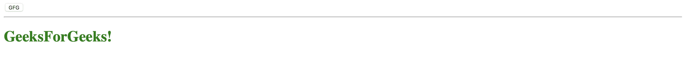
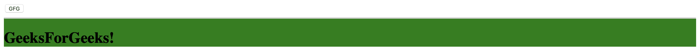
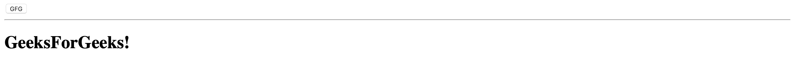
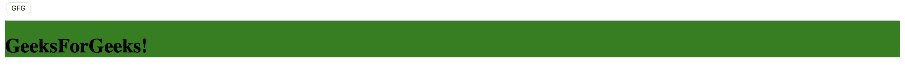

# 如何在页脚追加角度样式？

> 原文:[https://www . geesforgeks . org/如何在页脚中添加角度样式/](https://www.geeksforgeeks.org/how-to-append-angular-styles-in-footer/)

要将 CSS 样式附加到页脚或任何带有 angularJS 的 HTML 元素，如果我们有预定义的 CSS 类，我们可以使用 [ng 类](https://www.geeksforgeeks.org/angularjs-ng-class-directive/)指令，或者如果我们想要在运行时动态创建样式，可以使用 [ng 样式](https://www.geeksforgeeks.org/angularjs-ng-style-directive/)指令。

**语法:**

```ts
<footer ng-style="jsObject">...</footer>
```

运筹学

```ts
<footer ng-class="jsObject/Array/String">...</footer>
```

在 ng 样式的指令中，jsObject 包含 CSS 键值对。
在 ng 类指令中，表达式可以是 jsObject、Array 或 String。这里的 jsObject 是一个 CSS 类名和一个布尔值的键值对映射，String 只是 CSS 类名，而 Arrays 可以两者都有。

**示例 1:** 在本例中，我们使用 *ng-style* 指令向页脚元素追加样式。

```ts
<!DOCTYPE html>
<html ng-app="myApp">

<head>
    <script src=
"https://ajax.googleapis.com/ajax/libs/angularjs/1.7.8/angular.min.js">
    </script>
</head>

<body ng-controller="MyController">
    <button type="button"
        ng-click="click(this)">GFG
    </button>

    <!-- ng-style to append styles on footer -->
    <footer ng-style="styleObj">
        <hr>
        <h1>GeeksForGeeks!</h1>
    </footer>

    <script type="text/javascript">
        var myApp = angular.module('myApp', []);

        myApp.controller('MyController', [
            '$scope', function($scope) {
                $scope.styleObj = {
                    "color": "green"
                }

                $scope.click = function($scope) {

                    // CSS key value pairs to append new
                    // style of background-color
                    $scope.styleObj["background-color"] = "green";

                    // Modifying existing style
                    $scope.styleObj["color"] = "black";
                }
            }
        ]);
    </script>
</body>

</html>
```

**输出:**

*   **点击按钮前:**
    
*   **点击按钮后:**
    

当我们按下按钮 GFG，它将调用点击功能。然后 click 函数通过给 styleObj 一个新的属性并修改现有的属性来改变它的值。

**示例 2:** 在本例中，我们使用带有对象的 *ng 类*指令将样式附加到页脚元素。

```ts
<!DOCTYPE html>
<html ng-app="myApp">

<head>
    <style>
        .gfg {
            background-color: green;
        }
    </style>

    <script src=
"https://ajax.googleapis.com/ajax/libs/angularjs/1.7.8/angular.min.js">
    </script>
</head>

<body ng-controller="MyController">
    <button type="button" ng-click="click(this)">
        GFG
    </button>

    <footer ng-class="clsObj">
        <hr>
        <h1>GeeksForGeeks!</h1>
    </footer>

    <script type="text/javascript">
        var myApp = angular.module('myApp', []);

        myApp.controller('MyController', [
            '$scope', function($scope) {
                $scope.clsObj = {
                    "gfg": false
                }

                $scope.click = function($scope) {
                    $scope.clsObj["gfg"] = true;
                }
            }
        ]);
    </script>
</body>

</html>
```

**输出:**

*   **按下按钮前:**
    
*   **按下按钮后:**
    