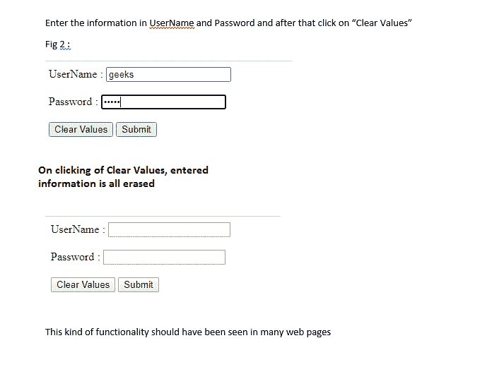
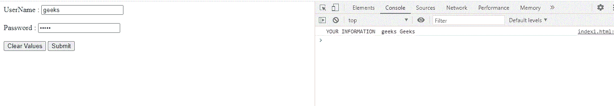
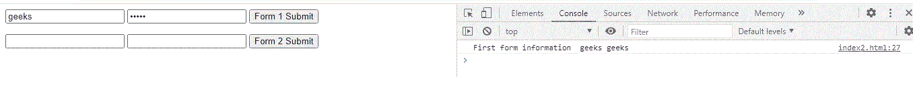
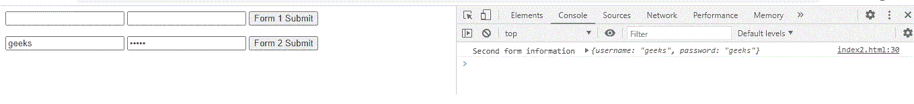

# 如何使用 AngularJS 分配和读取两个不同提交按钮的值？

> 原文:[https://www . geeksforgeeks . org/如何使用-angularjs/](https://www.geeksforgeeks.org/how-to-assign-and-read-values-of-two-different-submit-buttons-using-angularjs/) 分配和读取两个不同提交按钮的值

**简介:**通常很多网站都会提供相关种类的信息，也支持类似一个或多个提交按钮的操作，也是为了更进一步。
例如，

*   用户将被要求填写表单，表单中有提交按钮选项，如“提交表单”、“清除字段”甚至“链接到类似页面”等。
*   在任何网站的主首页，我们都可以看到“用电子邮件注册”、“登录”、“通过谷歌登录”、“通过脸书登录”等。,

每个提交都需要以这样一种方式处理，即它们需要执行各自的操作。在本文中，让我们通过下面的例子来看看如何通过 AngularJS 做到这一点。

**ng 控件说明:**

*   **ng-app:** 我们的根元素，它是一个简单的 app。
*   **ng-控制器:**定义应用控制器。这里的“MainCtrl”是一个 JavaScript 函数，它将帮助我们按照我们喜欢的方式处理多个提交按钮。
*   我们定义了一个控制器，其实例上公开了一个名为 username 和 password 的变量。
*   我们将 ng-model 的值指向 MainCtrl 上相同的用户名变量。
*   因此，输入框中的任何变化都会更新我们控制器中的模型。
*   当控制器中的变量值发生变化时，输入字段会自动更新该值。
*   我们可以清楚地看到，代码没有使用任何 id 或 CSS，因为这个 ng 模型，值会自动更新
*   ng-click->On 按钮需要执行点击动作。
*   编写了两个独立的函数，一个用于清除值，另一个用于提交。因此，清洁分离是通过这些不同的功能发生的。像这样，可以编写“n”个函数，并根据需求转移功能。

优点是控制器从来没有在 UI 中伸出过手，没有 JQuery 选择器，没有 findElementById 等涉及。在更新控制器中的模型字段时，用户界面会更新，并且可以用一种很好的方式获取最新的值。

**实施代码:**

## 超文本标记语言

```ts
<html ng-app="simpleapp">

<body ng-controller="MainCtrl as mainctrl">
    UserName :
    <input type="text" ng-model="mainctrl.username">
    <br>
    <br>
    Password :
    <input type="password" ng-model="mainctrl.password">
    <br>
    <br>
    <button ng-click="mainctrl.clear()">
        Clear Values
    </button>

    <button ng-click="mainctrl.submit()">
        Submit
    </button>

    <script src=
"https://ajax.googleapis.com/ajax/libs/angularjs/1.2.19/angular.js">
    </script>

    <script type="text/javascript">
        angular.module('simpleapp', [])
            .controller('MainCtrl', [function () {
                var self = this;
                self.clear = function () {

                    // Clearing fields, given
                    // as empty values
                    self.username = '';
                    self.password = '';

                };
                self.submit = function () {
                    console.log('yOUR INFORMATION ',
                        self.username, self.password);
                };
            }]);
    </script>
</body>

</html>
```

**输出:**

点击“清除值”，输出如图
所示



清除字段->单击清除值，输入的值被清除

点击“提交”，输出如图
所示



提交→点击提交按钮

**示例 2:** 在下面的示例中，通过两个不同的表单和两个提交按钮进行多次提交。即使用“ng-submit”代替按钮控件。

在第一种形式中，用户名和密码直接在控制器上，而对于第二种形式，它们被绑定到控制器中的用户对象。因此，在提交表单时，输出代码略有不同。也就是说，对于第二种形式，我们可以直接作为 self.user 访问，因为对于第二种形式，我们的 ng 模型是 mainctrl.user.username 和 mainctrl.user.password。

因此，在 form2 提交过程中，我们可以获得 self.user 的值。但是如果我们绑定到一个对象，表单的所有内容都可以通过该对象轻松访问。

## 超文本标记语言

```ts
<html ng-app="multiformapp">

<body ng-controller="MainCtrl as mainctrl">

    <form ng-submit="mainctrl.form1submit()">
        <input type="text" ng-model="mainctrl.username">
        <input type="password" ng-model="mainctrl.password">
        <input type="submit" value="Form 1 Submit">
    </form>

    <form ng-submit="mainctrl.form2submit()">
        <input type="text" ng-model="mainctrl.user.username">
        <input type="password" ng-model="mainctrl.user.password">
        <input type="submit" value="Form 2 Submit">
    </form>

    <script src=
"https://ajax.googleapis.com/ajax/libs/angularjs/1.2.19/angular.js">
    </script>

    <script type="text/javascript">
        angular.module('multiformapp', [])
            .controller('MainCtrl', [function () {
                var self = this;
                self.form1submit = function () {

                    // Create user object to send
                    // to the server
                    var user = { username: self.username,
                            password: self.password };

                    console.log('First form information ',
                            self.username, self.password);
                };
                self.form2submit = function () {
                    console.log('Second form information ',
                            self.user);
                };
            }]);
    </script>
</body>

</html>
```

**输出:**

*   点击“表格 1 提交”输出显示为



第一次表单提交→当单击表单 1 提交按钮时

*   点击“表格 2 提交”输出显示为



第二次表单提交→单击表单 2 提交时

在验证两个表单提交的输出时，表单 2 提交提供了一种更简单的访问模型对象的方法。

**结论:** AngularJS 非常用户友好，因为它提供了 MVC 框架、HTML 中干净整洁的用户界面、双向绑定等。，根据需求，我们可以轻松处理不同提交按钮的事件，并相应地转移流。