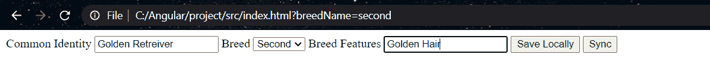
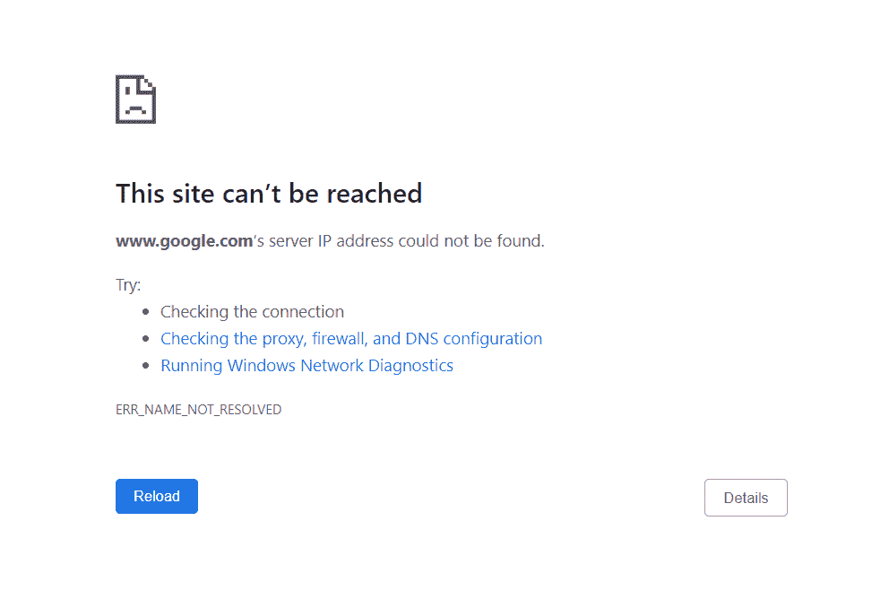
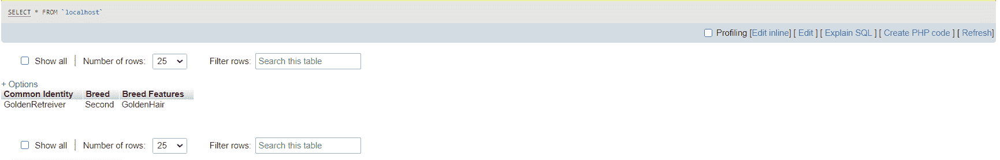

# Angular 8 中应用离线时如何自动保存数据？

> 原文:[https://www . geesforgeks . org/如何在应用程序处于离线状态时自动保存数据-angular-8/](https://www.geeksforgeeks.org/how-to-auto-save-data-when-application-is-offline-in-angular-8/)

当您的应用程序需要脱机工作，并且 CDN(内容交付网络)将失败时，自动保存数据将开始起作用。在本文中，我们将访问所需的步骤，这些步骤旨在脱机时将您的应用程序保存在本地，并在连接成功后提交它。

**环境设置:**

*   在构建使你的应用离线工作的库之前，确保下载实际的文件(例如:***【angular . js】***)。
*   例如，我们将有一个名为 ***app.js*** 的基本文件，其中包含我们的 Angular 代码，以及一个 html 文档，其中包含我们所有的 html 代码***【index.html】*****。**

```ts
<!DOCTYPE html>

<html lang="en">
<head>
    <meta charset="UTF-8">
    <title>Offline AutoSave data in Angular 8</title>
</head>
<body data-ng-app="app">

    <div data-ng-controller="MainController">

        <!-- Main Form -->

    </div>

<script src="angular.js"></script>
<script src="./app.js"></script>

</body>
</html>
```

**因此，让我们以数据输入应用程序为例，构建一个收集狗的数据的表单。如果你正在研究狗的各个品种，你的应用程序可能会根据你所处的位置偶尔离线。**

```ts
<!DOCTYPE html>
<html lang="en">
<head>
    <meta charset="UTF-8">
    <title>Offline AutoSave data in Angular 8</title>
</head>
<body data-ng-app="app">

    <div data-ng-controller="MainController">

        <form name="form.DogBreedForm" 
      novalidate data-ng-submit="save()">

            <label for="commonIdentity">
                           Common Identity</label>
            <input id="commonIdentity" type="text"
                   data-ng-model="formData.commonIdentity">

            <label for="breedName">Breed</label>
            <select name="breedName" id="breedName" 
                    data-ng-model="formData.breedName">
                <option value="first">First</option>
                <option value="second">Second</option>
                <option value="third">Third</option>
            </select>

            <label for="BreedFeatures">
                       Breed Features</label>
            <input id="BreedFeatures" 
                   type="text"
                   data-ng-model="formData.BreedFeatures">

            <button type="submit">Save Locally</button>
            <button type="button"
                    data-ng-click="sync()">Sync</button>

        </form>

    </div>

<script src="./angular.js"></script>
<script src="./app.js"></script>

</body>
</html>
```

**注意，我们已经为所有输入添加了新的术语 *<u>数据-ng-模型</u>* 。让我们为输入数据模型创建一个名为 *<u>$scope.formData</u>* 的父对象。**

***<u>$scope.save</u>* 功能将处理数据保存实例到本地存储， *<u>$scope.sync</u>* 将处理应用上线时的提交操作。**

*****输出*** ( 离线时 ):**

**

页面输出(输入值)** 

**现在，我们处于离线状态，因此它将向我们显示以下内容。**

**

现在让我们深入研究一下，一旦用户在表单中输入数据，如何执行功能并离线存储数据。

*保存功能*–local storage 将以字符串键值对的形式保存我们的数据。

存储在本地存储器中的数据将接受字符串。在下面的保存函数中，我们声明了一个 stringCopy 变量和一个关于 *<u>$scope.formData.</u>* 的 lcKey 属性，我们使用了时间戳，这是一个唯一的标识符。

*   **JSON 文件**

JSON 格式文件常用于通过网络连接传递结构化数据。它主要在服务器和 web 应用程序之间传输数据。因此，在解析字符串 JSON 时，如果它无效，就会引发异常。为了避免这些异常，让我们使用 tr-catch 块来处理它。

JSON 代表 JavaScript Object notification 是一种独立的语言，而 JSON 是一种数据格式，它欣然允许我们与任何平台共享数据。它将数据分发到任何类型的介质，并且链接 JSON 并不复杂。

```ts
stringCopy = JSON.stringify($scope.formData);

```

*解析本地存储并保存到服务器- S* 在脱机时使用 *<u>JSON.stringify</u>* 将数据保存到本地存储。现在我们使用 *<u>JSON.parse</u>* 在您的应用程序上线时将数据同步到数据库。

*注意–我们在 html 文档中包含了一个按钮，用于保存您的数据并将其提交到表单部分的本地存储中。*T3】

*   **app.js 文件**

App.js 代表您设计 NodeJs 应用程序的主要 javascript 文件。该文件必须存储在主应用程序根目录中。该文件还可以包含不同的名称(例如:main.js)。它通过 web 应用程序在 nodejs 功能和 html 代码之间建立了一个接口。

```ts
angular.module('app', [])
    .controller('MainController', ['$scope', function ($scope) {
        var fetchAll = function () {

                var finds = [];

                if (localStorage.length === 0) {
                    return [];
                }

                for (var i=0;i<localStorage.length;i++) {

                    try {
                        finds.push(
JSON.parse(localStorage.getItem(localStorage.key(i))));
                    } catch (err) {
                        console.log(err);
                    }

                }

                return finds;

            };

        $scope.formData = {};        
        $scope.save = function () {
            var stringCopy = '';
            $scope.formData.lcKey = Date.now().toString();
            try {
                stringCopy = JSON.stringify($scope.formData);
            } catch (err) {

                console.debug(err);
                return;
            }
            localStorage[$scope.formData.lcKey] = stringCopy;

        };

        $scope.sync = function () {

            var records = fetchAll();

            if (
navigator && navigator.onLine && records.length) {

                    records.forEach(function (find, idx) 
                        $http({
                            url: '/api/finds',
                            method: 'POST',
                            data: find
                        }).then(function (res) {

                 localStorage.removeItem(find.lcKey.toString());
                 ecords.splice(idx); //remove from records array

                        }, function (err) {

                            //error handling - service call failures

                        });
                    });

                } else {

                    //error handling - Alert the user for patience
                }

        };

    }]);
```

最后同步数据后，*T2【输出】T4【输出】(*T6【在线时】T7):



我们使用 *<u>fetchAll</u>* 功能自动检测连接并保存您的数据并将其同步到数据库。我们将在提交函数中调用这个函数。一旦建立连接，存储在本地存储中的数据将通过逐个循环存储的记录并将其提交给数据库来同步。

因此，本文帮助您在应用程序脱机时将数据本地存储到 localStorage，并在数据库联机时使用 *<u>$scope 函数</u>* 进行输入和解析，将数据同步到数据库。**