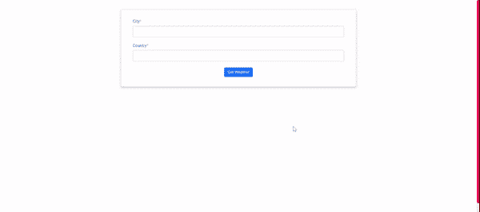
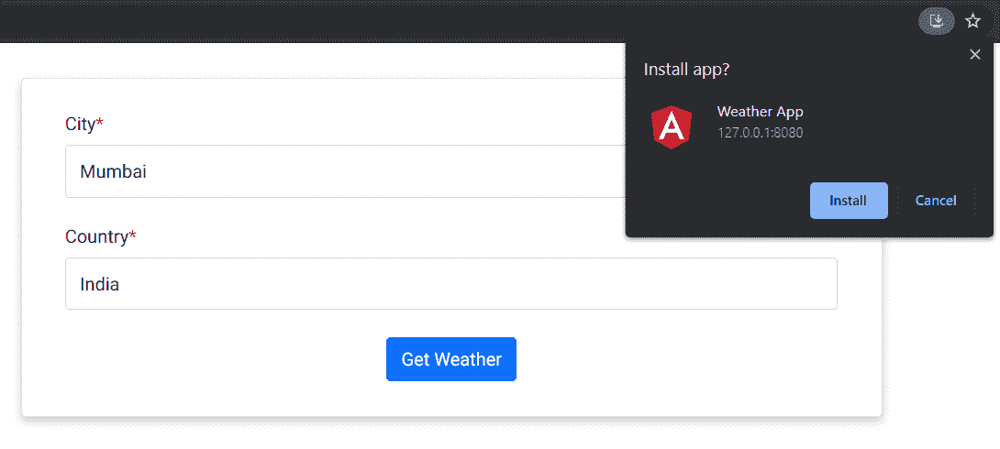
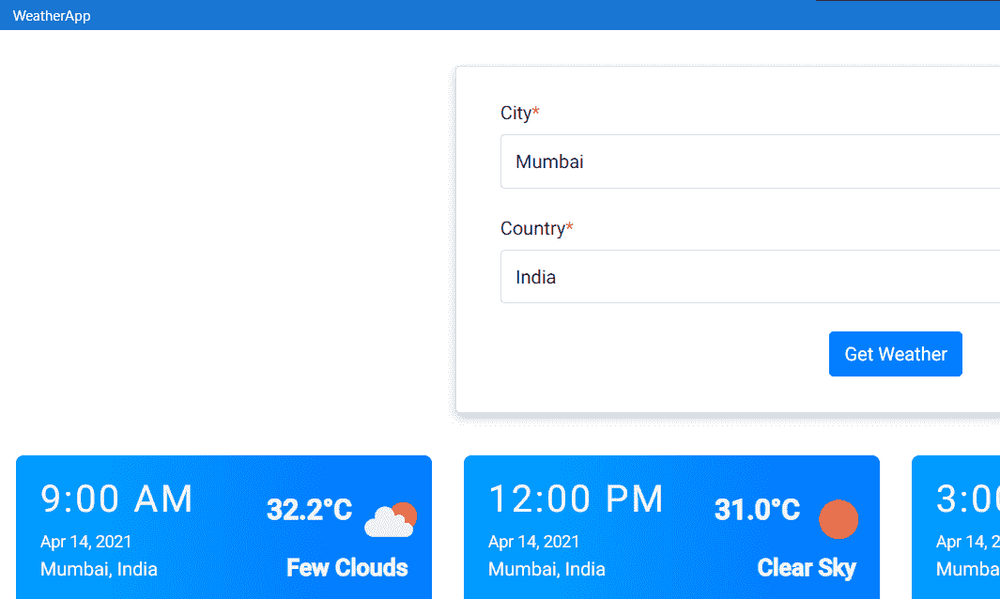
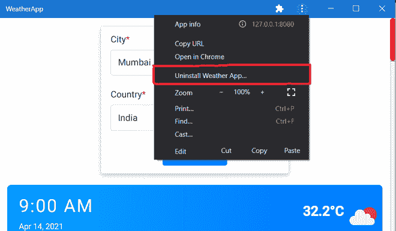

# 如何在 Angular 9 中构建渐进式 web app(PWA)？

> 原文:[https://www . geesforgeks . org/how-build-progressive-web-app pwa-in-angular-9/](https://www.geeksforgeeks.org/how-to-build-progressive-web-apppwa-in-angular-9/)

在本文中，我们将使用 Angular 开发一个 [PWA](https://www.geeksforgeeks.org/general-introduction-to-progressive-web-appspwa/) (渐进式网络应用程序)。

**什么是 PWA？**

渐进式网络应用程序是经过设计的网络应用程序，它们是有能力的、可靠的和可安装的。PWA 是用现代 API 构建和增强的，以提供增强的功能、可靠性和可安装性，同时还能到达任何人、任何地方、任何具有单一代码库的设备上。PWA 不需要通过应用商店部署；相反，我们使用不同的方法，并通过 URL 在 web 服务器上部署它。但是在开发 PWA 时，我们必须注意以下因素:

1.  **响应性:**可在台式机、移动设备或平板电脑等所有设备上工作，不会出现任何损坏。
2.  **安全&安全:**使用 HTTPS 向我们的 PWA 提供数据确保了安全。
3.  **渐进式:**利用现代网络功能为每个用户开发类似应用的体验。
4.  **自动更新:**无需用户干预即可下载并安装更新。(这是在[服务人员](https://www.geeksforgeeks.org/service-workers-in-javascript/)的帮助下)
5.  **可发现:** PWA 应该可以通过搜索引擎进行搜索。(使用 web 应用程序清单)
6.  **可安装:**可安装在用户设备主屏幕上。
7.  **脱机工作:**应该配置为脱机工作和稀疏网络。

**第一步:初始化新的 Angular 项目:**现在，我们先从创建 angular app 开始。在这里，我们将创建一个简单的天气应用程序。为此，首先，创建一个新的 Angular App，并使用以下命令在项目目录中导航。

```
ng new weather-app
cd weather-app
```

**步骤 2:添加引导链接:**我们将在开发前端时使用引导进行造型。在项目的*index.html*文件中添加以下链接。

> <src = " https://cdn . jsdelivr . net/NPM/bootstrap @ 5 . 0 . 0-beta 3/dist/js/bootstrap . bundle . min . js "完整性= " sha 384-Jew 9 xmcg 8 r+ph 31 jmwh 6 wwp 0 wintqrmb 4s 7 zodaudhntxwong 2 VI 5 dk 3 QM 9 EKF " cross origin = " anonymous ">

**第三步:获取天气数据的 OpenWeatherMap API:**获取天气实况数据，我们将使用[OpenWeatherMap](http://openweathermap.org/api)API。通过创建您的帐户获得一个应用编程接口密钥。

**第 4 步:开发天气应用程序的用户界面:**通过运行以下命令创建名为**天气**的角度组件和名为**应用程序接口**的角度服务:

```
ng generate component components/weather
ng generate service services/API
```

现在，将以下代码粘贴到它们各自的文件中。

## 天气.组件. ts

```
import { Component, OnInit } from '@angular/core';
import { WeatherService }
     from 'src/app/services/weather.service';

@Component({
  selector: 'app-weather',
  templateUrl: './weather.component.html',
  styleUrls: ['./weather.component.css'],
})
export class WeatherComponent implements OnInit {
  city: any = '';
  country: any = '';
  weather: any = null;

  constructor(private
   _weatherService: WeatherService) {}

  ngOnInit(): void {}

  getDate(str: string) {
    return str.split(' ')[0];
  }

  getTime(str: string) {
    return str.split(' ')[1];
  }

  displayWeather() {
    this._weatherService
  .getWeather(this.city, this.country)
  .subscribe(
      (data) => (this.weather = data),
      (err) => console.log(err)
    );
  }
}
```

## weather.component.html

```
<div class="container-fluid">
  <div class="input card">
    <div class="mb-4">
      <label for="city" class="form-label">
        City<span class="text-danger">*
        </span>
      </label>
      <input type="text" class="form-control" 
             name="city" id="city" [(ngModel)]="city"/>
    </div>
    <div class="mb-1">
      <label for="country" class="form-label">
        Country<span class="text-danger">*
        </span></label>
      <input type="text" class="form-control"
             name="country" id="country" 
             [(ngModel)]="country"/>
    </div>
    <div class="text-center mt-4">
      <button type="submit" class="btn btn-primary" 
              (click)="displayWeather()">
        Get Weather</button>
    </div>
  </div>

  <div class="row" *ngIf="weather" 
       [(ngModel)]="weather">
    <div class="col-md-3" *ngFor="let wth of weather.list">
      <div class="weather-info">
        <div class="d-flex justify-content-between">
          <div class="info-date">
            <h1>{{ wth.dt_txt | date: "shortTime" }}</h1>
            <span>{{ getDate(wth.dt_txt) | date }}</span>
            <span class="weather-city">{{ city }},
              {{ country }}</span>
          </div>

          <div class="info-weather">
            <div class="weather-wrapper">
              <span class="weather-temperature">
                {{ wth.main.temp - 273.15 | number: "1.1-1" }}°C
              </span>
              <div class="weather-type">
                
              </div>
              <br />
            </div>
            <span class="weather-description">
              {{ wth.weather[0].description | titlecase }}
            </span>
          </div>
        </div>
        <div class="d-flex justify-content-between mt-3">
          <div class="humidity"> 
            Humidity {{ wth.main.humidity }}%</div>
          <div class="wind">
            <i class="fas fa-wind"></i>Wind 
            {{ wth.wind.speed }} km/h
          </div>
          <div class="pressure">Pressure 
            {{ wth.main.pressure }}</div>
        </div>
      </div>
    </div>
  </div>
</div>
```

## weather.component.css

```
.col-md-3 {
  margin: 5px auto;
}

.input {
  margin: 2% 25%;
  padding: 2% 2.5%;
  font-size: 16px;
  box-shadow: 0 4px 8px 0 rgba(0, 0, 0, 0.2);
  transition: 0.3s;
}

input {
  padding: 10px 12px;
}

.weather-info {
  width: 100%;
  height: 100%;
  padding: 20px 20px;
  border-radius: 8px;
  border: 2px solid #fff;
  box-shadow: 0 0 4px rgba(255, 255, 255, 0.3);
  background: linear-gradient(to right, #00a4ff, #0072ff);
  transition: transform 0.2s ease;
  color: whitesmoke;
}

.info-date {
  display: flex;
  flex-direction: column;
  justify-content: center;
}

.info-date h1 {
  margin-bottom: 0.65rem;
  font-size: 2rem;
  letter-spacing: 2px;
}

.info-weather {
  display: flex;
  flex-direction: column;
  align-items: flex-end;
  justify-content: center;
  text-align: right;
}

.weather-wrapper {
  display: flex;
  align-items: center;
  justify-content: flex-end;
  width: 100%;
}
@keyframes animation-icon {
  from {
    transform: scale(1);
  }
  to {
    transform: scale(1.2);
  }
}

.weather-type {
  display: inline-block;
  width: 48px;
  height: 48px;
  transition: all 0.2s ease-in;
  animation: animation-icon 0.8s infinite;
  animation-timing-function: linear;
  animation-direction: alternate;
}
.weather-temperature {
  font-size: 1.5rem;
  font-weight: 800;
}

.weather-description {
  margin-top: 1rem;
  font-size: 20px;
  font-weight: bold;
}

.weather-city {
  margin-top: 0.25rem;
  font-size: 16px;
}

.wind i {
  margin: 10px;
}
```

## 天气服务

```
import { Injectable } from '@angular/core';
import { HttpClient } from '@angular/common/http';

@Injectable({
  providedIn: 'root',
})
export class WeatherService {
  private readonly apiKey: string = <your API key>;

  constructor(private _http: HttpClient) {}

  getWeather(city: string, country: string) {
    const apiUrl = 
 `https://api.openweathermap.org/data/2.5/forecast?q=${city},${country}&appid=${this.apiKey}`;
    return this._http.get(apiUrl);
  }
}
```

现在给 app.component.html 的天气预报打电话

```
<app-weather></app-weather>
```

**输出:**



**第五步:将 angular app 转换为 PWA:** 使用 Angular CLI 很容易将您的 Angular app 转换为 PWA。导航到项目的文件夹。现在，运行以下命令添加 PWA 功能。

```
ng add @angular/pwa
```

上述命令添加了以下新文件:

1.  用于 PWA 信息的名为 manifest.webmanifest 的清单文件
2.  用于配置服务工作者的 ngsw-config.json 文件
3.  资产/图标目录中有许多大小的默认图标(这些图标可以在以后更改)
4.  使用@angular/service-worker 包的服务人员

现在，让我们看看每个文件的作用。

**清单.网络清单**

该文件包含应用程序的名称、主题和背景颜色，以及各种大小的图标。当您将应用程序添加到手机时，会应用此配置。它会通过将名称和图标添加到应用程序列表来创建网页视图，当应用程序运行时，会应用背景和主题颜色。

## java 描述语言

```
{
  "name": "weather-app",
  "short_name": "weather-app",
  "theme_color": "#1976d2",
  "background_color": "#fafafa",
  "display": "standalone",
  "scope": "./",
  "start_url": "./",
  "icons": [
    {
      "src": "assets/icons/icon-72x72.png",
      "sizes": "72x72",
      "type": "image/png",
      "purpose": "maskable any"
    },
    {
      "src": "assets/icons/icon-96x96.png",
      "sizes": "96x96",
      "type": "image/png",
      "purpose": "maskable any"
    },
    {
      "src": "assets/icons/icon-128x128.png",
      "sizes": "128x128",
      "type": "image/png",
      "purpose": "maskable any"
    },
    {
      "src": "assets/icons/icon-144x144.png",
      "sizes": "144x144",
      "type": "image/png",
      "purpose": "maskable any"
    },
    {
      "src": "assets/icons/icon-152x152.png",
      "sizes": "152x152",
      "type": "image/png",
      "purpose": "maskable any"
    },
    {
      "src": "assets/icons/icon-192x192.png",
      "sizes": "192x192",
      "type": "image/png",
      "purpose": "maskable any"
    },
    {
      "src": "assets/icons/icon-384x384.png",
      "sizes": "384x384",
      "type": "image/png",
      "purpose": "maskable any"
    },
    {
      "src": "assets/icons/icon-512x512.png",
      "sizes": "512x512",
      "type": "image/png",
      "purpose": "maskable any"
    }
  ]
}
```

**ngsw-config** 有了这个文件，人们将能够管理与 PWA 相关的各种不同的事情。这是我们缓存应用编程接口端点的地方。

## java 描述语言

```
{
 "$schema": "./node_modules/@angular/service-worker/config/schema.json",
 "index": "/index.html",
 "assetGroups": [
   {
     "name": "app",
     "installMode": "prefetch",
     "resources": {
       "files": [
         "/favicon.ico",
         "/index.html",
         "/manifest.webmanifest",
         "/*.css",
         "/*.js"
       ]
     }
   },
   {
     "name": "assets",
     "installMode": "lazy",
     "updateMode": "prefetch",
     "resources": {
       "files": [
         "/assets/**",
         "/*.(eot|svg|cur|jpg|png|webp|gif|otf|ttf|woff|woff2|ani)"
       ]
     }
   }
 ]
}
```

**第 6 步:为生产环境构建我们的 Angular App:**

```
ng build --prod
```

运行上述命令后，我们的构建文件夹将在 dist/weather-app 中创建。现在，使用 cd dist/weather-app 移动到构建文件夹。

```
cd dist/weather-app
```

使用 NPM 全球安装 **http 服务器**包。

```
npm install -g http-server
```

你可以在这里找到这个天气应用 [**的代码**](https://github.com/girishgr8/Angular-PWA)。

**第七步:在桌面添加我们的天气 App 图标启动:**一旦你在浏览器中启动了 angular app，URL 栏右侧会出现一个下载图标，如下所示:



安装天气应用程序

点击**安装**按钮，在桌面添加图标，启动应用。现在，您点击桌面上创建的应用程序图标。您将看到以下屏幕。(**注意:**点击图标，在浏览器中不会打开)



从桌面启动应用程序(任何设备)

卸载 PWA 很容易。只需点击顶部导航中的三个点，然后点击“卸载天气应用”。



正在卸载 PWA