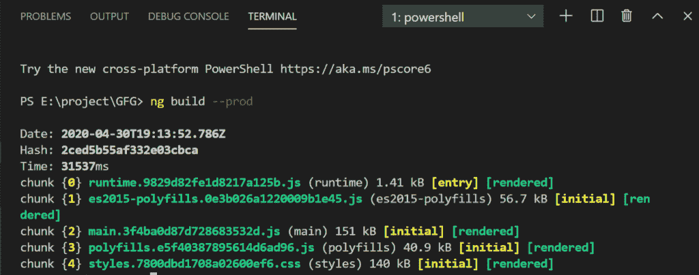
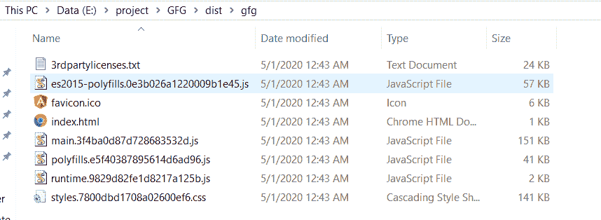

# 如何捆绑 Angular 应用进行生产？

> 原文:[https://www . geeksforgeeks . org/如何捆绑有角度的应用程序进行生产/](https://www.geeksforgeeks.org/how-to-bundle-an-angular-app-for-production/)

**简介**
在部署 web 应用程序之前，Angular 提供了一种借助几个 CLI 命令检查 web 应用程序行为的方法。通常，ng serves 命令用于从本地内存构建、监视和服务应用程序。但是对于部署，通过运行 ng build 命令可以看到应用程序的行为。

**ng 发球和 ng 造的区别**

| ng 发球 | ng 构建 |
| --- | --- |
| ng serve 命令专门用于快速、本地和迭代开发，也用于从本地 CLI 开发服务器构建、监视和服务应用程序。 | ng build 命令旨在构建应用程序和部署构建工件。 |
| 该命令不会生成输出文件夹。 | 输出文件夹是–dist/。 |
| ng 服务从内存中构建工件，以获得更快的开发体验。 | ng build 命令只生成一次输出文件，并不提供它们。 |

**步骤**
在执行部署应用程序的步骤之前，请确保系统中已经安装了 **Angular CLI** 如果没有，请运行以下命令。

```ts
npm install -g @angular/cli
```

第一步是在应用程序部署之前将其打包用于生产。

*   导航到项目目录。

```ts
cd project-folder
```

*   Run ng build command in Angular CLI

    ```ts
    ng build --prod 
    ```

    

    *   To get the preview of the application, run the following command:

    ```ts
    ng serve --prod
    ```

    这将启动一个带有生产文件的本地 HTTP 服务器。导航到 http://localhost:4200/查看应用程序。
    有了这些步骤，应用程序就可以部署了。

    **逼近**
    **ng build** 命令将 Angular app 编译到给定输出路径下名为 **dist/** 的输出目录中。该命令必须在工作目录中执行。Angular 中的应用程序构建器使用 webpack 构建工具，在工作区配置文件(angular.json)中指定配置选项，或者使用命名的替代配置。当您使用 CLI 创建项目时，默认情况下会创建一个“生产”配置，您可以通过指定— `configuration="production"`或`--prod="true"`选项来使用该配置。

    **–生产标志**激活许多优化标志。其中之一就是——面向提前编译的 aot。您的组件模板是在构建过程中编译的，因此 TypeScript 可以检测到代码中的更多问题。您可以在开发模式下编译，但是如果您想在为 prod 构建之前看到这个错误，仍然可以激活–AOT 标志。

    **dist/Folder**
    dist 文件夹是构建文件夹，包含所有可以托管在服务器上的文件和文件夹。
    dist 文件夹包含 JavaScript 格式的 angular 应用程序的编译代码，以及所需的 HTML 和 CSS 文件。
    **内部区/文件夹**

    | 文件夹/文件 | 描述 |
    | --- | --- |
    | 资产 | 该文件夹包含从 Angular CLI 资产配置中复制的资源。 |
    | index.html | index.html 文件是申请的入口点。 |
    | 主要的。[哈希]。射流研究… | 该文件包含捆绑应用程序。 |
    | 波利希尔。[hash].bundle.js | 它包含多堆依赖项 |
    | 运行时-[es-version]。[hash].bundle.js | 它包含网络包加载器 |
    | 风格。[hash].bundle.css | 它包含样式定义 |

    

    ### 不足之处

    *   **性能:**动态应用程序的性能并不总是那么好。复杂的 SPa 由于其尺寸，使用起来可能比较缓慢和不方便。
    *   **陡峭的学习曲线:**由于 AngularJS 是一种多用途的仪器，完成任何任务的方法总是不止一种。这在工程师中造成了一些混乱。