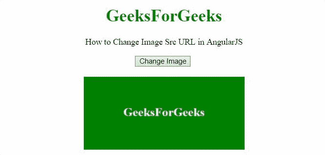
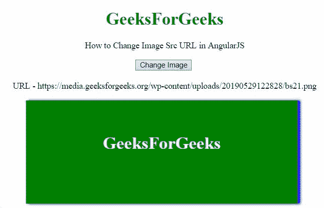

# 如何使用 AngularJS 更改图片来源 URL？

> 原文:[https://www . geesforgeks . org/how-change-image-source-URL-using-angularjs/](https://www.geeksforgeeks.org/how-to-change-image-source-url-using-angularjs/)

这里的任务是在 AngularJS 的帮助下更改图像的源 URL。

**方法:**方法是当用户点击按钮时，改变图像的 URL。当用户点击一个按钮时，一个方法连同新的网址一起被调用，该方法用控制器中的旧网址替换新网址。

**例 1:**

```html
<!DOCTYPE HTML>
<html>

<head>
    <script src=
"//ajax.googleapis.com/ajax/libs/angularjs/1.2.13/angular.min.js">
    </script>
    <script>
        var myApp = angular.module("app", []);
        myApp.controller("controller", function ($scope) {
            $scope.imgUrl =
"https://media.geeksforgeeks.org/wp-content/uploads/20190515121004/gfgbg1-300x136.png";
            $scope.changeURL = function (url) {
                $scope.imgUrl = url;
            };
        });
    </script>
</head>

<body style="text-align:center;">
    <h1 style="color:green;">
        GeeksForGeeks
    </h1>
    <p>
        How to Change Image Src URL in AngularJS
    </p>
    <div ng-app="app">
        <div ng-controller="controller">
            <button ng-click="changeURL(
'https://media.geeksforgeeks.org/wp-content/uploads/20190515120525/gfglogo1.png')">
                Change Image</button>
            <br>
            <br>
            
        </div>
    </div>
</body>

</html> 
```

**输出:**



**例 2:** 在本例中，在输出中可以看到网址的变化。

```html
<!DOCTYPE HTML>
<html>

<head>
    <script src=
"//ajax.googleapis.com/ajax/libs/angularjs/1.2.13/angular.min.js">
    </script>

    <script>
        var myApp = angular.module("app", []);
        myApp.controller("controller", function ($scope) {
            $scope.imgUrl =
"https://media.geeksforgeeks.org/wp-content/uploads/20190529122828/bs21.png";
            $scope.changeURL = function (url) {
                $scope.imgUrl = url;
            };
        });
    </script>
</head>

<body style="text-align:center;">
    <h1 style="color:green;">
        GeeksForGeeks
    </h1>
    <p>
        How to Change Image Src URL in AngularJS
    </p>
    <div ng-app="app">
        <div ng-controller="controller">
            <button ng-click="changeURL(
'https://media.geeksforgeeks.org/wp-content/uploads/20190529122826/bs11.png')">
                Change Image</button>
            <br>
            <br>
            URL - {{imgUrl}}
            
        </div>
    </div>
</body>

</html>     
```

**输出:**

