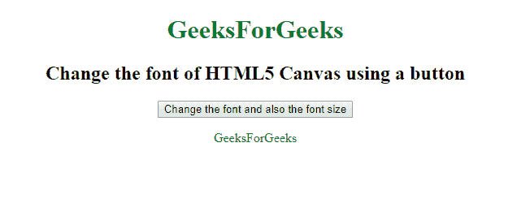
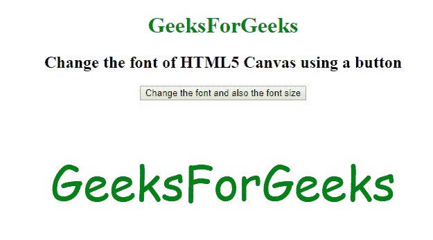
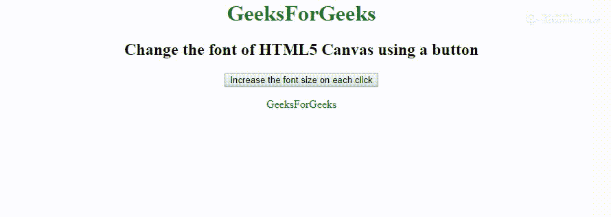

# 如何使用 Angular.js 中的一个按钮改变 HTML5 Canvas 的字体？

> 原文:[https://www . geesforgeks . org/如何使用角度按钮更改 html5-canvas 的字体/js/](https://www.geeksforgeeks.org/how-to-change-the-font-of-html5-canvas-using-a-button-in-angular-js/)

在本文中，我们将学习如何使用 AngularJS 中的按钮来更改 HTML5 Canvas 的字体。在 click 的帮助下，字体的属性可以由用户改变，无论是字体大小还是字体样式。

**语法:**

*   **字体大小**(相应更改字体大小):

    ```
    variable.fontSize = "100px"
    ```

*   **字体样式**(相应更改字体样式):

    ```
    variable.font = "Comic Sans MS"
    ```

**例 1:**

```
<!DOCTYPE html>
<html>

<head>
    <title>
      Change the font of 
      HTML5 Canvas using a button
  </title>
</head>

<body>
    <center>
        <h1 style="color:green">
          GeeksForGeeks
      </h1>
        <h2>
          Change the font of HTML5 Canvas using a button
      </h2>
        <input type="button" 
               value="Change the font and also the font size" 
               onclick="increaseFontSizeBy100px()">

        <p id="a" style="color:green">
          GeeksForGeeks
      </p>

        <script>
            function increaseFontSizeBy100px() {
                document.getElementById(
                    'a').style.fontSize = "100px";
                document.getElementById(
                    'a').style.font = "69px Comic Sans MS";
            }
        </script>
    </center>
</body>

</html>
```

**输出:**
**前:**

**后:**


**例 2:**

```
<html>

<head>
    <title>
      Change the font of 
      HTML5 Canvas using a button
  </title>
</head>

<body>
    <center>
        <h1 style="color:green">
          GeeksForGeeks
      </h1>
        <h2>
          Change the font of HTML5 Canvas using a button
      </h2>

        <input type="button"
               value="Increase the font size on each click" 
               onclick="increaseFontSizeBy1px()">
        <p id="b" style="color:green">
          GeeksForGeeks
      </p>

        <script>
            function increaseFontSizeBy1px() {
                var id = document.getElementById('b');

                var style = window.getComputedStyle(
                  id, null).getPropertyValue('font-size');

                var currentSize = parseInt(style);

                currentSize++;

                document.getElementById(
                  'b').style.fontSize = currentSize.toString();

            }
        </script>
    </center>
</body>

</html>
```

**输出:**
