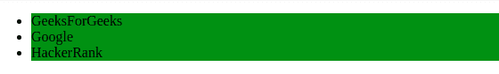
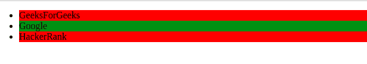

# 如何在 Angular 2+中使用 ngFor 单独更改列表项 bg-color？

> 原文:[https://www . geesforgeks . org/如何更改列表项-BG-color-individual-using-ngforer-in-angular-2/](https://www.geeksforgeeks.org/how-to-change-the-list-item-bg-color-individually-using-ngfor-in-angular-2/)

**简介:**
我们可以使用*ngFor 指令和属性绑定来绑定背景颜色来解决这个问题。

**Approach:**

*   使用*ngFor 指令遍历。html 文件。*   通过使用属性绑定，绑定列表中每个项目的背景颜色。*   默认情况下，在。ts 文件。*   使用单击事件处理程序切换列表中项目的背景色。*   Once the implementation is done then serve the project using below command.

    ```ts
    ng serve --open
    ```

    **通过代码实现:**
    **app . component . html:**

    ```ts
    <ul>                        

        <li  (click)="changeColor[i]=!changeColor[i]"  
    // we are toggling the background 
    // colour on click event handler
       [style.background-color] = "changeColor[i]  ? 'red' : 'green'" 
       *ngFor="let item of list ; let i = index">
          {{item.name}}
        </li>

    </ul>
    ```

    **app . component . ts:**T2】

    ```ts
    import { Component } from '@angular/core';

    @Component({
      selector: 'my-app',
      templateUrl: './app.component.html',
      styleUrls: [ './app.component.css' ]
    })
    export class AppComponent  {

    changeColor= [false, false, false];

    list = [
        { name : 'GeeksForGeeks' },
        { name : 'Google' },
        { name : 'HackerRank'}
      ];
    }
    ```

    **输出:** **点击任意项目前:**

    

    **点击任意项目后:**

    