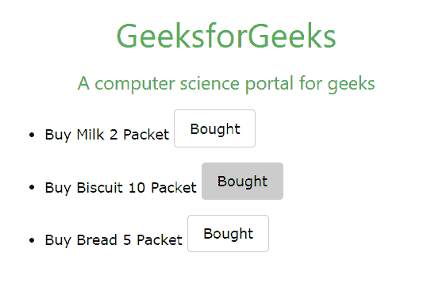
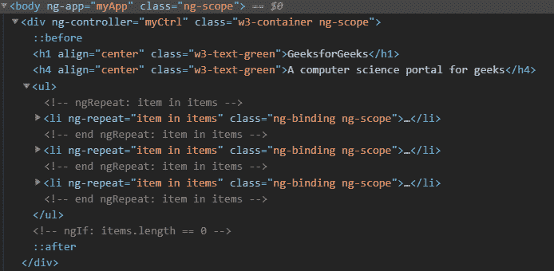
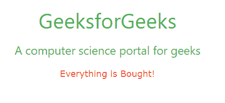
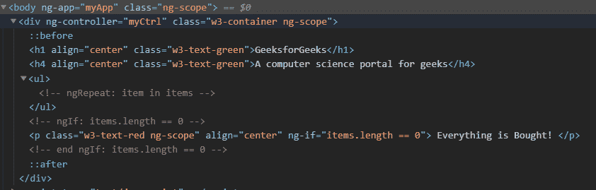
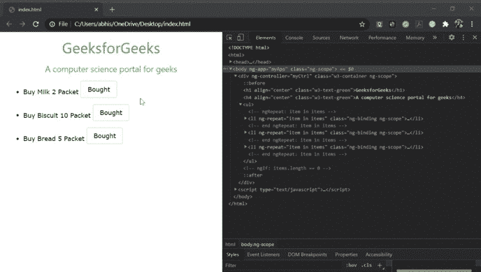

# 如何检查一个带有 ng-if 的元素在 DOM 上是否可见？

> 原文:[https://www . geeksforgeeks . org/如何用 ng-if-visible-on-DOM 检查元素/](https://www.geeksforgeeks.org/how-to-check-an-element-with-ng-if-is-visible-on-dom/)

**ng-if 指令:**AngularJS 中的 **ng-if** 指令用于根据表达式移除或重新创建 HTML 元素的一部分。如果其中的表达式为假，则删除该元素，如果为真，则将该元素添加到 DOM 中。

**语法:**

```
<element ng-if="expression"> Contents... </element>
```

**进场:**

*   考虑一个包含三个项目的清单。
*   一旦所有商品都买了，我们就会显示一条信息——“所有东西都买了！”。
*   在开始 NG-IF 时，从 DOM 树的一部分中移除该消息，并基于表达式，当它被评估为真时，它在 DOM 中被重新创建。
*   为了观察这些变化，我们将在网络浏览器上检查代码。在谷歌浏览器中启用检查的不同方法:
    *   菜单栏->更多工具->开发人员工具。
    *   在浏览器中右键单击->检查
    *   Ctrl + Shift + I(窗口)
    *   Cmd + Opt + I （Mac OS）

**注意:**更多信息请前往[铬-检查-元素-工具-快捷方式。](https://www.geeksforgeeks.org/chrome-inspect-element-tool-shortcut/)

**代码实现:**

## 超文本标记语言

```
<!DOCTYPE html>
<html>

<head>
    <meta name="viewport" content=
        "width=device-width, initial-scale=1">
    <link rel="stylesheet" href=
"https://www.w3schools.com/w3css/4/w3.css">
    <script type="text/javascript" src=
"https://cdnjs.cloudflare.com/ajax/libs/angular.js/1.8.0/angular.min.js">
    </script>
</head>

<body ng-app="myApp">
    <div ng-controller="myCtrl"
        class="w3-container">
        <h1 align="center" class="w3-text-green">
            GeeksforGeeks
        </h1>
        <h4 align="center" class="w3-text-green">
            A computer science portal for geeks
        </h4>
        <ul>
            <li ng-repeat="item in items">
                Buy {{item.name}} {{item.quantity}}
                <button ng-click=Bought($index)
                    class="w3-button w3-round w3-border
                        w3-margin-bottom">
                    Bought
                </button>
            </li>
        </ul>
        <p class="w3-text-red" align="center"
            ng-if="items.length == 0">
            Everything is Bought!
        </p>

    </div>
    <script type="text/javascript">
        (function () {
            angular.module("myApp", []).controller(
                "myCtrl", function ($scope) {
                $scope.items = [
                    { name: "Milk", quantity: "2 Packet" },
                    { name: "Biscuit", quantity: "10 Packet" },
                    { name: "Bread", quantity: "5 Packet" }
                ];
                $scope.Bought = function (index) {
                    $scope.items.splice(index, 1);
                };
            });
        })();
    </script>
</body>

</html>
```

**输出:**

**点击所有按钮前:**这里，我们有三个按钮可以点击并购买各自的物品。



**在 Inspect 窗口:**我们可以看到 ng-if 被注释掉了，DOM 树的一部分作为表达式被评估为 False。



**点击所有按钮后:**由于我们已经点击了所有按钮并购买了每一件物品，屏幕上会显示一条消息。



**在 Inspect 窗口:**我们可以看到 ng-if 现在不再被注释，现在它是 DOM 树的一部分，因为表达式被评估为 True。



这个 gif 输出显示了所有正在发生的事情。

