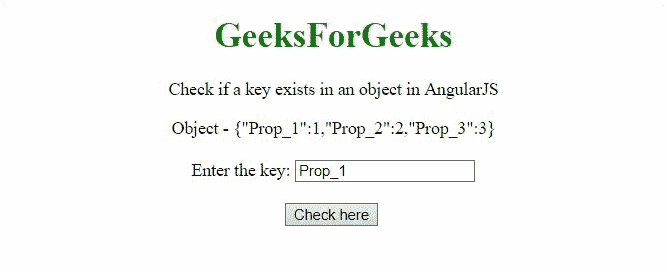
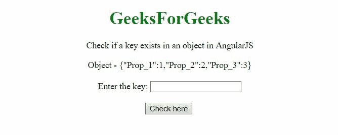

# 如何用 AngularJS 检查对象中键的存在？

> 原文:[https://www . geeksforgeeks . org/如何使用-angularjs/](https://www.geeksforgeeks.org/how-to-check-the-existence-of-key-in-an-object-using-angularjs/) 检查对象中是否存在密钥

给定一个包含(键，值)对的对象，任务是使用 AngularJS 检查对象中是否存在键。

**方法:**方法是使用运算符中的**检查对象中是否存在键。在第一个例子中，键**“道具 1”**被输入并且它存在于对象中。在第二个例子中，用户可以检查他们想要检查存在的密钥。**

**例 1:**

```html
<!DOCTYPE HTML>
<html>

<head>
    <script src=
"//ajax.googleapis.com/ajax/libs/angularjs/1.2.13/angular.min.js">
    </script>

    <script>
        var myApp = angular.module("app", []);
        myApp.controller("controller", function ($scope) {
            $scope.obj1 =
                { "Prop_1": 1, "Prop_2": 2, "Prop_3": 3 };
            $scope.res = '';
            $scope.textval = "Prop_1";
            $scope.checkK = function () {
                var txtVal = $scope.textval;
                if (!(txtVal in $scope.obj1)) {
                    $scope.res = "Key not Exists.";
                } else {
                    $scope.res = "Key Exists";
                }
            }
        });
    </script>
</head>

<body style="text-align:center;">
    <h1 style="color:green;">
        GeeksForGeeks
    </h1>
    <p>
        Check if a key exists in 
        an object in AngularJS
    </p>
    <div ng-app="app">
        <div ng-controller="controller">
            Object - {{obj1}}<br><br>
            Enter the key: <input type="text" 
                    ng-model="textval">
            <br><br>
            <button ng-click="checkK()">
                Check here</button>
            <br><br>
            {{res}}<br>
        </div>
    </div>
</body>

</html> 
```

**输出:**



**例 2:**

```html
<!DOCTYPE HTML>
<html>

<head>
    <script src=
"//ajax.googleapis.com/ajax/libs/angularjs/1.2.13/angular.min.js">
    </script>

    <script>
        var myApp = angular.module("app", []);
        myApp.controller("controller", function ($scope) {
            $scope.obj1 =
                { "Prop_1": 1, "Prop_2": 2, "Prop_3": 3 };
            $scope.res = '';
            $scope.textval = "";
            $scope.checkK = function () {
                var txtVal = $scope.textval;
                if (!(txtVal in $scope.obj1)) {
                    $scope.res = "Key not Exists.";
                } else {
                    $scope.res = "Key Exists";
                }
            }
        });
    </script>
</head>

<body style="text-align:center;">
    <h1 style="color:green;">
        GeeksForGeeks
    </h1>
    <p>
        Check if a key exists in 
        an object in AngularJS
    </p>
    <div ng-app="app">
        <div ng-controller="controller">
            Object - {{obj1}}<br><br>
            Enter the key: <input type="text" 
                    ng-model="textval">
            <br><br>
            <button ng-click="checkK()">
                Check here</button>
            <br><br>
            {{res}}<br>
        </div>
    </div>
</body>

</html>   
```

**输出:**

