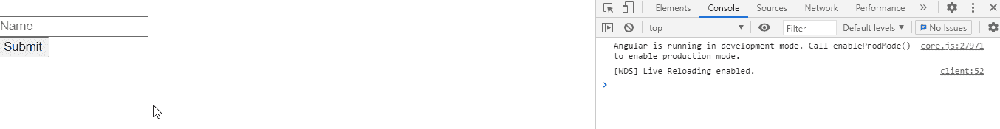

# 如何在 Angular 10 中检查窗体或控件是否无效？

> 原文:[https://www . geesforgeks . org/如何检查表单或控件是否无效或不在角度-10/](https://www.geeksforgeeks.org/how-to-check-whether-a-form-or-a-control-is-invalid-or-not-in-angular-10/)

在本文中，我们将检查 Angular 10 中的表单是否无效。**无效属性**用于报告控件或表单是否无效。

**语法:**

```
form.invalid 
```

**返回值:**

*   **布尔值:**将布尔值设为检查表单是否无效。

**模块:**无效属性使用的模块是:

*   模具模块

**进场:**

*   创建要使用的角度应用程序。
*   在 app.component.html，使用表单指令制作表单。
*   在 app.component.ts 中，使用无效属性获取信息。
*   使用 ng serve 为 angular app 服务，以查看输出。

**例 1:**

## app.component.ts

```
import { Component } from '@angular/core';
import { FormGroup, FormControl, FormArray, Validators }
 from '@angular/forms'

@Component({
  selector: 'app-root',
  templateUrl: './app.component.html',
  styleUrls: ['./app.component.css']
})
export class AppComponent {
  form = new FormGroup({
    name: new FormControl(

    ),
    rollno: new FormControl() 
});

get name(): any {
  return this.form.get('name');
}

onSubmit(): void {
  console.log("Form is invalid : ",this.form.invalid);
}
}
```

## app.component.html

```
<form [formGroup]="form" (ngSubmit)="onSubmit()">
  <input formControlName="name" placeholder="Name">
<br>
<button type='submit'>Submit</button>
<br>
<br>
</form>
```

**输出:**



**参考:**[**https://angular . io/API/forms/AbstractControlDirective #无效**](https://angular.io/api/forms/AbstractControlDirective#invalid)