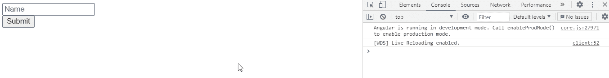

# 如何在 Angular 10 中检查窗体或控件是否被触摸？

> 原文:[https://www . geeksforgeeks . org/如何检查窗体或控件是否被触摸或不处于角度-10/](https://www.geeksforgeeks.org/how-to-check-whether-a-form-or-a-control-is-touched-or-not-in-angular-10/)

在本文中，我们将检查在 Angular 10 中是否触摸了表单。**触摸属性**用于报告控件或表单是否被触摸。

**语法:**

```ts
form.touched
```

**返回值:**

*   **布尔值:**将布尔值设置为检查表单是否被触摸。

**模块:**被触摸属性使用的模块为:

*   模具模块

**进场:**

*   创建要使用的角度应用程序。
*   在 app.component.html，使用表单指令制作表单。
*   在 app.component.ts 中，使用 touched 属性获取信息。
*   使用 ng serve 为 angular app 服务，以查看输出。

**示例:**

## app.component.ts

```ts
import { Component } from '@angular/core';
import { FormGroup, FormControl, FormArray, 
        Validators } from '@angular/forms'

@Component({
  selector: 'app-root',
  templateUrl: './app.component.html'
})

export class AppComponent {
  form = new FormGroup({
    name: new FormControl(
    ),
    rollno: new FormControl() 
  });

  get name(): any {
    return this.form.get('name');
  }

  onSubmit(): void {
    console.log("Form is touched : ",this.form.touched);
  }
}
```

## app.component.html

```ts
<form [formGroup]="form" (ngSubmit)="onSubmit()">
  <input formControlName="name" placeholder="Name">
  <br>

  <button type='submit'>Submit</button>
  <br><br>
</form>
```

**输出:**



**参考:**[https://angular . io/API/forms/abstractcontroldirectional #触动](https://angular.io/api/forms/AbstractControlDirective#touched)