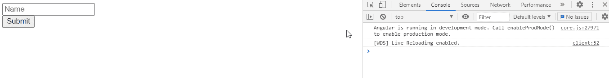

# 如何在 Angular 10 中检查窗体或控件是否有效？

> 原文:[https://www . geesforgeks . org/如何检查表单或控件是否有效-角度-10/](https://www.geeksforgeeks.org/how-to-check-whether-a-form-or-a-control-is-valid-or-not-in-angular-10/)

在本文中，我们将检查在 Angular 10 中是否触摸了表单。**有效属性**用于指示控件或表单是否有效。

**语法:**

```
form.valid
```

**返回值:**

*   **布尔值:**将布尔值设为检查表单是否有效。

**模块:**有效属性使用的模块是:

*   模具模块

**进场:**

*   创建要使用的角度应用程序。
*   在 app.component.html，使用表单指令制作表单。
*   在 app.component.ts 中，使用有效属性获取信息。
*   使用 ng serve 为 angular app 服务，以查看输出。

**示例:**

## java 描述语言

```
import { Component } from '@angular/core';
import { FormGroup, FormControl, 
    FormArray, Validators } from '@angular/forms'

@Component({
    selector: 'app-root',
    templateUrl: './app.component.html'
})

export class AppComponent {
    form = new FormGroup({
        name: new FormControl(

        ),
        rollno: new FormControl()
    });

    get name(): any {
        return this.form.get('name');
    }

    onSubmit(): void {
        console.log("Form is valid : ", this.form.valid);
    }
}
```

## app.component.html

```
<form [formGroup]="form" (ngSubmit)="onSubmit()">
    <input formControlName="name" placeholder="Name">
    <br>

    <button type='submit'>Submit</button>
    <br><br>
</form>
```

**输出:**



**参考:**T2>https://angular.io/api/forms/AbstractControlDirective#valid