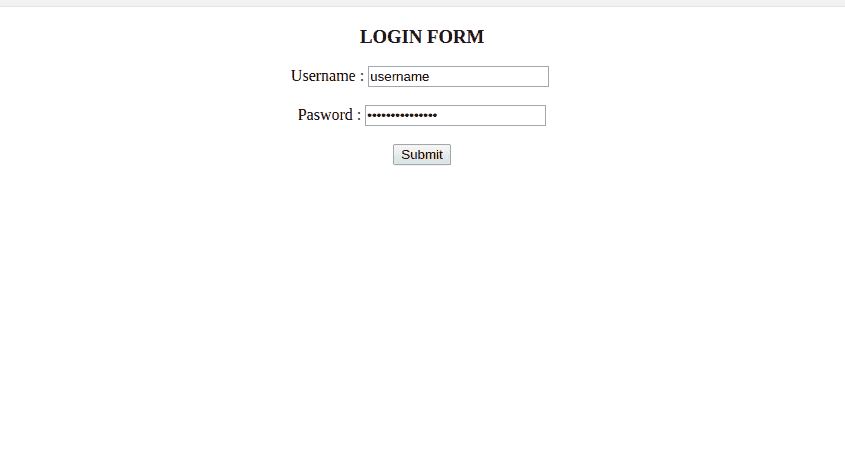
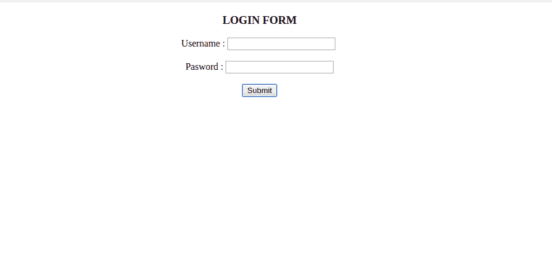

# 在 Angular 2 中提交后如何清除表单？

> 原文:[https://www . geesforgeks . org/angular-2 中提交后如何清除表单/](https://www.geeksforgeeks.org/how-to-clear-form-after-submission-in-angular-2/)

在 Angular 2 中，它们是两种类型的形式:

*   模板驱动的表单。
*   反应形式。

在模板驱动的表单中，大部分内容将在中填充。html 文件。
在反应形式中，大部分功能和内容将在`.ts`文件中执行。反应式表单的主要优势是，我们可以创建自定义验证，第二个关键优势是当我们执行单元测试时，因为 HTML 代码将是干净的，所以编写单元测试更可行。

以模板驱动方式重置表单:

在模板驱动的方法中，我们需要从“@angular/forms”中导入一个表单，并使用[(ngModel)]指令进行双向数据绑定，我们还应该从`app.module.ts`文件中的“**@ angular/forms”**中导入 **FormsModule** 。在下面一行中显示了输入格式。除此之外，当我们提到 ngModel 指令时，我们需要向输入类型添加 name 属性。

```
import { FormsModule } from '@angular/forms';
```

在反应表单中，我们需要从`'@angular/forms'`导入表单组。

在以各自的方式导入上述模块后，角形模块提供了一种称为 reset()的内置方法。我们可以使用方法并重置表单。

**示例:** `.html`文件

```
// In .html file
<form #login="ngForm" (ngSubmit)="completeLogin(login)">
    <h3>Login Form</h3>
  <label for="name">Username :</label>
  <input type="text" [(ngModel)]="username" name="name" id="name">

  <label for="password">Password :</label>
  <input type="password"
        [(ngModel)]="password"
        name="name" 
        id="password">

  <button type="submit">Submit</button>

</form>
```

**示例:** `.ts`文件

```
import {NgForm} from '@angular/forms'
import { Component, OnInit } from '@angular/core';

@Component({
  selector: "app-login",
  templateUrl: "./login.html",
  styleUrls: [],
})

export class Sample implements OnInit{

constructor(){}

ngOninit(){
}

username='';
password='';

completeLogin(login :NgForm){
 // In .ts file

login.reset() 
// call this inbuilt method to reset the form

}

}
```

**在反应形式中重置形式:**

**示例:** `.html`文件

```
<form [formGroup]="login" (ngSubmit)="completeLogin()">
     // In.html file
  <h3>Login Form</h3>
.
.  <label for="name">Username :</label>
  <input type="text" formControlName="username" id="name">

  <label for="password">Password :</label>
  <input type="password" 
         formControlName="password" id="password">

  <button type="submit">Submit</button>
</form>
```

**示例:** `.ts`文件

```
import {FormGroup, FormControl} from '@angular/forms' 
import { Component, OnInit } from '@angular/core';

@Component({
  selector: "app-signin",
  templateUrl: "./signin.html",
  styleUrls: ["],
})

export class Sample implements OnInit{    
// In.ts file

login:FormGroup;
constructor(){}

ngOninit(){

login=newFormGroup({
username:new FormControl(''),
password:new FormControl(''),
})

}

completeLogin(){   

this.login.reset();  
// calling this method will reset the method

}

}
```

输出:



提交表单后，输出将是:

