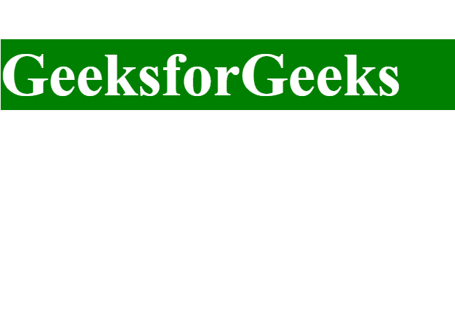
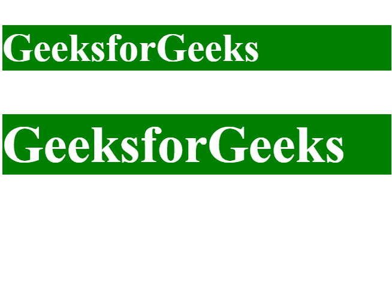

# ng 类和 ng 风格如何结合？

> 原文:[https://www . geesforgeks . org/如何将 ng 类与 ng 样式结合/](https://www.geeksforgeeks.org/how-to-combine-ng-class-with-ng-style/)

使用 **ng-style** 设置样式属性。 **ng-style** 的值是一个对象，用于引用应用于元素的 CSS 样式。

**语法:**

```ts
<element ng-style="object">..</element>
```

**属性:**
**对象**:对象用于返回应用于元素的 css 样式。

**返回值:**返回应用于 ng 类元素的样式。

**例 1:**

```ts

<!DOCTYPE html>
<html>
<script src=
"https://ajax.googleapis.com/ajax/libs/angularjs/1.6.9/angular.min.js">
  </script>

<body ng-app="gfg" 
      ng-controller="geekctrl">

    <h1 ng-style="geekstyle">
      GeeksforGeeks
  </h1>

    <script>
        var app = angular.module("gfg", []);
        app.controller(
          "geekctrl", function($scope) {
            $scope.geekstyle = {
                "color": "white",
                "background-color": "green",
                "font-size": "80px",

            }
        });
    </script>

</body>

</html>
```

**输出:**


**例 2:**

```ts
<!DOCTYPE html>
<html>
<script src=
"https://ajax.googleapis.com/ajax/libs/angularjs/1.6.9/angular.min.js">
  </script>

<body ng-app="gfg" 
      ng-controller="geekctrl">

    <h1 ng-style="geekstyle">
      GeeksforGeeks
  </h1>
    <h2 ng-style="geekstyle1">
      GeeksforGeeks
  </h2>
    <script>
        var app = angular.module("gfg", []);
        app.controller("geekctrl", function($scope) {
            $scope.geekstyle = {
                "color": "white",
                "background-color": "green",
                "font-size": "60px",

            }
            $scope.geekstyle1 = {
                "color": "white",
                "background-color": "green",
                "font-size": "80px",

            }
        });
    </script>

</body>

</html>
```

**输出:**


**浏览器支持:**列出的浏览器支持 **ng 级**和 **ng 风格**–

*   微软公司出品的 web 浏览器
*   火狐浏览器
*   谷歌 Chrome
*   歌剧
*   旅行队