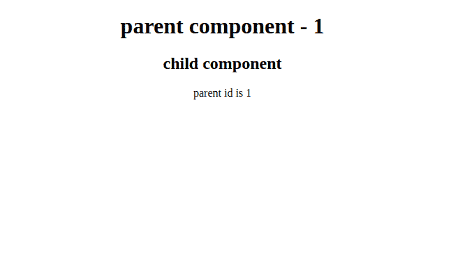

# Angular 9 中父组件与子组件如何通信？

> 原文:[https://www . geesforgeks . org/如何沟通-从父组件到子组件-in-angular-9/](https://www.geeksforgeeks.org/how-to-communicate-from-parent-component-to-the-child-component-in-angular-9/)

棱角分明使得组件之间的交流非常容易。在本文中，我们将学习如何从父组件与子组件进行通信。

**进场:**

*   让我们创建两个组件:
    1.  父母
    2.  儿童
*   在父组件中，声明您想要在子组件中接收的属性，比如“ParentId”。
*   在父组件中包含子组件时，使用属性绑定将“ParentId”属性绑定到子组件。

    ```
    <child [id] = "parentid"></child>
    ```

*   现在在子组件中导入**从 **@angular/core** 输入**，创建一个由 **@input** 修饰器修饰的属性，从父组件接收“ParentId”。属性的名称应该与用于绑定“ParentId”属性(即“Id”)的名称相同。
*   “ParentId”将作为“Id”在子组件中成功接收。

**示例:**

*   在这个例子中，我们将创建一个属性`'ParentId'`，并在子组件中接收它。
    让我们为父组件编写代码。

    ```
    import { Component } from '@angular/core';

    @Component({
      selector: 'app-root',

    // code for parent component view.

      template:`
      <div style="text-align: center;">
      <h1>
        parent component - {{parentid}}
      </h1>
      </div>

    // Bind the ParentId to child component.

      <child [id] = "parentid"></child>
      `,
      styleUrls: []
    })
    export class AppComponent {

    // This property is to be sent to the child component.

    parentid: number = 1;

    }
    ```

*   现在为子组件

    ```
    import { Component, OnInit, Input} from '@angular/core';

    @Component({
      selector: 'child',
      template: `
      <div style="text-align: center;">
      <h2>child component</h2>

    // property successfully received from the parent component.

      parent id is {{id}}
      </div>
      `,
      styles: []
    })
    export class TestComponent implements OnInit {

    // @input decorator used to fetch the 
    // property from the parent component.

      @Input()
      id: number;

      ngOnInit(): void {
      }

    }
    ```

    编写代码

**输出:**
