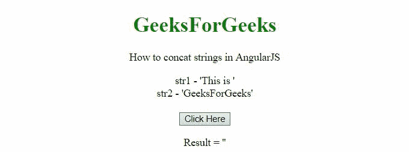

# 如何用 AngularJS 连接字符串？

> 原文:[https://www . geesforgeks . org/how-concat-strings-use-angularjs/](https://www.geeksforgeeks.org/how-to-concat-strings-using-angularjs/)

在本文中，我们将看到如何在 AngularJS 中连接字符串。在 AngularJS 中有很少的方法可以连接字符串。在本文中，我们将看到其中的两个。

**示例 1:** 在第一个示例中，我们使用**“+”运算符**来连接字符串

## 超文本标记语言

```tshtml
<!DOCTYPE HTML> 
<html> 

<head>
    <script src=
"https://ajax.googleapis.com/ajax/libs/angularjs/1.2.13/angular.min.js">
    </script>
    <script>
        var myApp = angular.module("app", []);
        myApp.controller("controller", function($scope) {
            $scope.str1 = 'This is ';
            $scope.str2 = 'GeeksForGeeks';
            $scope.res = '';
            $scope.join = function() {
                $scope.res = $scope.str1 + $scope.str2;
            };
        });
    </script>
</head>

<body style = "text-align:center;">
    <h1 style = "color:green;">  
        GeeksForGeeks  
    </h1>

    <p>
        How to concat strings in AngularJS
    </p>

    <div ng-app = "app">  
        <div ng-controller = "controller">
            str1 - '{{str1}}'
            <br>
            str2 - '{{str2}}'
            <br>
            <br>
            <input type = "button" 
                ng-click = "join()" value = "Click Here">
            <br>

            <p>Result = '{{res}}'</p>
        </div>
    </div>
</body>   

</html>
```

**输出:**



**示例 2:** 在第二个示例中，我们将使用标准的 **concat()方法**进行连接。

## 超文本标记语言

```tshtml
<!DOCTYPE HTML> 
<html> 

<head>
    <script src=
"https://ajax.googleapis.com/ajax/libs/angularjs/1.2.13/angular.min.js">
    </script>

    <script>
        var myApp = angular.module("app", []);
        myApp.controller("controller", function($scope) {
            $scope.str1 = 'This is ';
            $scope.str2 = 'GeeksForGeeks';
            $scope.res = '';
            $scope.join = function() {
                $scope.res = $scope.str1.concat($scope.str2);        
            };
        });
    </script>
</head>

<body style = "text-align:center;">
    <h1 style = "color:green;">  
        GeeksForGeeks  
    </h1>

    <p>
        How to concat strings in AngularJS
    </p>

    <div ng-app = "app">  
        <div ng-controller = "controller">
            str1 - '{{str1}}'
            <br>
            str2 - '{{str2}}'
            <br>
            <br>
            <input type = "button" 
                ng-click = "join()" value = "Click Here">
            <br>

            <p>Result = '{{res}}'</p>
        </div>
    </div>
</body>   

</html>
```

**输出:**

