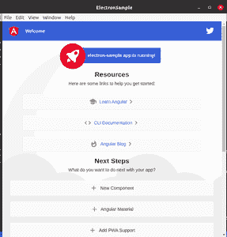
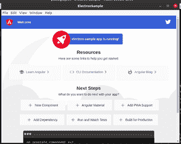

# 如何用电子把 angular 4 应用转换成桌面应用？

> 原文:[https://www . geeksforgeeks . org/如何使用电子将 angular-4 应用程序转换为桌面应用程序/](https://www.geeksforgeeks.org/how-to-convert-angular-4-application-to-desktop-application-using-electron/)

使用电子 JS，我们可以非常容易地将我们现有的角度项目转换成桌面应用程序。在这篇文章中，我们将创建一个示例 Angular 项目，并逐步将其转换为桌面应用程序。

**先决条件:**

*   [必须安装 NPM](https://www.geeksforgeeks.org/node-js-npm-node-package-manager/)

**环境设置:**

*   安装角度命令行界面:

```
npm install -g @angular/cli
```

*   创建新的角度项目。这里我们的项目名称是“**电子样品**”:

```
ng new electron-sample
cd electron-sample
```

*   现在运行项目，打开 *http://localhost:4200* 检查安装是否成功。

```
ng serve -o
```

*   安装电子 JS 作为开发依赖项:

```
npm install electron --save-dev
```

*   我们还需要一个名为**电子包装机**的包装。这个包将捆绑我们的应用程序，并产生桌面应用程序文件。全球安装:

```
npm install -g electron-packager
```

**示例:**在根目录中，创建一个文件 **main.js** ，它将成为电子的入口点。在 **main.js** 中添加以下代码:

## java 描述语言

```
const { app, BrowserWindow } = require("electron");
const path = require("path");
const url = require("url");

let win;
function createWindow() {
  win = new BrowserWindow({ width: 700, height: 700 });
  // load the dist folder from Angular
  win.loadURL(
    url.format({

      // compiled version of our app
      pathname: path.join(__dirname, '/dist/index.html'), 
      protocol: "file:",
      slashes: true
    })
  );
  win.on("closed", () => {
    win = null;
  });
}
app.on("ready", createWindow);
// If you are using MACOS, we have to quit the app manually 
app.on("window-all-closed", () => {
  if (process.platform !== "darwin") {
    app.quit();
  }
});
```

在上面的代码中，我们简单地打开了 Angular 应用程序的编译版本，该版本位于 **dist/** 目录中。请注意，我们直接提供了 dist 文件夹，因此这段代码可以在任何应用程序上运行。但是文件**index.html**位于子目录中。因此，在 **angular.json** 中，按如下方式更改**输出路径**键中的值。

```
...
"architect": {
       "build": {
         "builder": "@angular-devkit/build-angular:browser",
         "options": {
           // Make changes in this line
           "outputPath": "dist",   
           "index": "src/index.html",
           ....
```

这将把编译后的文件保存到 dist 文件夹，而不是子目录。在 src/index.html 中，将行**<base href = "/>**更改为 **< base href= "。/>**如下。

```
<head>
 <meta charset="utf-8">
 <title>ElectronSample</title>
 <base href="./">   ***<!-- Change this line -->***
 <meta name="viewport" content="width=device-width, initial-scale=1">
 <link rel="icon" type="image/x-icon" href="favicon.ico">
</head>
```

现在在 **package.json** 中，我们除了要指向电子 app 的起点之外，还要为我们的 app 的开发和测试添加一些命令。在**包**中添加以下行

```
{
 "name": "electron-sample",
 "version": "0.0.0",
 // This line will provide an entry 
 // point for the electron app
 "main": "main.js",
 "scripts": {
   // Runs the app after compilation
   "electron": "electron .", 
   // Compiles and runs the app
   "electron-build": "ng build --prod && electron .",
   "ng": "ng",
   "start": "ng serve",
   "build": "ng build",
   "test": "ng test",
   "lint": "ng lint",
   "e2e": "ng e2e"
 },
 ...
 ...
```

现在我们可以通过运行该应用程序来测试它/

```
npm run electron-build
```

请注意，如果我们在全球范围内安装了 electron，我们可以直接运行这些命令。您应该会看到以下输出:

**输出:**



对于已编译的应用程序，我们可以使用直接运行该应用程序

```
npm run electron
```

当我们创建了最终的应用程序时，我们可以生成编译后的文件，这些文件可以直接在我们的系统上使用，而无需安装依赖项。电子打包模块帮助我们构建二进制文件。

```
electron-packager . --platform=linux
```

这里我们可以在*达尔文、Linux、Mac 和 win32* 中选择我们的平台。执行上述命令将创建一个带有应用程序和操作系统名称的新文件夹。在这个目录中打开终端:

```
sudo chmod +x electron-sample
./electron-sample
```

这将打开应用程序，您应该会看到以下输出:

**输出:**

