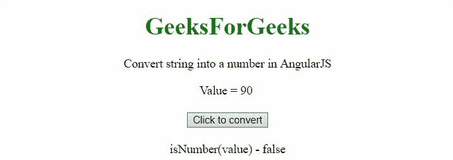
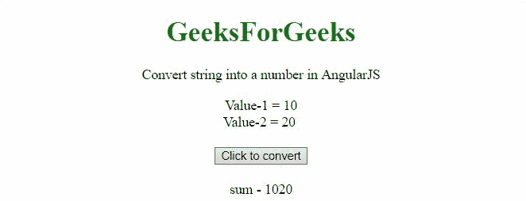

# 如何用 AngularJS 将字符串转换成数字？

> 原文:[https://www . geeksforgeeks . org/如何使用-angularjs/](https://www.geeksforgeeks.org/how-to-convert-string-into-a-number-using-angularjs/) 将字符串转换为数字

在本文中，我们将看到如何借助 AngularJS 将字符串转换为数字。

**进场:**

*   **parsent()方法**用于将字符串转换为整数。
*   我们将通过 **isNumber()方法检查字符串是否为整数。**

**示例 1:** 在第一个示例中，字符串**‘90’**被转换为整数。

## 超文本标记语言

```html
<!DOCTYPE HTML>
<html>

<head>
    <script src=
"https://ajax.googleapis.com/ajax/libs/angularjs/1.2.13/angular.min.js">
    </script>

    <script>
        var myApp = angular.module("app", []);
        myApp.controller("controller", function ($scope) {
            $scope.a = '90';
            $scope.isNumberA = angular.isNumber($scope.a);
            $scope.convertToInt = function () {
                $scope.a = parseInt($scope.a);
                $scope.isNumberA = angular.isNumber($scope.a);
            };
        });
    </script>
</head>

<body style="text-align:center;">
    <h1 style="color:green;">
        GeeksForGeeks
    </h1>

    <p>
        Convert string into a 
        number in AngularJS
    </p>

    <div ng-app="app">
        <div ng-controller="controller">
            Value = {{a}}
            <br>
            <br>
            <button ng-click='convertToInt()'>
                Click to convert
            </button>
            <br>
            <br>
            isNumber(value) - {{isNumberA}}<br>
        </div>
    </div>
</body>

</html>
```

**输出:**



**例 2:** 将 2 个字符串相加，然后转换为整数，再相加。

## 超文本标记语言

```html
<!DOCTYPE HTML>
<html>

<head>
    <script src=
"https://ajax.googleapis.com/ajax/libs/angularjs/1.2.13/angular.min.js">
    </script>

    <script>
        var myApp = angular.module("app", []);
        myApp.controller("controller", function ($scope) {
            $scope.a = "10";
            $scope.b = "20";
            $scope.strToInt = function () {
                $scope.a = parseInt($scope.a);
                $scope.b = parseInt($scope.b);
            };
        });
    </script>
</head>

<body style="text-align:center;">
    <h1 style="color:green;">
        GeeksForGeeks
    </h1>

    <p>
        Convert string into a 
        number in AngularJS
    </p>

    <div ng-app="app">
        <div ng-controller="controller">
            Value-1 = {{a}}
            <br>
            Value-2 = {{b}}
            <br><br>
            <button ng-click='strToInt()'>
                Click to convert
            </button>
            <br><br>
            sum - {{a + b}}<br>
        </div>
    </div>
</body>

</html>
```

**输出:**

