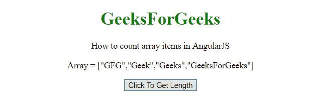
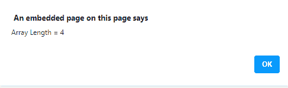
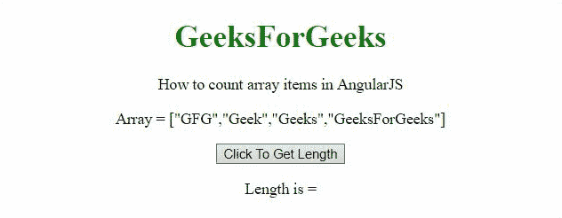

# 如何统计 AngularJS 中的数组项？

> 原文:[https://www . geesforgeks . org/如何计数数组中的项目 angularjs/](https://www.geeksforgeeks.org/how-to-count-array-items-in-angularjs/)

给定一个数组，任务是获取 AngularJS 中数组变量的长度。为此，我们将使用**。length()方法**获取一个数组变量的长度。

**示例 1:** 在本例中，数组长度由警告框显示。

## 超文本标记语言

```tshtml
<!DOCTYPE HTML>
<html>

<head>
    <script src=
"https://ajax.googleapis.com/ajax/libs/angularjs/1.2.13/angular.min.js">
    </script>

    <script>
        var myApp = angular.module("app", []);
        myApp.controller("controller", function ($scope) {
            $scope.arr = ['GFG', 'Geek', 
                'Geeks', 'GeeksForGeeks'];
            $scope.length = '';
            $scope.getLen = function () {
                $scope.length = $scope.arr.length;
                alert("Array Length = " + $scope.length);
            };
        });
    </script>
</head>

<body style="text-align:center;">
    <h1 style="color:green;">
        GeeksForGeeks
    </h1>

    <p>
        How to count array items in AngularJS
    </p>

    <div ng-app="app">
        <div ng-controller="controller">

            <p>Array = {{arr}}</p>

            <button ng-click="getLen()">
                Click To Get Length
            </button>
        </div>
    </div>
</body>

</html>
```

**输出:**

*   **点击按钮前:**



*   **点击按钮后:**



**示例 2:** 在本例中，长度显示在< p >元素中。

## 超文本标记语言

```tshtml
<!DOCTYPE HTML>
<html>

<head>
    <script src=
"https://ajax.googleapis.com/ajax/libs/angularjs/1.2.13/angular.min.js">
    </script>

    <script>
        var myApp = angular.module("app", []);
        myApp.controller("controller", function ($scope) {
            $scope.arr = ['GFG', 'Geek', 
                    'Geeks', 'GeeksForGeeks'];
            $scope.length = '';
            $scope.getLen = function () {
                $scope.length = $scope.arr.length;
            };
        });
    </script>
</head>

<body style="text-align:center;">
    <h1 style="color:green;">
        GeeksForGeeks
    </h1>

    <p>
        How to count array items in AngularJS
    </p>

    <div ng-app="app">
        <div ng-controller="controller">

            <p>Array = {{arr}}</p>

            <button ng-click="getLen()">
                Click To Get Length
            </button>

            <p>Length is = {{length}}</p>

        </div>
    </div>
</body>

</html>
```

**输出:**

