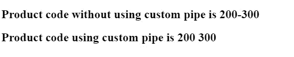
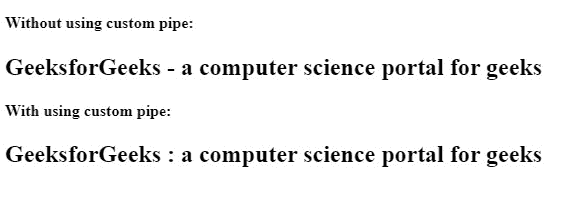

# 如何在 AngularJS 中创建自定义管道？

> 原文:[https://www . geesforgeks . org/如何创建自定义管道 in angularjs/](https://www.geeksforgeeks.org/how-to-create-a-custom-pipe-in-angularjs/)

在本文中，我们将学习如何生成自定义管道，而不是在 Angular 中使用内置管道&并探索其实现。管道是一种功能，用于在将数据呈现给用户之前修改数据。一些预先构建的管道是日期、大写、小写、货币、小数、数字等。Angular 有一个名为[数据绑定](https://www.geeksforgeeks.org/angularjs-data-binding/)的强大功能，帮助我们将类属性绑定到 HTML 元素属性。有时，在向用户显示数据之前，我们需要显示格式正确的数据。例如，如果我们需要打印日期，那么可能会打印出与用户无关的长格式日期。因此，管道用于在数据显示在浏览器上之前转换数据。我们可以使用管道来更改属性值，以使它们更加用户友好或适合特定区域。我们可以假设管道是可以接受参数、执行计算和返回一些东西的函数。管道将字符串、整数、日期和数组作为输入值，由“|”后跟管道名称分隔，并返回格式化结果。通过包含冒号和参数值来定义参数。为了保存文件，我们需要将其保存为 *<文件名> .pipe.ts* 。使用组件模板表达式中的管道显示转换值的语法如下:

**语法:**

```
{{ inputValue | *pipename : parameter* }}
```

然而，我们可能会遇到希望在数据转换中添加更复杂功能的情况。因此，Angular 提供了自定义管道。自定义管道可用于各种用例，如格式化电话号码、突出显示搜索结果关键字、返回数字的平方等。为了生成自定义管道，我们可以遵循两种方法:

*   通过为管道创建一个单独的文件，我们必须用组件文件手动设置和配置管道功能&需要将其导入到模块文件中。
*   通过使用 Angular CLI，它将自动在组件和模块文件中设置所有必要的配置。

我们将通过一系列的例子来理解这两种方法。

**方法 1:** 让我们按照以下步骤手动生成自定义管道:

**步骤 1:** 构造一个实现 PipeTransform 接口的类。确保导出该类，以便其他组件可以使用它来导入管道。使用大写字母书写管道类的名称。在本例中，我们将该类命名为*仲裁管道*。

```
export class ArbitraryPipe implements PipeTransform {}
```

**第二步:**pipe Transform 界面有一个 transform 方法。在 transform 方法中，我们编写代码来转换和返回值。在这种情况下，我们希望传入要用空格替换的字符。方法返回类型也被定义为字符串，因为我们返回的是转换后的字符串。

```
export class ArbitraryPipe implements PipeTransform {
  transform(value: string, character: string): string {
    return value.replace(character, ' ');
  }
}
```

**步骤 3:** 要使类成为管道，请向其添加管道装饰器。这是一个函数，所以我们像其他装饰者一样添加括号。管道的名称在传递给函数的对象中指定。模板中将使用管道的名称。

```
@Pipe({
  name: 'arbitrary'
})
export class ArbitraryPipe implements PipeTransform {
  transform(value: string, character: string): string {
    return value.replace(character, ' ');
  }
}
```

**第四步** ***:*** 从 *@angular/core* 导入管道和管道变换，这样我们就可以分别从这些模块使用管道装饰器和管道变换接口。

## 任意. pipe.ts

```
import { Pipe, PipeTransform } from '@angular/core';

@Pipe({
  name: 'arbitrary'
})
export class ArbitraryPipe implements PipeTransform {
  transform(value: string, character: string): string {
    return value.replace(character, ' ');
  }
}
```

**第 5 步** ***:*** 现在我们使用组件模板中的任意管道。只需将管道和管道名称添加到模板中，即可使用任意管道。使用冒号分隔转换所需的任何参数。转换方法的第一个参数是要转换的值，在本例中是我们的 productCode。这是我们的管道名称。冒号表示管道参数，因此我们的破折号作为转换方法的第二个参数提供。然后根据方法的逻辑转换传入的值，并返回和显示修改后的字符串。

## app.component.html

```
<h2>Product code without using custom pipe is {{productCode}} </h2>

<h2>Product code using custom pipe is {{productCode | arbitrary:'-'}} </h2>
```

**第六步** ***:*** 在这种情况下，我们需要导入模块文件中的 ArbitraryPipe，也可以将我们的任意 Pipe 添加到 *app.module.ts* 文件中的@NgModule 的声明数组中，在 AppModule 中进行声明。

## app.module.ts

```
import { BrowserModule } from '@angular/platform-browser';
import { NgModule } from '@angular/core';

import { AppComponent } from './app.component';
import { ArbitraryPipe } from './arbitrary.pipe';

@NgModule({
  declarations: [AppComponent, ArbitraryPipe],
  imports: [BrowserModule],
  providers: [],
  bootstrap: [AppComponent]
})
export class AppModule {}
```

我们的 *app.component.ts* 文件如下所示:

## app.component.ts

```
import { Component } from '@angular/core';

@Component({
  selector: 'my-app',
  templateUrl: './app.component.html'
})
export class AppComponent {
  productCode = '200-300';
```

**输出:**



**方法 2:** 在这种情况下，我们将使用 Angular CLI 生成管道& Angular CLI 将处理我们在第一种方法即中执行的所有配置设置。，它会自动导入随机管道&将其包含在申报数组中，还会配置 *random.pipe.ts 文件*。要生成管道，我们遵循以下命令:

```
ng generate pipe random
```

该命令将生成一个名为 *random.pipe.ts* 的文件，其中包含在应用程序根级别实现定制管道的示例代码。它还将为编写单元测试构建一个规范文件，并修改 app.module.ts 中的引用。

## random.pipe.ts

```
import { Pipe, PipeTransform } from '@angular/core';

@Pipe({
  name: 'random'
})
export class RandomPipe implements PipeTransform {
  transform(value: string, character: string): string {
    return value.replace(character, ': ');
  }
}
```

我们的 *app.component.ts* 文件如下所示:

## app.component.ts

```
import { Component } from '@angular/core';

@Component({
  selector: 'my-app',
  templateUrl: './app.component.html',
  styleUrls: ['./app.component.css']
})
export class AppComponent {
  name = 'GeeksforGeeks -  a computer science portal for geeks ';
}
```

我们可以在 HTML 模板中使用管道声明。

## app.component.html

```
<h4>Without using custom pipe: </h4>
<h2>{{name}}</h2>
<h4>With using custom pipe:</h4>
<h2>{{name | random: '-'}}</h2>
```

## app.module.ts

```
import { NgModule } from '@angular/core';
import { BrowserModule } from '@angular/platform-browser';
import { FormsModule } from '@angular/forms';

import { AppComponent } from './app.component';
import { RandomPipe } from './random.pipe';

@NgModule({
  imports: [BrowserModule, FormsModule],
  declarations: [AppComponent, RandomPipe],
  bootstrap: [AppComponent]
})
export class AppModule {}
```

**输出:**运行 *ng 发球*命令后，将显示以下输出。

