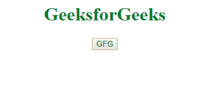
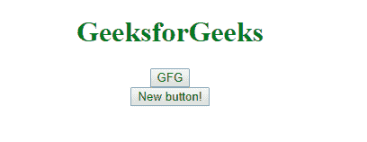

# 如何在 Angular 中用点击事件动态创建按钮？

> 原文:[https://www . geesforgeks . org/how-to-create-button-dynamic-with-click-in-event-angular/](https://www.geeksforgeeks.org/how-to-create-button-dynamically-with-click-event-in-angular/)

任务是使用 angular 通过点击事件动态创建一个按钮。在这些例子中，当有人点击按钮时，就会创建一个新的按钮。

在 AngularJS 中创建按钮最简单的方法是使用 *ng-repeat* 指令。我们可以很容易地在按钮点击事件中连接一个重复逻辑。

**语法:**

```
<element ng-repeat="variable in expression"> Contents... </element>
```

**示例:**这里我们有一个*计数器*变量，它保存 DOM 中当前存在的按钮的计数。每次按下主按钮(GFG)时，它都会增加 1。计数增加后，ng-repeat 会生成一个新按钮。

```
<!DOCTYPE html>
<html ng-app="myApp">

<head>
    <script src=
"https://ajax.googleapis.com/ajax/libs/angularjs/1.7.8/angular.min.js">
    </script>
</head>

<body ng-controller="MyController">
    <center>
        <h1 style="color:green">
          GeeksforGeeks
      </h1>
        <button type="button" 
                ng-click="click(this)">
          GFG
      </button>
        <br>
        <!-- Dynamically created 
button using repeat -->
        <button type="button" 
                ng-repeat="i in range(0, counter)">
          New button!
      </button>
    </center>
</body>
<script type="text/javascript">
    var myApp = angular.module('myApp', []);

    myApp.controller('MyController', ['$scope', function($scope) {
        $scope.counter = 0;

        $scope.click = function($scope) {
            $scope.counter++;
        }
        $scope.range =
            function(min, max, step) {
                step = step || 1;
                var input = [];
                for (var i = min; i < max; i += step) {
                    input.push(i);
                }
                return input;
            };
    }]);
</script>

</html>
```

**输出:**当我们不断点击按钮时，DOM 中的按钮数量不断增加:


