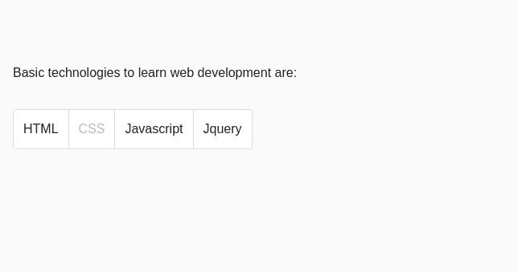

# 如何在 AngularJS 中将 mat-button-toggle-group 创建为只读模式？

> 原文:[https://www . geesforgeks . org/如何创建 mat-button-toggle-group-as-read-only-mode-in-angularjs/](https://www.geeksforgeeks.org/how-to-create-mat-button-toggle-group-as-read-only-mode-in-angularjs/)

Angular Material 是由 Angular 团队开发的 UI 组件库，用于构建桌面和移动网络应用程序的设计组件。

为了安装它，我们需要在我们的项目中安装 angular，一旦你有了它，你可以输入下面的命令并下载它。

**安装语法:**

```
ng add @angular/material
```

**进场:**

*   首先，使用上述命令安装角度材料。
*   安装完成后，从 app.module.ts 文件中的“@angular/material”导入“MatButtonToggleModule”。
*   然后使用<mat-button-toggle-group>和标签创建角度按钮切换组。</mat-button-toggle-group>
*   由于 MatButtonToggleModule 不包含只读属性，我们可以使用 disabled 属性使其成为只读的。
*   完成上述步骤后，就可以开始项目了。

**代码实现:**

**app.module.ts:**

## java 描述语言

```
import { NgModule } from '@angular/core';
import { BrowserModule } from 
    '@angular/platform-browser';
import { FormsModule } from '@angular/forms';

import { AppComponent } from './app.component';

import { BrowserAnimationsModule } from 
    '@angular/platform-browser/animations';

import { MatButtonModule } from 
    '@angular/material/button';
import { MatButtonToggleModule } from 
    '@angular/material/button-toggle';

@NgModule({
  imports:      [ BrowserModule, 
                  FormsModule, 
                  BrowserAnimationsModule, 
                  MatButtonModule,
                  MatButtonToggleModule ],
  declarations: [ AppComponent ],
  bootstrap:    [ AppComponent ]
})
export class AppModule { }
```

**app.component.html:**

## 超文本标记语言

```
<mat-button-toggle-group name="techno" 
    aria-label="technology">

    <mat-button-toggle value="html">
        HTML
    </mat-button-toggle>

    <mat-button-toggle disabled value="css">
        CSS
    </mat-button-toggle>

    <mat-button-toggle value="javascript">
        Javascript
    </mat-button-toggle>

    <mat-button-toggle value="jquery">
        Jquery
    </mat-button-toggle>
</mat-button-toggle-group>
```

**输出:**



**观察:**如果你清楚地观察上面的输出，你就能理解你不能选择，这就是只读属性的样子。