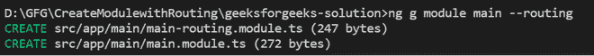
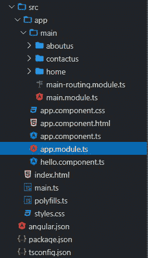
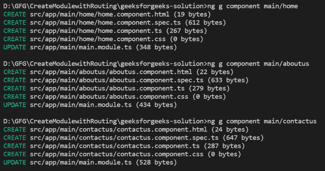
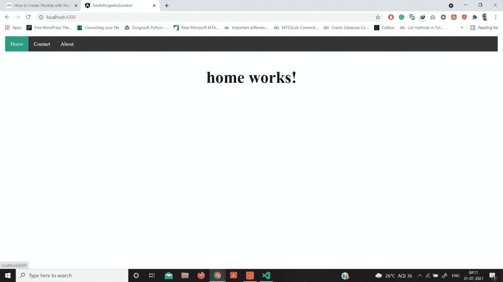

# 如何在 Angular 9 中用 Routing 创建模块？

> 原文:[https://www . geeksforgeeks . org/如何创建角度路由模块-9/](https://www.geeksforgeeks.org/how-to-create-module-with-routing-in-angular-9/)

Angular 应用是模块化的，NgModules 是 Angular 自己的模块化架构。模块是紧密集成的应用程序域、工作流或包含内聚代码块的功能集的容器。它们的范围由它们包含的模块控制，它们可以包含组件、服务提供者和其他代码文件。您可以从其他模块导入函数，也可以导出函数的子集供其他模块使用。

角度路由允许用户创建一个具有多个视图的*单页应用程序*，并允许在它们之间导航。用户可以在这些视图之间切换，而不会丢失应用程序状态和属性。在本文中，我们将讨论如何在 Angular 9 中创建带有路由的模块。我们将通过一个非常简单的示例来讨论如何在 Angular 9 应用程序中创建路由模块，以便您能够轻松理解它的工作原理。

我们将应用上述方法逐步构建路由模块。

*   **创建新的角度应用程序:**使用以下命令，我们可以快速创建角度应用程序:

    ```
    ng new geeksforgeeks-solution
    ```

*   **创建主模块:**进入我们的项目文件夹。我们希望在正确创建应用程序后，使用 Angular CLI 命令创建一个模块。在 angular 应用程序中，angular 给出一个命令来构造一个带有路由的模块。因此，要创建*主模块*，运行以下命令:

    ```
    ng g module main --routing
    ```

    运行上述命令成功后，它将在新文件夹名称中创建两个文件，作为**应用程序**文件夹中的**主**。

    

*   **导入-模块到模块. ts 文件:**我们只需将我们的模块导入到 *app.module.ts* 文件中，因此更新该文件如下所示:

**进场:**

*   创建要使用的 Angular 应用程序。
*   在应用程序组件内创建导航链接，然后向每条路线提供*“路线链接”*指令，并将路线值传递给*“路线链接”*指令。
*   然后将路由添加到 routing.module.ts 文件，然后将 routing.module.ts 导入 app.module.ts 文件。

**项目结构:**如下图所示:



**示例:**

## app.module.ts

```
import { NgModule } from "@angular/core";
import { BrowserModule } from "@angular/platform-browser";

import { AppRoutingModule } from "./app-routing.module";
import { AppComponent } from "./app.component";
import { MainModule } from "./main/main.module";

@NgModule({
  declarations: [AppComponent],
  imports: [BrowserModule, AppRoutingModule, MainModule],
  providers: [],
  bootstrap: [AppComponent],
})
export class AppModule {}
```

**为** **主模块创建组件:**我们现在使用以下命令为我们的*主模块*添加一个新组件，所以让我们为主模块创建*主页，关于我们*，以及*联系我们*组件:

```
ng g component main/home
ng g component main/aboutus
ng g component main/contactus
```

**成功运行上述命令后:**



**添加组件的路由:**在这一步中，我们只需添加带有我们创建的组件的路由，因此我们需要更新我们的*主模块*路由模块文件，如下所示:

## main-routing.module.ts

```
import { NgModule } from "@angular/core";
import { RouterModule, Routes } from "@angular/router";
import { AboutUsComponent } from "./about-us/about-us.component";
import { ContactUsComponent } from "./contact-us/contact-us.component";
import { HomeComponent } from "./home/home.component";

const routes: Routes = [
  { path: "", component: HomeComponent },
  { path: "aboutus", component: AboutUsComponent },
  { path: "contactus", component: ContactUsComponent },
];

@NgModule({
  imports: [RouterModule.forChild(routes)],
  exports: [RouterModule],
})
export class MainRoutingModule {}
```

**更新组件 HTML 文件:**最后，我们需要更新我们的应用组件的 HTML 文件，我们需要添加所有路由与路由器出口的绑定，所以我们更新如下所示:

## app.component.html

```
<!DOCTYPE html>
<html>
  <head>
    <style>
      ul {
        list-style-type: none;
        margin: 0;
        padding: 0;
        overflow: hidden;
        background-color: #333;
      }

      li {
        float: left;
      }

      li a {
        display: block;
        color: white;
        text-align: center;
        padding: 14px 16px;
        text-decoration: none;
      }

      li a:hover {
        background-color: #04aa6d;
      }

      .active {
        background-color: #333;
      }
    </style>
  </head>
  <body>
    <ul>
      <li><a class="active" href="#home" routerLink="/">Home</a></li>
      <li><a href="#contact" routerLink="/contactus">Contact</a></li>
      <li><a href="#about" routerLink="/aboutus">About</a></li>
    </ul>

    <div style="text-align: center; font-weight: bolder; font-size: 50px">
      <router-outlet></router-outlet>
    </div>
  </body>
</html>
```

现在，我们可以使用下面的命令运行示例应用程序:

```
ng serve
```

**输出:**



最终应用输出