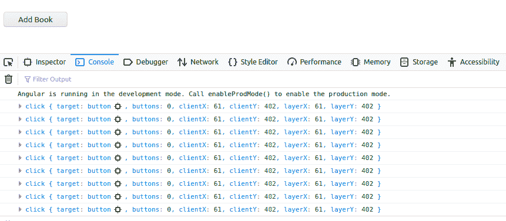

# 如何在 AngularJS 中使用 fromEvent 方法创建可观察的数据流？

> 原文:[https://www . geesforgeks . org/how-create-observable-data-stream-use-from-event-method-in-angularjs/](https://www.geeksforgeeks.org/how-to-create-observable-data-stream-using-fromevent-method-in-angularjs/)

在本文中，我们将学习 Observable 如何在 angular 应用程序中支持发布者和订阅者之间的数据共享。与 promises 之类的技术相比，Observable 被称为事件处理、异步编程和处理多个值的更好的技术。

*   **可观察的:**代表随着时间推移可以到达的数据流或数据源。但是，没有订阅者，可观察的是没有意义的。

*   **订阅者:**简单来说，它是一段关注可观察对象及其数据的代码。它获取数据，并使其可用于组件。

**先决知识:**

1.  Angular v6.2.9 或以上和 RxJs v6.4.0 或以上
2.  节点 v10.15.3 或更高版本以及 NPM v6.4.1 或更高版本

(注意:RxJs 自动安装 Angular，同样 NPM 自动安装 Node)

你一定已经理解了[可观察](https://www.geeksforgeeks.org/angular-7-observables/)的基本概念，并订阅了 Angular。如果没有，请按照文章[如何在 Angular 应用](https://social-coder.herokuapp.com/articles/l3e0rlbq6)中实现可观察-订阅。
**项目结构:**会是这样的


**创建可观察对象最常见和最简单的方法:**创建可观察对象最常见和最简单的方法是使用 RxJs 库提供的方法。这是一个第三方库，在您创建新的角度项目时会自动安装。其中一个方法是**从事件**。稍后我们将讨论其他方法，如间隔和计时器。

**FromEvent:** FromEvent 是 RxJs 提供的一种创建可观察对象的方法。最好的是，我们可以直接从 DOM 事件中创建可观察的对象。DOM 事件是指点击事件、按键事件、滚动事件等。这是一个简单的鼠标点击，我们可以创建一个数据流，即一个可观察的。FromEvent 会帮助我们解决这个问题。

**语法:**

```ts
fromEvent(target,eventName)
    .subscribe((res)=>{console.log(res)})
```

我们来谈谈这两个参数。

**目标**:可以是任意的 DOM EventTarget，比如按钮、单选按钮、滑块等。无论我们使用什么样的 DOM EventTarget，它都应该有注册/注销事件处理程序的方法。我们上面讨论的元素是内置机制。我们不必为此编写代码。

**事件名称**:是我们想听的事件类型。

**示例**:点击、鼠标下移、鼠标上移、点击、dblclick、鼠标移动、鼠标悬停、鼠标滚轮、鼠标移出、touchstart、touchmove、touchend、touchcancel、keydown、keypress、keyup 等。

**方法:**我们将在 UI 上创建一个简单的按钮“添加图书”，每次点击这个按钮，我们将创建一个数据流。为了简单起见，我们的数据流将只包含一个硬编码的字符串，即“Book”。每次点击，我们都会继续生成第一本书、第二本书、第三本书等等。为了在用户界面上显示该流，我们将创建一个空的< ul >，并在运行时继续将每本书作为一个列表项添加到< ul >中，即< li >。

**准备:**要从 DOM 元素触发的任何事件中创建可观察的对象，首先，我们需要获取对该 DOM 元素的引用。这可以使用 ViewChild 和 ElementRef 来完成。因此，这方面的代码可以写成:

*   **HTML:**

    ```ts
    <button #addBtn>Add</button>
    ```

*   **TypeScript:**

    ```ts
    @ViewChild(‘addBtn’, {static: true}) addBtn: ElementRef;
    ```

    这里，this.addBtn.nativeElement 返回原生的 DOM 元素。这将是我们的目标(准确地说是事件目标)，这是 fromEvent 方法的第一个参数。第二个参数是“点击”，因为我们使用的是按钮点击。所以，代码变成了:

    **JavaScript:**

    ```ts
    fromEvent(this.addBtn.nativeElement, 'click')
        .subscribe((res)=>{console.log(res)}
    ```

一个小问题出现了！我们把这一行代码放在哪里？

嗯，最好的地方是 ngAfterViewInit。这是因为除非完成，否则 ViewChild 不会初始化 addBtn 元素。因此，我们将把这段代码放在 ngAfterViewInit 中，因为优先级方面，它是组件加载时要执行的第一个方法。

**JavaScript:**

```ts
ngAfterViewInit() {
  fromEvent(this.addBtn.nativeElement, 'click')
    .subscribe((res) => {
      console.log(res);
    })
}
```

如果我们点击按钮，我们将在控制台上看到:



所有这些都是我们点击按钮时生成的数据流。

**先把它转换成工作代码开始吧。**

*   **步骤 1:创建一个新的角度项目**

    ```ts
    ng new observable-app
    ```

*   **步骤 2:创建一个名为 FromEventComponent** 的组件

    ```ts
    ng g c from-event
    ```

    应创建 4 个新文件，并更新 and app.module.ts

    

    所有必需的文件和更改

*   **步骤 3:创建服务打印服务**

    ```ts
    ng g s print-service
    ```

我们可以在没有服务的情况下做到这一点，但是要使我们的代码更加动态和有意义。让我们使用一项服务。这是正在做的。现在，让我们进行必要的更改，使其发挥作用。

## from-event.component.html

```ts
<!-- To display the data/stream on 
UI we will keep on adding each stream
as a list item in ul below -->
<ul id="elementContainer"></ul>

<!-- Button which will create a stream -->
<button #addBtn>Add Book</button>
```

## print-service.service.ts

```ts
printStream(containerName, stream) {
  let element = document.createElement('li');
  element.innerText = stream;
  document.getElementById(containerName).appendChild(element);
}
```

因为我们已经创建了一个名为 printStream 的方法。它将接受两个论点。第一个参数是要附加数据的 DOM 元素，第二个参数是我要附加的数据或流。现在我们可以将这个服务注入到组件中，并使用这个方法:

## from-event.component.ts

```ts
ngAfterViewInit() {
  let count = 1;
  fromEvent(this.addBtn.nativeElement, "click")
  .subscribe((res) => {
    this._printService.printStream(
      "elementContainer", "Book " + count++);
  })
}
```

我们采用了一个计数变量来区分流。它将继续用“Book”添加自动递增的整数。这里，在“这个”行。_ printservice . printstream(' element container '，' Book ' + count++)”，我们在告诉在哪里追加以及追加什么。

**最终代码:**

## from-event.component.html

```ts
<!-- To display the data/stream 
on UI we will keep on adding 
each stream as a list item in 
ul below -->
<ul id="elementContainer"></ul>

<!--Button which will create a stream-->
<button #addBtn>Add Book</button>
```

## from-event.component.ts

```ts
import { Component, ElementRef, OnInit, ViewChild } from "@angular/core";
import { fromEvent } from "rxjs";
import { PrintServiceService } from "../print-service.service";

@Component({
  selector: "app-from-event",
  templateUrl: "./from-event.component.html",
  styleUrls: ["./from-event.component.css"],
})
export class FromEventComponent implements OnInit {
  @ViewChild("addBtn", { static: true }) addBtn: ElementRef;
  constructor(private _printService: PrintServiceService) {}

  ngOnInit() {}

  ngAfterViewInit() {
    let count = 1;
    fromEvent(this.addBtn.nativeElement, "click").subscribe((res) => {
      this._printService.printStream("elementContainer", "Book " + count++);
    });
  }
}
```

## print-service.service.ts

```ts
import { Injectable } from "@angular/core";

@Injectable({
  providedIn: "root",
})
export class PrintServiceService {
  constructor() {}

  printStream(containerName, stream) {

  // Creating li element in run time
    let element = document.createElement("li"); 
    element.innerText = stream;

    // Appending li to ul
    document.getElementById(containerName).appendChild(element); 
  }
}
```

## app.component.html

```ts
...
<app-from-event></app-from-event>
```

**输出:**您可以看到每次点击鼠标都会处理流。在接下来的文章中，我们将了解间隔和计时器。这只不过是另一种通过添加设施来创建可观察对象的方式。希望这有所帮助。

