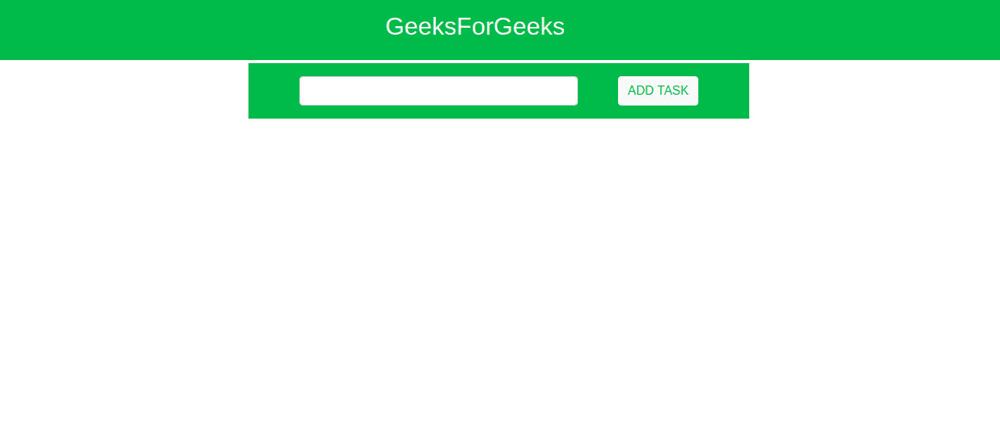
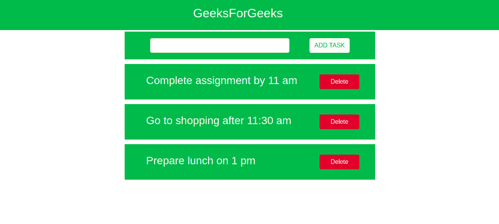

# 如何在 Angular 7 中创建待办事项？

> 原文:[https://www . geesforgeks . org/how-to-create-todo-list-in-angular-7/](https://www.geeksforgeeks.org/how-to-create-todo-list-in-angular-7/)

ToDo 应用程序用来帮助我们记住一些重要的任务。我们只是添加任务，完成后，删除它们。这个待办事项列表使用了各种 Bootstrap 类，使我们的 web 应用程序不仅有吸引力，而且响应迅速。

**进场:**

1.  使用以下命令创建一个新的角度应用程序:

    ```ts
    ng new my-todo-list
    ```

2.  通过 cd 进入应用程序并运行。之后打开本地主机，检查应用程序是否正常工作。

    ```ts
    cd my-todo-list
    ng serve
    ```

3.  Install bootstrap using the following command:

    ```ts
    npm install bootstrap
    ```

    在项目中编辑 **style.css** 文件

    ```ts
    @import 'bootstrap/dist/css/bootstrap.css';
    ```

4.  打开 src/app 文件夹，开始编辑**app.component.html**T3

    ```ts
    <!--Division for GeeksForGeeks heading-->
    <div class="container-fluid">
        <div class="row bg-success justify-content-center
                align-items-center" style="height:80px">
            <div class="col-3"></div>
            <div class="col-6 text-light h2">
                GeeksForGeeks
            </div>
        </div>

        <!--Division for taking input from user -->
        <div class="row mt-1" style="height:80px;">
            <div class="col-3 d-none col-md-3 d-md-block"></div>
            <div class="col-12 col-md-6 bg-success d-flex 
                        justify-content-center align-items-center 
                        text-light h3">

                <input [(ngModel)]="newTask" type="text" 
                        value="" class="col-7 form-control"
                            style="width:300px;">

                <div class="col-1"></div>

                <button (click)="addToList()" 
                    class="btn btn-light text-success">
                    ADD TASK
                </button>
            </div>

            <div class="col-3 d-none col-md-3 d-md-block"></div>
        </div>

        <!--Tasks added repeated divisions-->
        <div *ngFor="let x of items; let index = index;" 
                class="row mt-1" style="height:100px;">

            <div class="col-3 d-none col-md-3 d-md-block"></div>

            <div class="col-12 col-md-6 bg-success d-flex
                        justify-content-center align-items-center
                        text-light h3">

                <div class="col-9 text-light h3">{{x}}</div>

                <input (click)="deleteTask(index)" type="button"
                    value="Delete" class="col-2 btn btn-danger">
            </div>

            <div class="col-3 d-none col-md-3 d-md-block"></div>
        </div>
    </div>
    ```

    T4】
5.  打开 **app.component.ts** 文件，编写任务增删功能。

    ```ts
    import { Component } from '@angular/core';

    @Component({
        selector: 'app-root',
        templateUrl: './app.component.html',
        styleUrls: ['./app.component.css']
    })
    export class AppComponent {

        /* An empty array that is responsible
           to add a division */
        public items = [];

        /* A two-way binding performed which
           pushes text on division */
        public newTask;

        /* When input is empty, it will
           not create a new division */
        public addToList() {
            if (this.newTask == '') {
            }
            else {
                this.items.push(this.newTask);
                this.newTask = '';
            }
        }

        /* This function takes to input the
           task, that has to be deleted*/
        public deleteTask(index) {
            this.items.splice(index, 1);
        }
    }
    ```

6.  为了处理接受输入的表单，我们必须在**应用模块**文件中导入表单模块。

    ```ts
    import { FormsModule } from '@angular/forms'
    ```

**输出:**


