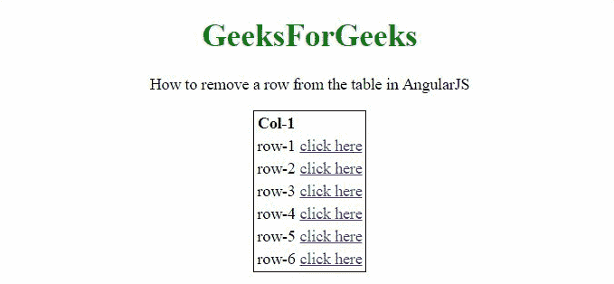

# 如何使用 AngularJS 从表中删除一行？

> 原文:[https://www . geeksforgeeks . org/如何使用-angularjs/](https://www.geeksforgeeks.org/how-to-delete-a-row-from-table-using-angularjs/) 从表格中删除一行

给定一个 HTML 表，任务是在 AngularJS 的帮助下从表中移除/删除行。

**方法:**方法是**从存储和服务于表数据的数组中删除**行。当用户点击表行附近的按钮时，它会传递该表的索引，该索引用于在**拼接()方法的帮助下从数组中移除条目。**

**示例 1:** 此示例包含一个**单列，**每一行都可以通过单击旁边的来删除。

```html
<!DOCTYPE HTML>
<html>

<head>
    <script src="//ajax.googleapis.com/ajax/libs/angularjs/1.2.13/angular.min.js">
    </script>

    <script>
        var myApp = angular.module("app", []);
        myApp.controller("controller",
            function ($scope) {
                $scope.rows = ['row-1',
                    'row-2',
                    'row-3',
                    'row-4',
                    'row-5',
                    'row-6'];
                $scope.remThis =
                    function (index, content) {
                        if (index != -1) {
                            $scope.rows.splice(index, 1);
                        }
                    };
            });
    </script>
</head>

<body style="text-align:center;">
    <h1 style="color:green;">
        GeeksForGeeks
    </h1>
    <p>
        How to remove a row from
        the table in AngularJS
    </p>
    <div ng-app="app">
        <div ng-controller="controller">
            <table style="border: 1px solid black; 
                    margin: 0 auto;">
                <tr>
                    <th>Col-1</th>
                </tr>
                <tr ng-repeat="val in rows">
                    <td>{{val}}</td>
                    <td><a href="#" ng-click=
                            "remThis($index, content)">
                            click here
                        </a>
                    </td>
                </tr>
            </table><br>
        </div>
    </div>
</body>

</html>
```

**输出:**



**例 2:** 本例包含**三列**，每一行都可以点击旁边的删除。

```html
<!DOCTYPE HTML>
<html>

<head>
    <script src="//ajax.googleapis.com/ajax/libs/angularjs/1.2.13/angular.min.js">
    </script>

    <script>
        var myApp = angular.module("app", []);
        myApp.controller("controller",
            function ($scope) {
                $scope.rows = [{
                    'ff': '11', 'fs': '12',
                    'ft': '13'
                }, {
                    'ff': '21',
                    'fs': '22', 'ft': '23'
                },
                { 'ff': '31', 'fs': '32', 'ft': '33' },
                { 'ff': '41', 'fs': '42', 'ft': '43' }];
                $scope.c = 2;

                $scope.remThis =
                    function (index, content) {
                        if (index != -1) {
                            $scope.rows.splice(index, 1);
                        }
                    };
            });
    </script>
</head>

<body style="text-align:center;">
    <h1 style="color:green;">
        GeeksForGeeks
    </h1>
    <p>
        How to remove a row from 
        the table in AngularJS
    </p>
    <div ng-app="app">
        <div ng-controller="controller">
            <table style=
                "border: 1px solid black; 
                margin: 0 auto;">
                <tr>
                    <th>Col-1</th>
                    <th>Col-2</th>
                    <th>Col-3</th>
                </tr>
                <tr ng-repeat="val in rows">
                    <td>{{val.ff}}</td>
                    <td>{{val.fs}}</td>
                    <td>{{val.ft}}</td>
                    <td><a href="#" ng-click=
                        "remThis($index, content)">
                            click here</a>
                    </td>
                </tr>
            </table><br>
        </div>
    </div>
</body>

</html>        
```

**输出:**

