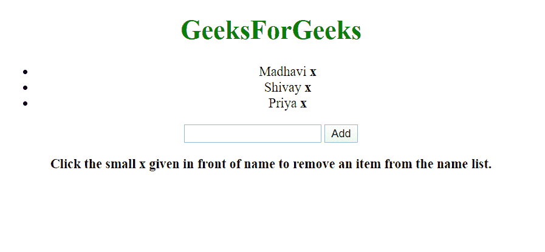
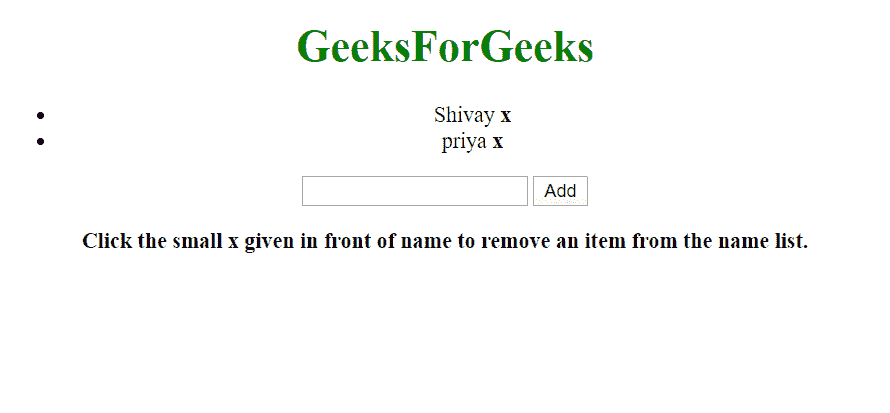

# 如何使用 ng-click 从数组中删除项目或对象？

> 原文:[https://www . geeksforgeeks . org/如何使用 ng-click/从数组中删除项目或对象](https://www.geeksforgeeks.org/how-to-delete-an-item-or-object-from-the-array-using-ng-click/)

任务是在单击按钮时从列表中删除该项目。这一切都应该通过使用 ng-click 来完成。这是通过使用 splice()方法完成的。下面给出了该方法的语法。

**拼接()函数的语法:**

```
array.splice(indexno, noofitems(n), item-1, item-2, ..., item-n)

```

**拼接()功能示例:**

```
const topics = ['Array', 'String', 'Vector'];
let removed=topics.splice(1, 1);
```

**输出:**

```
['Array', 'Vector']

```

**语法中的关键词解释如下:**

*   **索引号:**这是需要的数量。定义是指定在什么位置添加/删除项目的整数。
    如果是负数表示从数组末尾指定位置。
*   **nofitems(n):**这是可选数量。这表示要删除的项目数量。如果设置为 0，则不会删除任何项目。
*   **项-1、…项-n:** 这也是可选数量。这表示要添加到阵列中的新项目

**示例:**让我们更加关注示例。这里我们将通过例子来证明删除操作。这里给出了在极客网站上有账号的学生的名字。我们将尝试从学生姓名数组中删除其中一个姓名。

```
<!DOCTYPE html>
  <html>
     <script src=
"https://ajax.googleapis.com/ajax/libs/angularjs/1.6.4/angular.min.js">
     </script>

<body style = "text-align:center;">  

    <h1 style = "color:green;" >  
        GeeksForGeeks  
    </h1>  
<script>
  var app = angular.module("studentNames", []); 
</script>

<div ng-app="studentNames"  
    ng-init="names= ['Madhavi', 'Shivay', 'Priya']">
  <ul>
    <li ng-repeat="x in names track by $index">{{x}}
      <span ng-click="names.splice($index, 1)">
      <strong>x</strong</span>
    </li>
  </ul>
  <input ng-model="addItem">
  <button ng-click="names.push(addItem)">Add</button>
</div>

<p>Click the small x given in front  of
 name to remove an item from the name list.</p>

</body>
</html>
```

**输出:**
**点击前:**


**点击后:**
