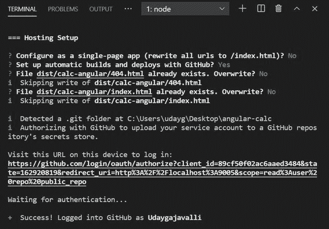

# 如何使用 GitHub 将角度应用部署到 Firebase？

> 原文:[https://www . geeksforgeeks . org/如何部署-angular-application-to-firebase-use-github/](https://www.geeksforgeeks.org/how-to-deploy-angular-application-to-firebase-using-github/)

我们中的许多人无法在网络上展示我们的小规模或个人项目。因为主持这些项目有点困难，有时也要花几块钱。
在本文中，我们将向您展示如何在不购买任何域或托管提供商的情况下，免费部署您的 Angular 应用程序。同样，厌倦了每次迭代都部署应用程序吗？让我们也使用 GitHub 设置自动构建和部署。

### 初始化 Git 并将项目推送到 GitHub 存储库

要将自动化构建和部署配置到 Firebase，必须首先将项目推送到 GitHub 存储库。

*   在 Visual Studio 代码中打开项目。
*   从侧边栏打开源代码管理菜单，或者简单地使用这个快捷键(按 Ctrl+Shift+G)来打开。
*   点击**发布到 GitHub** 按钮，如下图所示。


发布到 GitHub

*   根据需要输入存储库名称，并选择存储库的公共或私有类型。


*   等待 VS Code 将您的项目发布到 GitHub。

### 用于生产的捆绑角应用

默认情况下，所有角度项目都被设置为开发，所以让我们构建我们的项目并生成我们的 <u>dist</u> 文件。

*   在项目文件夹的终端中运行以下命令。

```
ng build --prod
```


*   现在过了一段时间，终端会生成一个 dist 文件夹，用于生产和部署。

### 下载 Firebase 和安装程序进行部署

Firebase 命令行界面(CLI)工具可用于从命令行测试、管理和部署 Firebase 项目。

*   要下载并安装 Firebase 命令行界面，请以管理员权限运行以下命令:

```
npm install -g firebase-tools
```

*   现在，您应该使用 google 帐户登录 firebase，在项目终端中使用以下命令:

```
firebase login
```


### 为部署创建一个 Firebase 项目

*   打开 firebase 网站，通过链接 https://console.firebase.google.com 登录到您的控制台
*   登录后，点击**添加项目**按钮，然后输入您的项目名称，点击**创建项目**按钮，创建您的 Firebase 项目。
*   现在是时候在您的项目终端中使用下面的命令初始化 firebase 了。

```
firebase init
```

*   Firebase 提供各种服务，如数据库、Firestore、函数、托管、存储。向下滚动，按空格键选择**主机**，然后按回车键继续。


*   按回车后，现在终端要求选择一个项目。选择选项**“使用现有项目”**，并按回车键选择您之前创建的项目名称。


*   现在，终端要求您选择包含托管资产的公共目录，以便使用 firebase deploy 上传。
*   输入您之前生成的包含角度构建的 dist 文件夹的路径。在我的例子中，它是**距离/计算角度**



*   现在选择**是**选项**设置自动构建并使用 GitHub 部署？**
*   以用户名/存储库格式输入您的 GitHub 用户名和存储库名称，选项为**“您希望为哪个 GitHub 存储库设置 GitHub 工作流？”**
*   对于所有其他选项，只需输入“是”或根据需要按回车键。


*   一旦 Firebase 初始化完成，只需在终端中输入以下命令来部署您的项目。

```
firebase deploy
```

*   一旦命令被执行，它就会提供一个带有 firebase 项目控制台链接和已部署项目的 URL 的输出，通过该输出，您可以通过任何设备访问您的应用程序。


现在，您的 Angular 应用程序已成功部署到 Firebase。