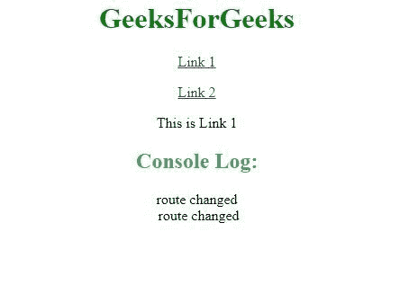

# 如何检测 AngularJS 中的路线变化？

> 原文:[https://www . geeksforgeeks . org/如何检测路线变化 angularjs/](https://www.geeksforgeeks.org/how-to-detect-a-route-change-in-angularjs/)

**方法:**要检测 AngularJS 中任何时刻的路线变化，可以通过使用$on()方法来实现。$on()方法是一个事件处理程序，该事件将处理在路线/视图更改完成时触发的$routeChangeSuccess。

**语法:**

```ts
$rootScope.$on('$routeChangeSuccess', function () {
    Content...
});

```

**示例:**在这里，每当有任何路线变更时，我们都会在控制台窗口中显示“路线变更”。在$on()方法中，我们更改了控制台路由。因此，通过这种方式，每当发生路由更改时，它都会触发由$on()事件处理程序处理的$routeChangeSuccess，然后在控制台窗口中显示“路由已更改”。

下面是上述方法的实现:

```ts
<!DOCTYPE html>
<html>
   <head>
      <title>Angular JS Route Change</title>

      <script src = 
"https://ajax.googleapis.com/ajax/libs/angularjs/1.3.14/angular.min.js"></script>

      <script src = 
"https://ajax.googleapis.com/ajax/libs/angularjs/1.3.14/angular-route.min.js">
      </script>
   </head>

   <body style = "text-align:center;">  

    <h1 style = "color:green;" >  
        GeeksForGeeks  
    </h1> 

    <div>
        <p><a href = "#viewLink1">Link 1</a></p>
        <p><a href = "#viewLink2">Link 2</a></p>
        <div ng-app = "mainApp" ng-controller = "GFGController">
        <div ng-view></div>
    </div>

    <script>
        var mainApp = angular.module("mainApp", ['ngRoute']);
        mainApp.config(['$routeProvider', function($routeProvider) {
            $routeProvider

            .when('/viewLink1', {
                template: "<p> This is Link 1 </p>"
            })

            .when('/viewLink2', {
                template: "<p> This is Link 2 </p>"
            })

            .otherwise({
                redirectTo: '/viewLink1'
            });
         }]);

         mainApp.controller(
                   'GFGController', function($scope, $location, $rootScope) {
            $rootScope.$on('$routeChangeSuccess', function () {
            console.log("route changed");
            });
         });
      </script>
   </body>
</html>
```

**输出:**
当我们更改链接时，$ routeChangeSuccess 事件被触发，从而在控制台窗口中显示路线已更改。
