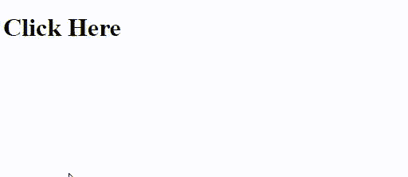
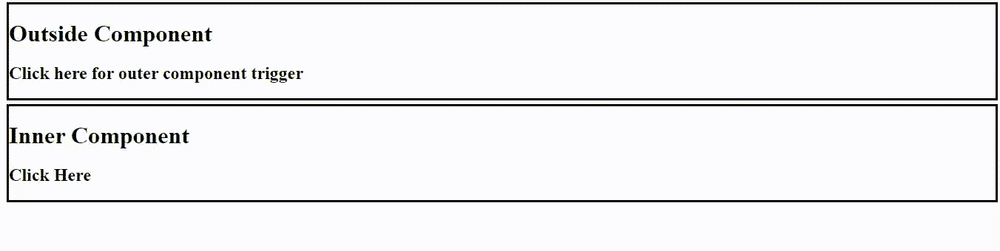

# 如何检测角度分量外的点击事件？

> 原文:[https://www . geesforgeks . org/如何检测-点击-事件-角度外-组件/](https://www.geeksforgeeks.org/how-to-detect-click-event-outside-angular-component/)

在 angular 中，通过不同的方式检测点击。由于 click 是一个事件，因此在组件内部，它是通过简单的事件绑定来检测的。组件内通过事件绑定进行检测的简单点击如下所示:

```ts
@Component({
  selector: "geeks",
  template: `
<h1 (click)="clicked()">{{ some_text }}</h1>
  `
})
export class GeeksComponent {
  constructor() {}
  some_text = "Click Here";
  clicked() {
    this.some_text = "Event Triggered";
  }
}
```

要检测组件外部的点击，在 angular 中使用 *@HostListener* 装饰器。它是一个装饰器，声明一个要监听的 DOM 事件，并提供一个带有处理程序方法的链接，以便每当该事件发生时运行。

**方法:**这里的方法是使用 *@HostListener decorator* 。在 angular 中，它是一个装饰器，有助于捕获 DOM 中发生的任何类型的事件，并为开发人员提供基于该事件执行任何操作的灵活性。这里，在简单的点击事件上，处理程序将把点击事件引用到组件上，对于 DOM 上的点击，它将使用*文档捕获:点击*。

使用 HostListener 的语法如下:

**语法:**

```ts
@HostListener(events, args)
handler_name(args){
  // Do something
}

```

HostListener 的语法中有三点需要注意:

1.  **事件名称:**顾名思义，这是 DOM 中需要监听的事件的名称。
2.  **参数:**这些是事件发生时传递给处理程序方法的一组参数。它接受列表格式的输入。
3.  **handlen_name:** 下面是触发事件时将调用的方法定义。它由 HostListener 自动调用。

**示例:在组件内通过点击进行绑定**为了在组件内绑定点击，将进入主机侦听器的事件名称将只是“点击”。在这种情况下，上述代码将写成:

```ts
@Component({
  selector: "geeks",
  template: `
    <h1>{{ some_text }}</h1>
  `
})
export class GeeksComponent {
  constructor() {}
  some_text = "Click Here";
  @HostListener("click")
  clicked() {
    this.some_text = "Event Triggered";
  }
}
```

**输出:**


这里不需要为处理程序的运行传递参数。HostListener 将“click”作为触发所单击方法的事件。

**与点击外部组件绑定**
要检测组件外部的点击，需要查看另一个事件。在这里，点击将不起作用，因为它检测到组件内的点击。这里的关键是在 DOM 中寻找点击，而不仅仅是组件，因此“document:click”将是正确的选择，同时我们需要过滤掉组件中的事件，这是由布尔变量“inside”完成的。因此，在下面给出的代码中，将有另一个组件添加到 is 中，它将充当外部上下文，但是单击它将导致当前组件上的 click 事件。

```ts
@Component({
  selector: "another",
  template: `
    <div style="border-style: solid;margin:5px;">
      <h1>Outside Component</h1>
      <h2>Click here for outer component trigger</h2>
    </div>
    <geeks></geeks>
  `
})
export class AnotherComponent {
  constructor() {}
}
@Component({
  selector: "geeks",
  template: `
    <div style="border-style:solid;margin:5px;">
      <h1>Inner Component</h1>
      <h2>{{ some_text }}</h2>
    </div>
  `
})
export class GeeksComponent {
  constructor() {}
  some_text = "Click Here";
  inside = false;
  @HostListener("click")
  clicked() {
    this.inside = true;
  }
  @HostListener("document:click")
  clickedOut() {
    this.some_text = this.inside
      ? "Event Triggered"
      : "Event Triggered Outside Component";
    this.inside = false;
  }
}
```

**输出:**

在本例中，如果点击文本“外部组件”，则显示的文本将是“事件触发的外部组件”。这显示了如何在极客组件中捕捉组件外部的点击。