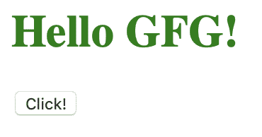
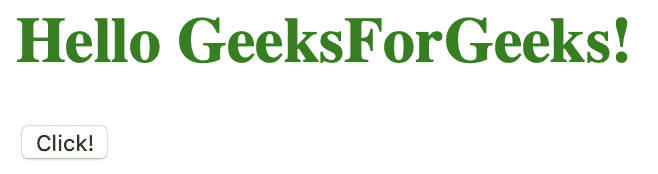
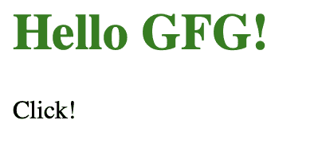
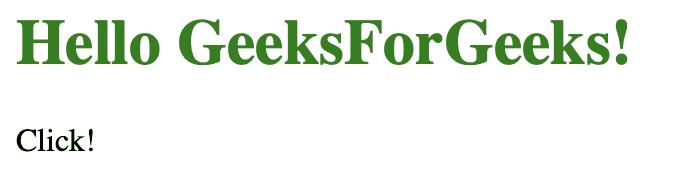

# 如何在 AngularJS 中使用 ng-click 直接更新一个字段？

> 原文:[https://www . geeksforgeeks . org/如何使用-ng-click-in-angularjs/直接更新字段/](https://www.geeksforgeeks.org/how-to-directly-update-a-field-by-using-ng-click-in-angularjs/)

任何字段都可以使用自定义的 JavaScript 函数通过 ng-click 进行更新。为此，我们可以在一个 HTML 中创建一个可点击的对象(通常是一个按钮)，并附上一个 **ng-click** 指令来调用这个自定义函数。AngluarJS 中的 ng-click 指令用于在单击元素时应用自定义行为。它可以用来显示/隐藏某些元素，也可以在单击按钮时弹出警报。

**语法:**

```
<element ng-click="expression"> Contents... </element>
```

**示例 1:** 本示例调用一个函数，在点击按钮后更改字段值。

```
<!DOCTYPE html>
<html ng-app="example">

<head>
    <title>
        How to directly update a field
        by using ng-click in AngularJS?
    </title>

    <script src=
"https://ajax.googleapis.com/ajax/libs/angularjs/1.7.8/angular.min.js">
    </script>
</head>

<body>
    <div ng-controller="basicCntrl">

        <h1 style="color:green">
            Hello {{name}}!
        </h1>

        <!-- on button click the change()
            function is called from $scope -->
        <button type="button"
                ng-click="change()">
            Click!
        </button>
    </div>

    <script type="text/javascript">
        var app = angular.module('example', []);
        app.controller('basicCntrl',
        function($scope) {
            $scope.name = "GFG";
            $scope.change = function() {
                this.name = 'GeeksForGeeks';
              }
        });
    </script>
</body>

</html>
```

**输出:**

*   **之前点击按钮:**
    
*   **点击按钮后:**
    

按钮调用*改变*功能，改变变量名。这个变化反映在页面上是因为 *{{name}}* 的语法。对于更简单的逻辑，如示例 1 所示，我们可以避免调用函数和更改 ng-click 指令中的变量。

**示例 2:** 本示例更改 ng-click 指令内部的变量名。

```
<!DOCTYPE html>
<html ng-app="example">

<head>
    <title>
        How to directly update a field
        by using ng-click in AngularJS?
    </title>

    <script src=
"https://ajax.googleapis.com/ajax/libs/angularjs/1.7.8/angular.min.js">
    </script>
</head>

<body>
    <div ng-controller="basicCntrl">

        <h1 style="color:green">
            Hello {{name}}!
        </h1>

        <!-- on button click the name is changed directly -->
        <button type="button"
                ng-click="name='GeeksForGeeks'">
            Click!
        </button>
    </div>

    <script type="text/javascript">
        var app = angular.module('example', []);

        app.controller('basicCntrl',

        function($scope) {
            $scope.name = "GFG";
        });
    </script>
</body>

</html>
```

**输出:**

*   **之前点击按钮:**
    
*   **点击按钮后:**
    

此外，我们可以使用其他的 HTML 标签来使 ng-click 工作，例如段落标签。

**示例 3:** 本示例使用段落标记来更改标题内容。

```
<!DOCTYPE html>
<html ng-app="example">

<head>
    <title>
        How to directly update a field
        by using ng-click in AngularJS?
    </title>

    <script src=
"https://ajax.googleapis.com/ajax/libs/angularjs/1.7.8/angular.min.js">
    </script>
</head>

<body>
    <div ng-controller="basicCntrl">

        <h1 style="color:green">
            Hello {{name}}!
        </h1>

        <!-- on paragraph click the name is changed directly -->
        <p ng-click="name='GeeksForGeeks'">
            Click!
        </p>
    </div>

    <script type="text/javascript">
        var app = angular.module('example', []);

        app.controller('basicCntrl',

        function($scope) {
            $scope.name = "GFG";
        });
    </script>
</body>

</html>
```

**输出:**

*   **点击之前参数图元素【点击】:**
    
*   **点击参数图元素后【点击】:**
    