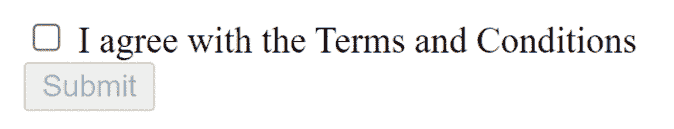

# 如何在 AngularJS 中根据复选框的状态禁用按钮？

> 原文:[https://www . geesforgeks . org/如何禁用按钮依赖检查框状态 in-angularjs/](https://www.geeksforgeeks.org/how-to-disable-a-button-depending-on-a-checkboxs-state-in-angularjs/)

在本文中，我们将学习根据 Angular 中的复选框状态禁用按钮。我们将使用名为 **ng-disabled** 的 Angular JS 指令，通过取消选中该框来禁用该按钮。请参考[残疾人指令](https://www.geeksforgeeks.org/angularjs-ng-disabled-directive/)。

ng-disabled 指令用于启用或禁用 HTML 元素。如果 ng-disabled 指令中的表达式返回 true，则 HTML 元素将被禁用，反之亦然。

**方法:**在本例中，我们选择了一个复选框，并根据该复选框检查提交按钮是启用还是禁用。这里 ng-model 指令用于绑定复选框和提交按钮&ng-disabled 指令用于处理禁用或启用操作。

这里，如果复选框被选中，它将返回真，并且真将被传递给禁用 ng 的指令。因此，提交按钮将被禁用，但我们需要在复选框被选中时启用它。因此，我们需要在 ng-disabled 指令上有一个 NOT 操作，以便每当复选框返回 TRUE 时，去往 ng-disabled 指令的值将为 FALSE，从而启用提交按钮。

**示例:**

## 超文本标记语言

```ts
<!DOCTYPE html>
<html lang="en">

<head>

    <!-- Including the  Angular JS CDN -->
    <script src=
"http://code.angularjs.org/1.2.0/angular.min.js">
    </script>
</head>

<body>

    <!-- Defining the Angular Application -->
    <div ng-app="">

        <!-- Here we define the ng-model to 
            the checkbox so that we can refer 
            to it whether it checked or not -->
        <input type="checkbox" name="isAgreed" 
            ng-model="isAgreed" />
        <p>I agree with the Terms and Conditions</p>
        <br />

        <!-- If the checkbox is checked then 
            button would be enabled and if not 
            checked then button would be disabled -->
        <button ng-disabled="!isAgreed">Submit</button>
    </div>
</body>

</html>
```

**输出:** 