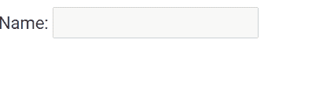
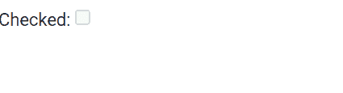
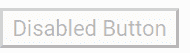

# 如何在 Angular 中禁用窗体控件？

> 原文:[https://www . geesforgeks . org/如何禁用角度控制表单/](https://www.geeksforgeeks.org/how-to-disable-a-form-control-in-angular/)

在本文中，我们将看到如何在 Angular 10 中禁用表单控件。我们将使用**抽象控件禁用属性**来禁用表单控件元素。

**语法:**

```
<formelement disabled></formelement>
```

**返回值:**

*   **布尔值:**返回布尔值，说明元素是否被禁用。

**进场:**

*   创建要使用的角度应用程序
*   在 app.component.html，使用表单指令制作表单。
*   现在使用抽象控件禁用属性禁用表单控件元素
*   使用 ng serve 为 angular app 服务，以查看输出。

**示例 1:** 在本例中，我们使用该属性禁用了输入元素。

## app.module.ts

```
import { NgModule } from '@angular/core';

// Importing forms module
import { FormsModule } from '@angular/forms';
import { BrowserModule } from '@angular/platform-browser';
import { BrowserAnimationsModule } from '@angular/platform-browser/animations';

import { AppComponent }   from './app.component';

@NgModule({
  bootstrap: [
    AppComponent
  ],
  declarations: [
    AppComponent
  ],
  imports: [
    FormsModule,
    BrowserModule,
    BrowserAnimationsModule,

  ]
})
export class AppModule { }
```

## app.component.html

```
<br>
<form #gfg = "ngForm">
    Name: <input type="text" name = 'name' ngModel disabled>
</form>
```

**输出:**



**示例 2:** 在本例中，我们使用该属性禁用了 checkbox 元素。

## app.module.ts

```
import { NgModule } from '@angular/core';

// Importing forms module
import { FormsModule } from '@angular/forms';
import { BrowserModule } from '@angular/platform-browser';
import { BrowserAnimationsModule } from '@angular/platform-browser/animations';

import { AppComponent }   from './app.component';

@NgModule({
  bootstrap: [
    AppComponent
  ],
  declarations: [
    AppComponent
  ],
  imports: [
    FormsModule,
    BrowserModule,
    BrowserAnimationsModule,

  ]
})
export class AppModule { }
```

## app.component.html

```
<br>
<form #gfg = "ngForm">
    Checked: <input type="checkbox" name = 'Check' ngModel disabled>
</form>
```

**输出:**



**示例 3:** 在本例中，我们已经使用该属性禁用了按钮元素。

## app.module.ts

```
import { NgModule } from '@angular/core';

// Importing forms module
import { FormsModule } from '@angular/forms';
import { BrowserModule } from '@angular/platform-browser';
import { BrowserAnimationsModule } from '@angular/platform-browser/animations';

import { AppComponent }   from './app.component';

@NgModule({
  bootstrap: [
    AppComponent
  ],
  declarations: [
    AppComponent
  ],
  imports: [
    FormsModule,
    BrowserModule,
    BrowserAnimationsModule,

  ]
})
export class AppModule { }
```

*   **app.component.html**

## app.component.html

```
<br>
<form #gfg = "ngForm">
    <button disabled>Disabled Button</button>
</form>
```

**输出:**



**参考:**[https://angular . io/API/forms/abstractcontroldirectional # disabled](https://angular.io/api/forms/AbstractControlDirective#disabled)