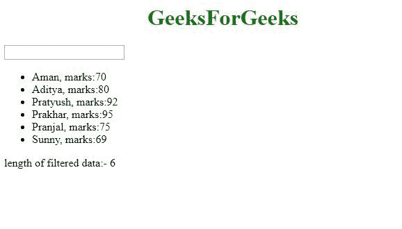
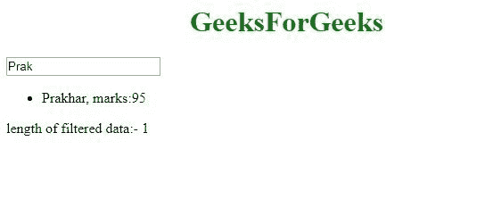

# 如何在 AngularJS 中显示过滤后的 ng-repeat 数据的长度？

> 原文:[https://www . geeksforgeeks . org/如何显示过滤 ng 重复数据长度 in angularjs/](https://www.geeksforgeeks.org/how-to-display-length-of-filtered-ng-repeat-data-in-angularjs/)

任务是显示过滤后的重复数据的长度。这里我们要用别名表达式来解决这个问题。

**方法:**为了显示过滤后的 ng-repeat 数据的长度，我们使用了一个别名表达式。我们为用于过滤 ng-repeat 数据的变量创建一个别名，并显示每个时刻别名的长度。

**语法:**

```
<element ng-repeat="expression | filter: search as result"> Content... </element>
<p> {{ result.length }} <p>

```

**示例:**

```
<!DOCTYPE html>
<html>

<head>
    <title>
        Angular JS Filtered data length
    </title>

    <script src = 
"https://ajax.googleapis.com/ajax/libs/angularjs/1.3.14/angular.min.js">
    </script>
</head>

<body > 
    <h1 style = "color:green; text-align:center;" > 
        GeeksForGeeks 
    </h1> 

    <div ng-app = "mainApp" ng-controller = "studentController">
        <input type = "text" ng-model = "searchName">
            <br/>

        <ul>
            <li ng-repeat = 
                "student in students | filter: searchName as result">
                {{ student.name + ', marks:' + student.marks }}
            </li>
        </ul>
        <p>length of filtered data:- {{ result.length }}</p>
    </div>

    <script>
        var mainApp = angular.module("mainApp", []);

        mainApp.controller('studentController', function($scope) {
            $scope.students = [
                {name:'Aman', marks:70},
                {name:'Aditya', marks:80},
                {name:'Pratyush', marks:92},
                {name:'Prakhar', marks:95},
                {name:'Pranjal', marks:75},
                {name:'Sunny', marks:69}
            ];
        });
    </script>
</body>

</html>
```

**说明:**
这里我们展示的是学生的详细信息，有一个搜索框可以按学生姓名进行搜索。现在，我们将搜索框的输入绑定到 AngularJS searchName 变量中。SearchName 变量用于过滤，我们为它创建一个别名，在这里是 result，然后显示 result.length。因此，随着过滤后的 ng-repeat 数据长度的变化，result 的长度也随之变化。

**输出:**
**初始屏幕会是:**

**然后搜索后，过滤 ng-重复数据长度变化:**

