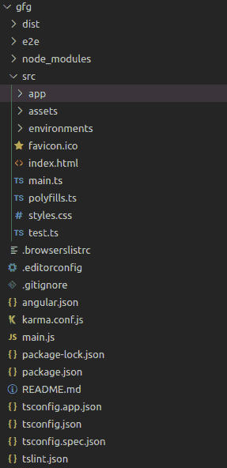
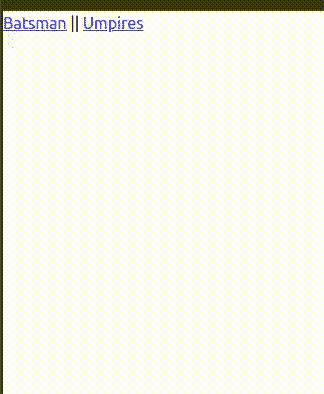

# 使用 Angular 在路线间导航时如何显示装载画面？

> 原文:[https://www . geesforgeks . org/如何显示-加载-屏幕-在路线之间导航时-使用-angular/](https://www.geeksforgeeks.org/how-to-display-loading-screen-when-navigating-between-routes-using-angular/)

在这篇文章中，我们将看到如何在从一个组件导航到另一个组件时显示加载屏幕。当用户导航路线时，应用程序可能会与后端通信以加载一些有用的数据，这可能会产生一些延迟。这时候，如果用户没有在屏幕上看到任何东西，他可能会认为要么是应用坏了，要么是客户端机器出了问题。因此，有必要让用户在一些消息或加载动画的帮助下使用应用程序。

**先决条件:**必须安装 [NPM](https://www.geeksforgeeks.org/node-js-npm-node-package-manager/)

**环境设置:**我们将创建一个简单的应用程序，它将在导航时模拟一些延迟，并在导航路线时显示一个装载微调器。让我们快速设置环境:

```
npm install -g @angular/cli
ng new <project-name>
```

**项目结构:**执行以上命令后，会得到如下的项目结构:



项目结构

**现在执行这些命令:**

```
cd <project-name>
ng serve -o
```

**输出:**打开 **http://localhost:4200** 检查默认角度登陆页面是否加载。

**按照以下步骤操作:**

*   **步骤 1:** 我们将从 **JSON** 文件而不是实际的服务器加载数据。在 **src/assets/** 中创建新文件 **data.json** 并添加以下数据。

    **data.json:**

    ```
    {
        "K.S. Williamson": 0,
        "S.P.D. Smith": 0,
        "M. Labuschagne": 0,
        "J.E. Root": 0,
        "V. Kohli": 0,
        "Babar Azam": 0,
        "H.M. Nicholls": 0,
        "C.A. Pujara": 0,
        "D.A. Warner": 0,
        "B.A. Stokes": 0,
        "Gerard Abood": 1,
        "Afzaal Ahmed": 1,
        "Mesbahuddin Ahmed": 1,
        "Tanvir Ahmed": 1,
        "Javed Akhtar": 1,
        "A. F. M. Akhtaruddin": 1,
        "Rizwan Akram": 1,
        "Jahangir Alam": 1,
        "Brian Aldridge": 1
    }
    ```

*   **第二步:**要读取该数据，我们将使用 **HttpClient** 模块的 angular。我们需要在文件**中注册**

    ## app.module.ts

    ```
    import { NgModule } from '@angular/core';
    import { BrowserModule } from '@angular/platform-browser';

    import { AppRoutingModule } from './app-routing.module';
    import { AppComponent } from './app.component';
    // Import this module
    import {HttpClientModule} from '@angular/common/http';
    @NgModule({
      declarations: [
        AppComponent,
      ],
      imports: [
        BrowserModule,
        AppRoutingModule,
        HttpClientModule   // Register the module here
      ],
      providers: [],
      bootstrap: [AppComponent]
    })
    export class AppModule { }
    ```

*   **步骤 3:** 现在创建两个新组件。我们将在这两者之间导航。

    ```
    ng generate component batsman
    ng generate component umpire
    ```

    它将为每个组件生成 4 个文件。我们将理解其中一个的代码。另一个会有类似的工作。在**击球手.组件. ts** 中，添加以下代码。

    ## 击球手.组件. ts

    ```
    import { HttpClient } from '@angular/common/http';
    import { Component, OnInit } from '@angular/core';

    @Component({
      selector: 'app-batsman',
      templateUrl: './batsman.component.html',
      styleUrls: ['./batsman.component.css']
    })
    export class BatsmanComponent implements OnInit {

      constructor(private http:HttpClient) { }
      batsman = []
      ngOnInit(): void {
        this.http.get('assets/data.json').subscribe(
          result => {
            setTimeout(() => {
              for (let key in result) {
                if (!result[key]) {
                  this.batsman.push(key);
                }
              }
            }, 2000);
          }
        )
      }

    }
    ```

    首先，导入 HttpClient 类。我们在构造函数中创建了一个 HttpClient 对象作为依赖注入。我们还初始化了一个空的击球手数组。HttpClient 的 **get()** 方法将返回一个**可观察的**，该方法返回数据作为其 **subscribe(result_callback，error_callback)** 方法中的第一个参数。在回调中，我们模拟了 2000 毫秒的延迟，并推送了值为 0 的名称。这意味着一旦页面被加载，将有 2 秒的延迟，勤务兵数组将被填充。现在将以下代码添加到**batsman.component.html。**

    ## batsman.component.html

    ```
    <div *ngIf="!batsman.length">
        <div class="spinner-border m-5" role="status">
            <span class="sr-only"></span>
          </div>
    </div>

    <div *ngIf="batsman.length">
        <table>
            <tr *ngFor="let person of batsman">
                <td>{{person}}</td>
            </tr>
        </table>
    </div>
    ```

*   **第四步:**有两个 div 标签。当击球手阵列为空时，显示第一个。另一个将在填充数组时显示。因此，在没有收到数据之前，我们将查看包含加载动画的第一个 div。**旋转边界**类存在于引导程序中。所以我们需要在我们的项目中添加 bootstrap。编辑**index.html**文件如下。

    ## index.html

    ```
    <!DOCTYPE html>
    <html lang="en">
      <head>
        <meta charset="utf-8" />
        <title>Geeks For Geeks</title>
        <base href="/" />
        <meta name="viewport" 
              content="width=device-width, initial-scale=1" />
        <link rel="icon" type="image/x-icon" 
              href="favicon.ico" />
        <!--Add this line-->
        <link href=
    "https://cdn.jsdelivr.net/npm/bootstrap@5.0.0-beta2/dist/css/bootstrap.min.css"
              rel="stylesheet"
              integrity=
    "sha384-BmbxuPwQa2lc/FVzBcNJ7UAyJxM6wuqIj61tLrc4wSX0szH/Ev+nYRRuWlolflfl"
              crossorigin="anonymous"/>
      </head>
      <body>
        <app-root></app-root>
        <!--Add these lines-->
        <script src=
    "https://cdn.jsdelivr.net/npm/@popperjs/core@2.6.0/dist/umd/popper.min.js"
                integrity=
    "sha384-KsvD1yqQ1/1+IA7gi3P0tyJcT3vR+NdBTt13hSJ2lnve8agRGXTTyNaBYmCR/Nwi"
                crossorigin="anonymous">
        </script>
        <script src=
    "https://cdn.jsdelivr.net/npm/bootstrap@5.0.0-beta2/dist/js/bootstrap.min.js"
                integrity=
    "sha384-nsg8ua9HAw1y0W1btsyWgBklPnCUAFLuTMS2G72MMONqmOymq585AcH49TLBQObG"
                crossorigin="anonymous">
        </script>
      </body>
    </html>
    ```

*   **第五步:**现在分别给**裁判员. component.ts** 和**umpires.component.html**添加以下代码。

    ## 裁判.组件. ts

    ```
    import { HttpClient } from '@angular/common/http';
    import { Component, OnInit } from '@angular/core';
    import { CricketService } from '../cricket.service';

    @Component({
      selector: 'app-umpires',
      templateUrl: './umpires.component.html',
      styleUrls: ['./umpires.component.css']
    })
    export class UmpiresComponent implements OnInit {

      constructor(private http:HttpClient) { }
      umpires = [];
      ngOnInit(): void {
        this.http.get('assets/data.json').subscribe(
          result => {
            setTimeout(() => {
              for (let key in result) {
                if (result[key]) {
                  this.umpires.push(key);
                }
              }
            }, 2000);

          }
        )
      }

    }
    ```

    ## umpires.component.html

    ```
    <div *ngIf="!umpires.length">
        <div class="spinner-border m-5" role="status">
            <span class="sr-only"></span>
          </div> 
    </div>

    <div *ngIf="umpires.length">
        <table>
            <tr *ngFor="let person of umpires">
                <td>{{person}}</td>
            </tr>
        </table>
    </div>
    ```

*   **步骤 6:** 在 **app-routing.module.ts** 中为这些组件创建路由，如下所示:

    ## app-routing.module.ts

    ```
    import { NgModule } from '@angular/core';
    import { RouterModule, Routes } from '@angular/router';
    import { BatsmanComponent } from './batsman/batsman.component';
    import { UmpiresComponent } from './umpires/umpires.component';

    const routes: Routes = [
      {path:'batsman', component:BatsmanComponent},
      {path:'umpires', component:UmpiresComponent}
    ];

    @NgModule({
      imports: [RouterModule.forRoot(routes)],
      exports: [RouterModule]
    })
    export class AppRoutingModule { }
    ```

*   **步骤 7:** 在“*路径*键中添加路径，在“*组件*键中添加相应的组件。导入必要的组件。现在在**app.component.html**为用户创建链接，编码部分完成:

    ## app.component.html

    ```
    <div>
      <a [routerLink]="['batsman']">Batsman</a> ||
      <a [routerLink]="['umpires']">Umpires</a>
      <router-outlet></router-outlet>
    </div>
    ```

    上面的代码创建了两个导航到各自组件的链接。 **<路由器出口>** 标签显示导航组件。

**运行以下命令:**

```
ng serve -o
```

**输出:**

