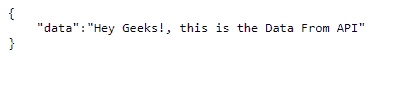

# 如何使用 Angular 8 在屏幕上显示 Spinner 直到来自 API 的数据加载？

> 原文:[https://www . geeksforgeeks . org/如何在屏幕上显示 spinner-to-data-from-API-loads-use-angular-8/](https://www.geeksforgeeks.org/how-to-display-spinner-on-the-screen-till-the-data-from-the-api-loads-using-angular-8/)

任务是在页面上显示一个微调器，直到来自 API 的响应到来。在这里，我们将制作一个简单的 CSS 微调器，它将加载直到来自 T2 的数据到来。你也可以带自举纺纱机或者自己做纺纱机。

**先决条件:**你将需要一些从 API 发出 Http get()请求和获取数据的知识。

在这里你需要一个 **API** 来获取数据。还可以创建一个假的应用编程接口，并使用数据进行显示。我们已经有一个包含以下数据的假 API:



**进场:**

*   创建所需的角度应用和组件。

    ```ts
    ng new app_name
    ng g c component_name
    ```

*   In component.html file, make an object with id **loading.**

    这里微调器定义为:

    ```ts
    <div class="d-flex justify-content-center">
      <div class="spinner-border" role="status" >
        <span class="sr-only" id="loading"></span>
      </div>
    </div>

    ```

    你可以用自己的方式做一个旋转器。

    *   In component.css file, give spinner the styles you want.

        这里微调器的样式为:

        ```ts
        #loading{
          position: absolute;
          left: 50%;
          top: 50%;
          z-index: 1;
          width: 150px;
          height: 150px;
          margin: -75px 0 0 -75px;
          border: 16px solid #f3f3f3;
          border-radius: 50%;
          border-top: 16px solid #3498db;
          width: 120px;
          height: 120px;
          animation: spin 2s linear infinite;
          }

          @keyframes spin {
            0% { transform: rotate(0deg); }
            100% { transform: rotate(360deg); }
          }

        ```

    *   通过发出获取请求从应用编程接口获取数据。
    *   从应用编程接口获取数据后，将其存储在**响应变量中。**
    *   有一个 **if 语句****检查来自 API 的响应**是否到来。
    *   如果响应来了，那么有一个函数 **hideloader()被调用。**
    *   在使用 DOM 操作的**隐藏加载器()**功能中，我们**将加载元素的显示设置为无。**

        ```ts
        document.getElementById('loading').style.display = 'none';
        ```

    *   为了更清楚地获取数据，我已经使用插值数据绑定将获取的数据显示给了 HTML。

    **代码实现**

    *   **app.module.ts**

        ```ts
        import { BrowserModule } from 
            '@angular/platform-browser';

        import { NgModule } from 
            '@angular/core';

        import { HttpClientModule } from 
            '@angular/common/http';

        import { FormsModule } from 
            '@angular/forms';

        import { AppRoutingModule } from 
            './app-routing.module';

        import { AppComponent } from 
            './app.component';

        import { ShowApiComponent } from 
            './show-api/show-api.component';

        @NgModule({
            declarations: [
                AppComponent,
                ShowApiComponent,
            ],
            imports: [
                BrowserModule,
                AppRoutingModule,
                HttpClientModule,
                FormsModule
            ],
            providers: [],
            bootstrap: [AppComponent]
        })
        export class AppModule { }
        ```

    *   **show-api.component.html**

        ```ts
        <h1>GeeksforGeeks</h1>

        <!-- spinnner element is 
            defined with id loading -->
        <div class="d-flex justify-content-center">
            <div class="spinner-border" role="status">
                <span class="sr-only" id="loading"></span>
            </div>
        </div>

        <!-- data from API is displayed  -->
        <h2>{{ dataDisplay }}</h2>
        ```

    *   **show-api.component.css**

        ```ts
        #loading{
          position: absolute;
          left: 50%;
          top: 50%;
          z-index: 1;
          width: 150px;
          height: 150px;
          margin: -75px 0 0 -75px;
          border: 16px solid #f3f3f3;
          border-radius: 50%;
          border-top: 16px solid #3498db;
          width: 120px;
          height: 120px;
          animation: spin 2s linear infinite;
          }

          @keyframes spin {
            0% { transform: rotate(0deg); }
            100% { transform: rotate(360deg); }
          }
        ```

    *   **show-api.component.ts**

        ```ts
        import { Component, OnInit } from '@angular/core';
        import { HttpClient } from '@angular/common/http';
        @Component({
            selector: 'app-show-api',
            templateUrl: './show-api.component.html',
            styleUrls: ['./show-api.component.css']
        })
        export class ShowApiComponent implements OnInit {
            dt: any;
            dataDisplay: any;
            constructor(private http: HttpClient) {
            }

            ngOnInit(): void {
                this.http.get(
        'http://www.mocky.io/v2/5ec6a61b3200005e00d75058')
                    .subscribe(Response => {

                        // If Response comes function
                        // hideloader() is called
                        if (Response) {
                            hideloader();
                        }
                        console.log(Response)
                        this.dt = Response;
                        this.dataDisplay = this.dt.data;
                    });
                // Function is defined
                function hideloader() {

                    // Setting display of spinner
                    // element to none
                    document.getElementById('loading')
                        .style.display = 'none';
                }
            }
        }
        ```

**输出:**

运行开发服务器以查看输出


**API 链接:“**[http://www . mocky . io/v2/5s 6a 61 b 32000005 e 00d 75058](http://www.mocky.io/v2/5ec6a61b3200005e00d75058)

CSS 是网页的基础，通过设计网站和网络应用程序用于网页开发。你可以通过以下 [CSS 教程](https://www.geeksforgeeks.org/css-tutorials/)和 [CSS 示例](https://www.geeksforgeeks.org/css-examples/)从头开始学习 CSS。