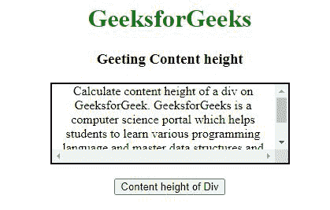
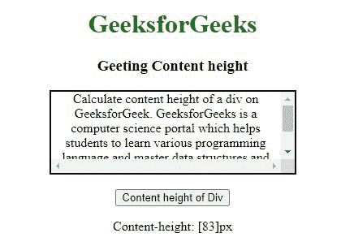
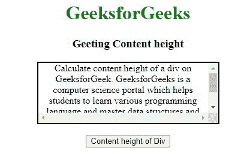
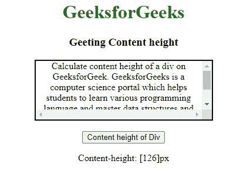

# 如何使用 AngularJS 动态获取一个 div 的内容高度？

> 原文:[https://www . geeksforgeeks . org/如何使用-angularjs/](https://www.geeksforgeeks.org/how-to-dynamically-get-the-content-height-of-a-div-using-angularjs/) 动态获取内容高度

div 的内容高度可以根据用户需求，使用 clientHeight 和 scrollHeight 属性动态获取。如果用户想要知道实际显示内容所需的空间，包括填充所占用的空间，但不包括滚动条、边距或边框，则用户可以使用以下任何过程来返回元素整个内容的高度。

*   **使用 Element.clientHeight 属性**
*   **使用元素滚动高度属性**

**示例 1:** 使用 clientHeight 属性的 div 的内容高度将返回元素整个内容的高度。

## 超文本标记语言

```tshtml
<!DOCTYPE html>
<html>

<head>
    <script src=
"https://ajax.googleapis.com/ajax/libs/angularjs/1.6.9/angular.min.js">
    </script>

    <style>
        #div1 {
            height: 100px;
            width: 300px;
            border: 2px solid black;
            overflow: scroll;
        }

        h1 {
            color: green;
        }
    </style>
</head>

<body>
    <center>
        <h1>GeeksforGeeks</h1>
        <h3>Getting Content height</h3>

        <div id="div1">
            Calculate content height of a div
            on GeeksforGeek. GeeksforGeeks is
            a computer science portal which
            helps students to learn various
            programming language and master
            data structures and algorithms.
            There are various courses available
            to learn new skills.
        </div>
        <br>
        <button onclick="contentheight()">
            Content height of Div
        </button>

        <p id="p1"></p>

    </center>

    <script>
        function contentheight() {
            var ans = "Content-height: "
                + angular.element(document
                    .getElementById("div1").clientHeight)
                + "px<br>";
            document.getElementById("p1").innerHTML = ans;
        }
    </script>
</body>

</html>
```

**输出:**

**之前点击按钮:**



**点击按钮后:**



**示例 2:** 使用 scrollHeight 属性的 div 的内容高度将返回元素整个内容的高度。

## 超文本标记语言

```tshtml
<!DOCTYPE html>
<html>

<head>
    <script src=
"https://ajax.googleapis.com/ajax/libs/angularjs/1.6.9/angular.min.js">
    </script>

    <style>
        #div1 {
            height: 100px;
            width: 300px;
            border: 2px solid black;
            overflow: scroll;
        }

        h1 {
            color: green;
        }
    </style>
</head>

<body>
    <center>
        <h1>GeeksforGeeks</h1>
        <h3>Getting Content height</h3>

        <div id="div1">
            Calculate content height of a div
            on GeeksforGeek. GeeksforGeeks is
            a computer science portal which
            helps students to learn various
            programming language and master
            data structures and algorithms.
            There are various courses available
            to learn new skills.
        </div>
        <br>

        <button onclick="contentheight()">
            Content height of Div
        </button>

        <p id="p1"></p>

    </center>

    <script>
        function contentheight() {
            var ans = "Content-height: "
                + angular.element(document
                .getElementById("div1").scrollHeight)
                + "px<br>";
            document.getElementById("p1").innerHTML = ans;
        }
    </script>
</body>

</html>
```

**输出:**

**之前点击按钮:**



**点击按钮后:**

