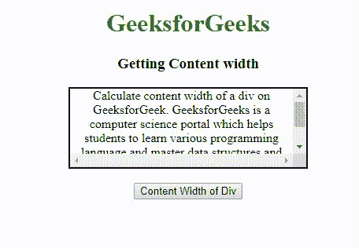

# 如何用 AngularJS 动态获取一个 div 的内容宽度？

> 原文:[https://www . geeksforgeeks . org/如何使用-angularjs/](https://www.geeksforgeeks.org/how-to-dynamically-get-the-content-width-of-a-div-using-angularjs/) 动态获取内容宽度

div 的内容宽度可以根据用户需求，使用 clientWidth 和 scrollWidth 属性动态获取。如果用户想要知道实际显示内容所需的空间，包括填充所占用的空间，但不包括滚动条、边距或边框，则用户可以使用以下任何过程来返回元素整个内容的宽度。

*   **使用元素。ClientWidth 属性**
*   **使用元素滚动宽度属性**

**示例 1:** 使用 ClientWidth 属性的 div 的内容宽度将返回元素整个内容的宽度。

## 超文本标记语言

```ts
<!DOCTYPE html>
<html>

<head>
    <script src=
"https://ajax.googleapis.com/ajax/libs/angularjs/1.6.9/angular.min.js">
    </script>
    <style>
        #div1 {
            height: 100px;
            width: 300px;
            border: 2px solid black;
            overflow: scroll;
        }

        h1 {
            color: green;
        }
    </style>
</head>

<body>
    <center>
        <h1>GeeksforGeeks</h1>
        <h3>Getting Content width</h3>
        <div id="div1">
          Calculate content width of a div on GeeksforGeek.
          GeeksforGeeks is a computer science portal which
          helps students to learn various programming language
          and master data structures and algorithms. There are
          various courses available to learn new skills.
        </div>
        <br>
        <button onclick="contentwidth()">Content Width of Div</button>

        <p id="p1"></p>

    </center>
    <script>
        function contentwidth() {
            var ans = "Content-width: "
            + angular.element(document.getElementById("div1").clientWidth)
            + "px<br>";
            document.getElementById("p1").innerHTML = ans;
        }
    </script>
</body>

</html>
```

**输出:**



**示例 2:** 使用 scrollWidth 属性的 div 的内容宽度将返回元素整个内容的宽度。

## 超文本标记语言

```ts
<!DOCTYPE html>
<html>

<head>
    <script src=
"https://ajax.googleapis.com/ajax/libs/angularjs/1.6.9/angular.min.js">
    </script>
    <style>
        #div1 {
            height: 100px;
            width: 300px;
            border: 2px solid black;
            overflow: scroll;
        }

        h1 {
            color: green;
        }
    </style>
</head>

<body>
    <center>
        <h1>GeeksforGeeks</h1>
        <h3>Getting Content width</h3>
        <div id="div1">
          Calculate content width of a div on GeeksforGeek.
          GeeksforGeeks is a computer science portal which
          helps students to learn various programming language
          and master data structures and algorithms. There are
          various courses available to learn new skills.
        </div>
        <br>
        <button onclick="contentwidth()">Content Width of Div</button>

        <p id="p1"></p>

    </center>
    <script>
        function contentwidth() {
            var ans = "Content-width: "
            + angular.element(document.getElementById("div1").scrollWidth)
            + "px<br>";
            document.getElementById("p1").innerHTML = ans;
        }
    </script>
</body>

</html>
```

**输出:**

