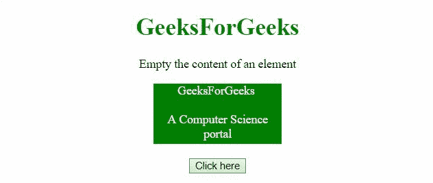
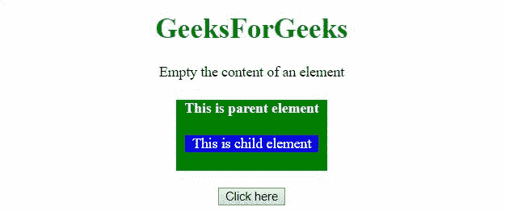

# 如何用 AngularJS 清空一个元素的内容？

> 原文:[https://www . geeksforgeeks . org/如何使用-angularjs/](https://www.geeksforgeeks.org/how-to-empty-the-content-of-an-element-using-angularjs/) 清空元素内容

这里的任务是在 AngularJS 的帮助下移除 HTML DOM 中元素的内容。

**方法:**首先选择要清空内容的元素。然后使用**清空()方法**移除元素的内容。

**示例 1:** 在本示例中，ID('div ')元素的内容被清空。

```tshtml
<!DOCTYPE HTML>
<html>

<head>
    <script src=
"//ajax.googleapis.com/ajax/libs/angularjs/1.2.13/angular.min.js">
    </script>

<script>
        var myApp = angular.module("app", []);
        myApp.controller(
            "controller", function ($scope) {
            $scope.emptyEl = function () {
                var el = angular.element(
                    document.querySelector('#div'));
                el.empty();
            };
        });
    </script>
    <style>
        #div {
            height: 80px;
            width: 170px;
            margin: 0 auto;
            background: green;
            color: white;
        }
    </style>
</head>

<body style="text-align:center;">
    <h1 style="color:green;">
        GeeksForGeeks
    </h1>
    <p>
        Empty the content of an element
    </p>
    <div id="div">
        GeeksForGeeks
        <br>
        <br>
        A Computer Science portal
    </div>
    <br>
    <div ng-app="app">
        <div ng-controller="controller">
            <input type="button" 
                value="Click here" 
                ng-click="emptyEl()">
        </div>
    </div>
</body>

</html> 
```

**输出:**



**示例 2:** 在此示例中，元素及其子元素的内容被清空。

```tshtml
<!DOCTYPE HTML>
<html>

<head>
    <script src=
"//ajax.googleapis.com/ajax/libs/angularjs/1.2.13/angular.min.js">
    </script>

    <script>
        var myApp = angular.module("app", []);
        myApp.controller("controller",
            function ($scope) {
                $scope.emptyEl = function () {
                    var el = angular.element(
                        document.querySelector('#div'));
                    el.empty();
                };
            });
    </script>

    <style>
        #div {
            height: 80px;
            width: 170px;
            margin: 0 auto;
            background: green;
            color: white;
        }

        #div2 {
            background: blue;
            margin: 10px;
        }
    </style>
</head>

<body style="text-align:center;">
    <h1 style="color:green;">
        GeeksForGeeks
    </h1>
    <p>
        Empty the content of an element
    </p>
    <div id="div">
        <h4>This is parent element</h4>
        <div id="div2">This is child element</div>
    </div>
    <br>
    <div ng-app="app">
        <div ng-controller="controller">
            <input type="button" 
                value="Click here" 
                ng-click="emptyEl()">
        </div>
    </div>
</body>

</html>
```

**输出:**

