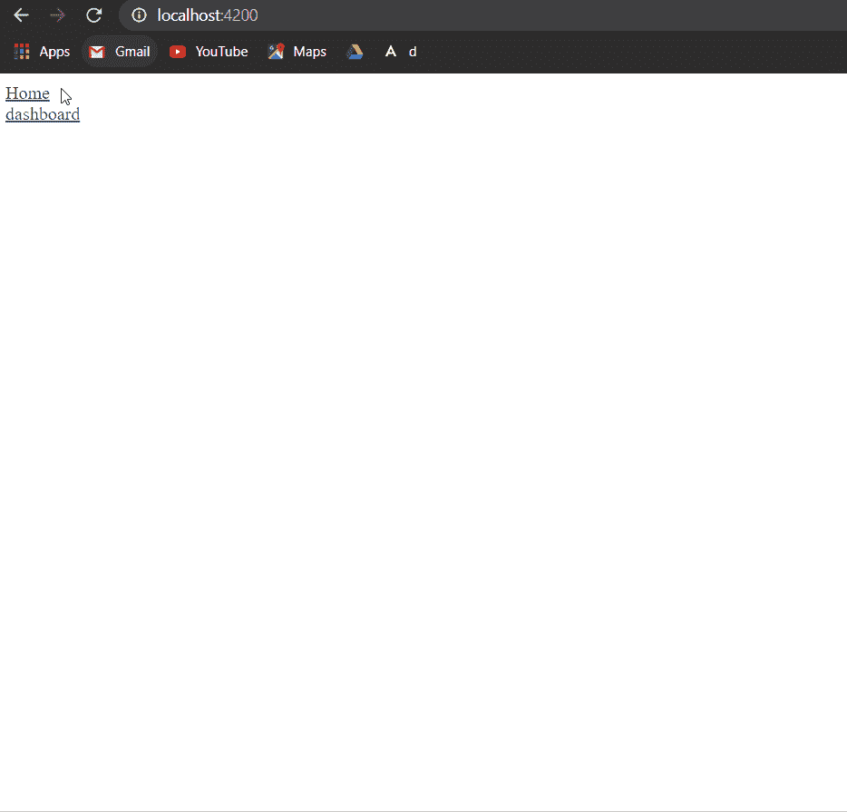

# 如何在 Angular 8 中启用组件页面之间的路由和导航？

> 原文:[https://www . geeksforgeeks . org/如何启用组件间路由和导航-页面角度-8/](https://www.geeksforgeeks.org/how-to-enable-routing-and-navigation-between-component-pages-in-angular-8/)

任务是通过创建角度组件的路线来启用角度组件之间的路由。当用户单击链接时，它将被导航到与所需组件相对应的页面链接。

让我们知道什么是角度路由

**角度 8 路由:**

Angular 8 路由器有助于在用户操作触发的页面之间导航。当用户点击链接或从浏览器地址栏输入网址时，导航就开始了。该链接可以包含指向用户的路由器的参考。我们也可以通过角度路由用链接传递其他参数。

**进场:**

*   Create an Angular app.

    **语法:**

    ```ts
    ng new app_name

    ```

*   For routing you will need components, here we have made two components (home and dash) to display home page and dashboard.

    **语法:**

    ```ts
    ng g c component_name

    ```

*   In app.module.ts, import **RouterModule** from @angular/router.

    **语法:**

    ```ts
    import { RouterModule } from '@angular/router';

    ```

*   然后在导入 **app.module.ts** 时定义路径。

    ```ts
    imports: [
        BrowserModule,
        AppRoutingModule,
        RouterModule.forRoot([
          { path: 'home', component: HomeComponent },
          { path: 'dash', component:DashComponent } 
        ])
      ],

    ```

*   现在对于 HTML 部分，定义 app.component.html 的 HTML。在链接中，将 routerLink 的路径定义为组件名称。

    ```ts
    <a routerLink="/home">Home </a><br>
    <a routerLink="/dash">dashboard</a>

    ```

*   在 app.component.html 应用路由器插座。路由视图渲染在< [路由器-出口](https://angular.io/api/router/RouterOutlet) >

    ```ts
    <router-outlet></router-outlet>

    ```

*   现在只需为**home.component.html**和**dash.component.html 文件**定义 HTML。
*   你的棱角分明的网络应用已经准备好了。

**代码实现:**

*   **app.module.ts:**

    ```ts
    import { BrowserModule } from '@angular/platform-browser';
    import { NgModule } from '@angular/core';
    import { RouterModule } from '@angular/router';
    import { AppRoutingModule } from './app-routing.module';
    import { AppComponent } from './app.component';
    import { HomeComponent } from './home/home.component';
    import { DashComponent } from './dash/dash.component';

    @NgModule({
      declarations: [
        AppComponent,
        HomeComponent,
        DashComponent
      ],
      imports: [
        BrowserModule,
        AppRoutingModule,
        RouterModule.forRoot([
          { path: 'home', component: HomeComponent },
          { path: 'dash', component:DashComponent } 
        ])
      ],
      providers: [],
      bootstrap: [AppComponent]
    })
    export class AppModule { }
    ```

*   **app.component.html**

    ```ts
    <a routerLink="/home">Home </a><br>
    <a routerLink="/dash">dashboard</a>
    <router-outlet></router-outlet>
    ```

*   **home.component.html**

    ```ts
    <h1>GeeksforGeeks</h1>
    ```

*   **dash.component.html**

    ```ts
    <h1>Hey GEEKS! Welcome to Dashboard</h1>
    ```

**输出:**

运行开发服务器并单击链接:

