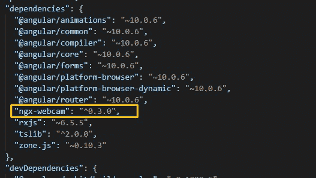
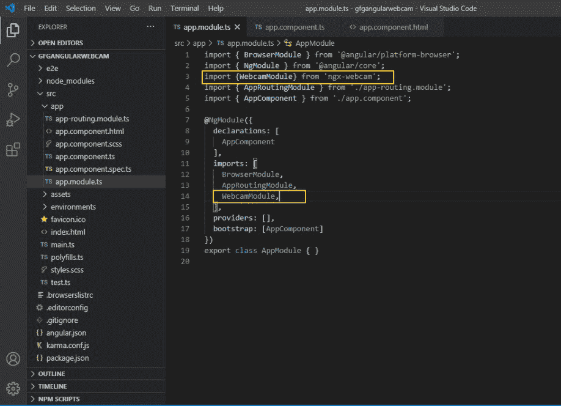
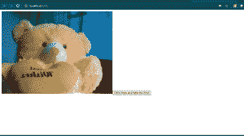
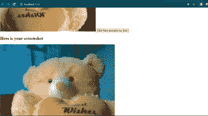

# 如何使用 ngx-网络摄像头在 Angular 10 中启用网络摄像头？

> 原文:[https://www . geeksforgeeks . org/如何启用 10 度角网络摄像头使用 ngx 网络摄像头/](https://www.geeksforgeeks.org/how-to-enable-webcam-in-angular-10-using-ngx-webcam/)

ngx-网络摄像头组件通过 Angular 10 中的动作和事件绑定，提供网络摄像头拍摄快照的访问。这个组件给了我们完全的控制和权限来以一种简单的方式捕获图像。

**将网络摄像头添加到应用程序的步骤:**

*   安装角度 10
*   创建角度命令行界面项目
*   Install the package by standard npm command :

    ```ts
    npm i ngx-webcam
    ```

    

*   将 WebcamModule 组件导入添加到 app.module.ts 文件，如下所示:

*   现在从 app.component.ts 文件中的 ngx-网络摄像头包库中添加 WebcamImage 组件，并在 AppComponent 类中使用它来处理网络摄像头的功能。

    ```ts
    import { Component } from '@angular/core';
    import {WebcamImage} from 'ngx-webcam';
    import {Subject, Observable} from 'rxjs';

    @Component({
      selector: 'app-root',
      templateUrl: './app.component.html',
      styleUrls: ['./app.component.scss']
    })
    export class AppComponent {
      title = 'gfgangularwebcam';

      public webcamImage: WebcamImage = null;
      private trigger: Subject<void> = new Subject<void>();
      triggerSnapshot(): void {
       this.trigger.next();
      }
      handleImage(webcamImage: WebcamImage): void {
       console.info('Saved webcam image', webcamImage);
       this.webcamImage = webcamImage;
      }

      public get triggerObservable(): Observable<void> {
       return this.trigger.asObservable();
      }
    }
    ```

*   下面是 app.component.html 代码:

    ```ts
    <div>
    <webcam [height]="400" 
            [width]="1000" 
            [trigger]="triggerObservable"
                (imageCapture)="handleImage($event)">
     </webcam>

    <button class="actionBtn" (click)="triggerSnapshot();">
        Click Here and take the Shot</button>

    <div class="snapshot" *ngIf="webcamImage">
      <h2>Here is your image!</h2>
      
    </div>
    ```

*   要运行该应用程序，请在终端运行以下命令:

    ```ts
    ng serve --open
    ```

*   转到浏览器，打开 Localhost:4200: 

*   按下按钮，看到输出快照:
    