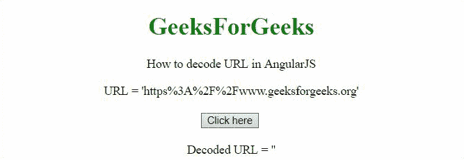

# 如何使用 AngularJS 对 URL 进行编码/解码？

> 原文:[https://www . geeksforgeeks . org/如何编码-解码-URL-使用-angularjs/](https://www.geeksforgeeks.org/how-to-encode-decode-url-using-angularjs/)

编码 URL

给定一个网址，任务是用 AngularJS 编码这个网址。

**方法:**方法是使用 **encodeURIComponent()方法**对 URL 进行编码。在第一个例子中，**网址(【https://ide . geeksforgeeks . org/tryit . PHP】)**被编码，在第二个例子中，**网址(【https://www . geeksforgeeks . org】)**被编码。

**例 1:**

## 超文本标记语言

```html
<!DOCTYPE HTML>
<html>

<head>
    <script src=
"//ajax.googleapis.com/ajax/libs/angularjs/1.2.13/angular.min.js">
    </script>

    <script>
        var myApp = angular.module("app", []);
        myApp.controller("controller", function ($scope) {
            $scope.url1 =
                'https://ide.geeksforgeeks.org/tryit.php';
            $scope.url2 = '';
            $scope.encodeUrl = function () {
                $scope.url2 = encodeURIComponent($scope.url1);
            }
        });
    </script>
</head>

<body style="text-align:center;">
    <h1 style="color:green;">
        GeeksForGeeks
    </h1>

<p>
        How to encode URL in AngularJS
    </p>

    <div ng-app="app">
        <div ng-controller="controller">
            URL = '{{url1}}'<br><br>
            <button ng-click="encodeUrl()">
                Click here</button>
            <br><br>
            Encoded URL = '{{url2}}'
        </div>
    </div>
</body>

</html>
```

**输出:**


**例 2:**

## 超文本标记语言

```html
<!DOCTYPE HTML>
<html>

<head>
    <script src=
"//ajax.googleapis.com/ajax/libs/angularjs/1.2.13/angular.min.js">
    </script>

    <script>
        var myApp = angular.module("app", []);
        myApp.controller("controller", function ($scope) {
            $scope.url1 = 'https://www.geeksforgeeks.org';
            $scope.url2 = '';
            $scope.encodeUrl = function () {
                $scope.url2 = encodeURIComponent($scope.url1);
            }
        });
    </script>
</head>

<body style="text-align:center;">
    <h1 style="color:green;">
        GeeksForGeeks
    </h1>

<p>
        How to encode URL in AngularJS
    </p>

    <div ng-app="app">
        <div ng-controller="controller">
            URL = '{{url1}}'<br><br>
            <button ng-click="encodeUrl()">
                Click here
            </button>
            <br><br>
            Encoded URL = '{{url2}}'
        </div>
    </div>
</body>

</html>
```

**输出:**


解码 URL

给定一个编码的网址，任务是使用 AngularJS 解码编码的网址。

**方法:**方法是使用 **decodeURIComponent()方法**对 URL 进行解码。在第一个例子中，**网址(【https % 3A % 2F % 2 Fide . geeksforgeeks . org % 2 Ftrytit . PHP】)被解码，在第二个例子中，**网址(【https % 3A % 2F % 2 Fww . geeksforgeeks . org】)被解码。****

**例 1:**

## 超文本标记语言

```html
<!DOCTYPE HTML>
<html>

<head>
    <script src=
"//ajax.googleapis.com/ajax/libs/angularjs/1.2.13/angular.min.js">
    </script>

    <script>
        var myApp = angular.module("app", []);
        myApp.controller("controller", function ($scope) {
            $scope.url1 =
            'https%3A%2F%2Fide.geeksforgeeks.org%2Ftryit.php';
            $scope.url2 = '';
            $scope.decodeUrl = function () {
                $scope.url2 =
                    decodeURIComponent($scope.url1);
            }
        });
    </script>
</head>

<body style="text-align: center;">
    <h1 style="color: green;">
        GeeksForGeeks
    </h1>

<p>
        How to decode URL in AngularJS
    </p>

    <div ng-app="app">
        <div ng-controller="controller">
            URL = '{{url1}}'<br><br>
            <button ng-click="decodeUrl()">
                Click here
            </button>
            <br><br>
            Decoded URL = '{{url2}}'
        </div>
    </div>
</body>

</html>
```

**输出:**


**例 2:**

## 超文本标记语言

```html
<!DOCTYPE HTML>
<html>

<head>
    <script src=
"//ajax.googleapis.com/ajax/libs/angularjs/1.2.13/angular.min.js">
    </script>

    <script>
        var myApp = angular.module("app", []);
        myApp.controller("controller", function ($scope) {
            $scope.url1 =
                'https%3A%2F%2Fwww.geeksforgeeks.org';
            $scope.url2 = '';
            $scope.decodeUrl = function () {
                $scope.url2 = decodeURIComponent($scope.url1);
            }
        });
    </script>
</head>

<body style="text-align:center;">
    <h1 style="color:green;">
        GeeksForGeeks
    </h1>

<p>
        How to decode URL in AngularJS
    </p>

    <div ng-app="app">
        <div ng-controller="controller">
            URL = '{{url1}}'<br><br>
            <button ng-click="decodeUrl()">
                Click here
            </button>
            <br><br>
            Decoded URL = '{{url2}}'
        </div>
    </div>
</body>

</html>       
```

**输出:**

