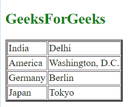

# 如何在 AngularJS 中使用 ng-repeat 获取细节？

> 原文:[https://www . geeksforgeeks . org/how-to-fetch-the-details-using-ng-repeat-in-angular js/](https://www.geeksforgeeks.org/how-to-fetch-the-details-using-ng-repeat-in-angularjs/)

AngularJS 由各种类型的预定义指令组成。大多数指令以 ng 开头，其中 ng 相当于 Angular。

**[ng-repeat:](https://www.geeksforgeeks.org/angular-js-ng-repeat-directive/)**
ng-repeat 指令用于迭代对象的属性。一旦集合中的项实例化了模板。每个模板都有自己的作用域，其中循环变量被设置为当前集合项，而$index 被设置为该项的键或索引。
**语法**

```
<element ng-repeat="(key, value) in Obj"></element>
```

其中键和值可以用作表达式中的用户定义标识符。
示例:-该示例显示了 ng-repeat 指令的用法。

```
<!DOCTYPE html>
<html>
<script src=
"https://ajax.googleapis.com/ajax/libs/angularjs/1.6.9/angular.min.js">
</script>
<body ng-app="myTable">
<h2 style = "color:green">GeeksForGeeks</h2>

<table ng-controller="control" border="2">
<tr ng-repeat="x in records">
  <td>{{x.Country}}</td>
  <td>{{x.Capital}}</td>  
</tr>
</table>

<script>
var app = angular.module("myTable", []);
app.controller("control", function($scope) {
  $scope.records = [
    {
      "Country" : "India",
      "Capital" : "Delhi"
    },
    {
      "Country" : "America ",
      "Capital" : "Washington, D.C. "
    },
    {
      "Country" : "Germany",
      "Capital" : "Berlin"
    },
    {
      "Country" : "Japan",
      "Capital" : "Tokyo"
    }
  ]
});
</script>

</body>
</html>
```

**输出:**
