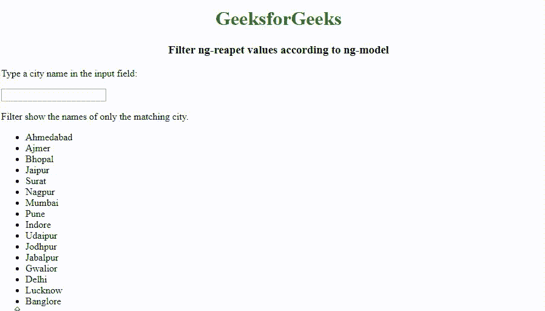
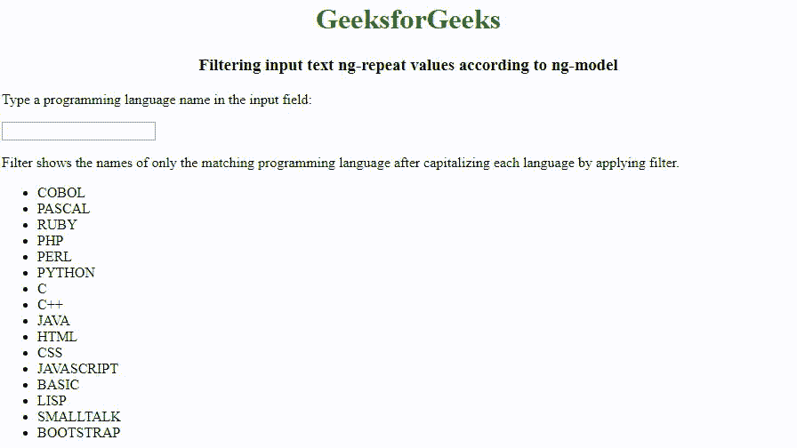

# 如何使用 AngularJS 根据 ng-model 过滤 ng-repeat 值？

> 原文:[https://www . geeksforgeeks . org/如何过滤-ng-重复-值-根据-ng-模型-使用-angularjs/](https://www.geeksforgeeks.org/how-to-filter-ng-repeat-values-according-to-ng-model-using-angularjs/)

通过使用输入字段的值作为过滤器中的表达式，可以根据 AngularJS 中的 **ng 模型**过滤 **ng-repeat** 值。我们可以在输入字段上设置 **ng-model** 指令来过滤 **ng-repeat** 值。

以下示例说明了该方法:
**示例 1:** 根据 ng 模型过滤输入文本 ng 重复值。该过滤器将只显示匹配城市的名称

```
<!DOCTYPE html>
<html>

<head>
    <script src=
"https://ajax.googleapis.com/ajax/libs/angularjs/1.6.9/angular.min.js">
    </script>
</head>

<body>
    <center>
        <h1 style="color:green;">GeeksforGeeks</h1>
        <h3>Filter ng-reapet values according to ng-model</h3>
    </center>
    <div ng-app="app1" ng-controller="controller1">

        <p>Type a city name in the input field:</p>

        <p>
            <input type="text" ng-model="testfilter">
        </p>
        <p>Filter show the names of only the matching city.</p>

        <ul>
            <li ng-repeat="x in citynames | filter:testfilter">
                {{ x }}
            </li>
        </ul>

    </div>

    <script>
        angular.module('app1', []).controller('controller1', function($scope) {
            $scope.citynames = [
                'Ahmedabad',
                'Ajmer',
                'Bhopal',
                'Jaipur',
                'Surat',
                'Nagpur',
                'Mumbai',
                'Pune',
                'Indore',
                'Udaipur',
                'Jodhpur',
                'Jabalpur',
                'Gwalior',
                'Delhi',
                'Lucknow',
                'Banglore'
            ];
        });
    </script>

</body>

</html>
```

**输出:**


**例 2:** 根据 ng-model 过滤输入文本 ng-repeat 值。通过应用筛选器将每种语言大写后，此筛选器将仅显示匹配编程语言的名称。

```
<!DOCTYPE html>
<html>
<head>
    <script src=
"https://ajax.googleapis.com/ajax/libs/angularjs/1.6.9/angular.min.js">
    </script>
</head>

<body>
    <center>
        <h1 style="color:green;">GeeksforGeeks</h1>
        <h3>Filtering input text ng-repeat values according to ng-model</h3>
    </center>
    <div ng-app="app1" ng-controller="controller1">

        <p>Type a programming language name in the input field:</p>

        <p>
            <input type="text" ng-model="testfilter">
        </p>
        <p>
          Filter shows the names of only the matching programming language
          after capitalizing each language by applying filter.
        </p>

        <ul>
            <li ng-repeat="x in programminglanguagenames| filter:testfilter">
                {{ x |myfilter}}
            </li>
        </ul>

    </div>

    <script>
        var app = angular.module('app1', []);
        app.filter('myfilter', function() {
            return function(x) {
                var i, c, txt = "";
                for (i = 0; i < x.length; i++) {
                    c = x[i];

                    c = c.toUpperCase();

                    txt += c;
                }
                return txt;
            };
        });
        app.controller('controller1', function($scope) {
            $scope.programminglanguagenames = [
                'cobol',
                'pascal',
                'ruby',
                'php',
                'perl',
                'python',
                'c',
                'c++',
                'java',
                'html',
                'css',
                'javascript',
                'basic',
                'lisp',
                'smalltalk',
                'bootstrap'
            ];
        });
    </script>

</body>

</html>
```

**输出:**
