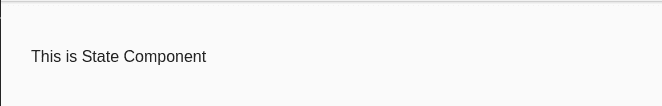

# 如何在角度方向强制重定向到特定路线？

> 原文:[https://www . geeksforgeeks . org/如何强制重定向到特定角度路线/](https://www.geeksforgeeks.org/how-to-force-redirect-to-a-particular-route-in-angular/)

**简介:**

我们可以使用属性绑定概念，并且可以将查询参数传递给 routerLink。使用属性绑定，我们可以绑定 queryParams 属性，并可以在对象中提供所需的详细信息。

**属性绑定:**这是一个概念，我们使用方括号符号将数据绑定到超文本标记语言(HTML)元素的文档对象模型(DOM)属性。

```
import {Component, OnInit} from '@angular/core'

@Component({

selector:'app-property',
template:
`<p [textContent]="title"></p> 
`
})

export class AppComponent implements OnInit{

constructor(){}
ngOnInit() {}

title='Property Binding example in GeeksforGeeks';

}
```

**输出:**


我们可以通过两种方式实现路由重定向:
1)第一种方法是从做。html 文件。
2)第二种方法是从。ts 文件。

**语法为*。html* 文件:**

```
<a [routerLink]="[/path]" >
   State Details 
</a>
```

*   **进场:**

    *   首先，在 app.module.ts 中配置路由
    *   用 HTML 文件中所需的路径实现 routerLink 属性绑定。
    *   提到上面的说明后，我们就可以点击配置好的 HTML 元素，并可以对其进行重定向。
    *   一旦你完成点击它，它会自动将你重定向到另一个组件。

    **通过代码实现:**
    **app.module.ts:**

    ```
    import { NgModule } from "@angular/core";
    import { BrowserModule } from "@angular/platform-browser";
    import { RouterModule, Routes } from "@angular/router";

    import { AppComponent } from "./app.component";
    import { StateComponent } from "./state/state.component";

    const routes: Routes = 
      [{ path: "punjab", component: StateComponent }];

    @NgModule({
        imports: [BrowserModule, RouterModule.forRoot(routes)],
        declarations: [AppComponent, StateComponent],
        bootstrap: [AppComponent],
    })
    export class AppModule {}
    ```

    **app.component.html:**

    ```
    <a [routerLink]="['/punjab']">
       State Details 
    </a>
    <router-outlet></router-outlet>
    ```

    点击锚点标签后，我们可以看到 url 将以如下方式更改，我们将被定向到 app.module.ts 文件中已配置的组件。

    

    **输出:**
    **state . component . html:**

    

*   **第二法从。ts 文件:**

    **Approach:**
*   首先，在 app.module.ts 中配置路由
*   通过从“@angular/router”导入“Router”来实现路由。
*   然后在构造函数中初始化路由器。
*   完成上述过程后，在一个函数中实现路由，以便可以从触发该函数。html 文件。
*   一旦一切都完成了，我们就可以强制将路由重定向到另一个组件。

**按代码实现:**
**app.module.ts:**

```
import { NgModule } from '@angular/core';
import { BrowserModule } from '@angular/platform-browser';
import { RouterModule, Routes } from '@angular/router';

import { AppComponent } from './app.component';
import { StateComponent } from './state/state.component';

const routes: Routes = [
  { path: 'punjab', component: StateComponent },
];

@NgModule({
  imports:      [ BrowserModule, RouterModule.forRoot(routes) ],
  declarations: [ AppComponent, StateComponent ],
  bootstrap:    [ AppComponent ]
})
export class AppModule { }
```

**app.component.ts:**

```
import { Component, OnInit } from '@angular/core';
import {Router} from '@angular/router';

@Component({
  selector: 'app-main',
  templateUrl: './main.component.html',
  styleUrls: ['./main.component.css']
})
export class HomeComponent implements OnInit {

  constructor(private router:Router) { }

 ngOnInit(){}
 onSelect(){
      this.router.navigate(['/punjab']);
 }
}
```

**app.component.html:**

```
<a (click)="onSelect()">
   State Details 
</a>
<router-outlet></router-outlet>
```

按照上面的代码和一，如果你点击锚标签，然后网址将被改变，你将被重定向到相应的配置组件。


**输出:**

