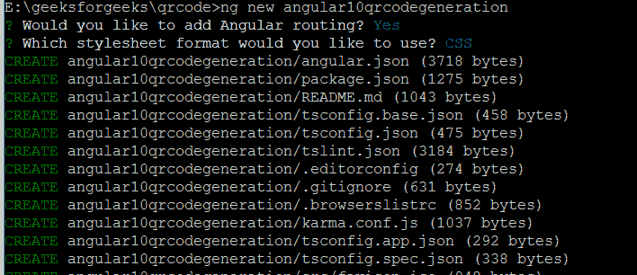
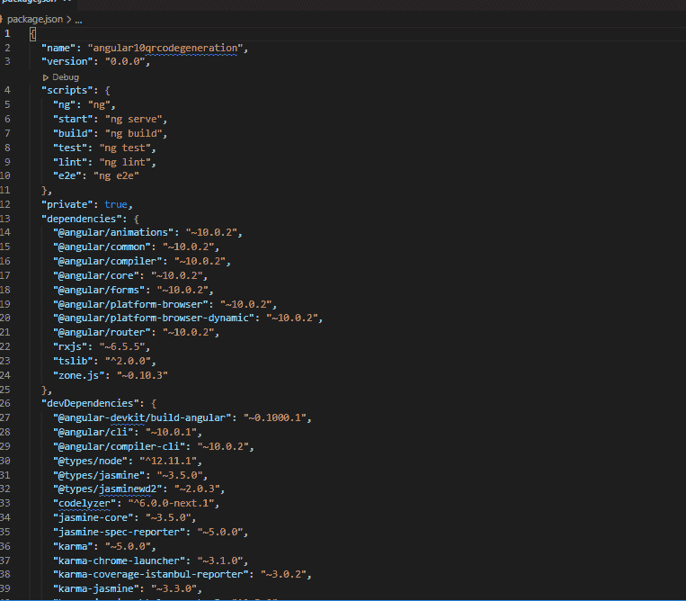
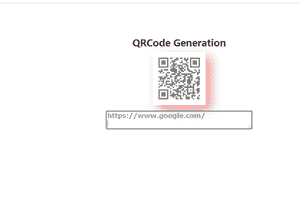

# 如何生成角为 10°的二维码？

> 原文:[https://www . geeksforgeeks . org/如何用-angular-10 生成-qr 码/](https://www.geeksforgeeks.org/how-to-generate-qr-codes-with-angular-10/)

二维码(快速响应码)已经成为每一个产品、组织、应用等必不可少的组成部分。在营销活动中，我们可以使用生成的二维码来

*   下载应用程序
*   发送电子邮件
*   查看企业位置等。

在本文中，让我们看看如何用 Angular 10 生成二维码。

**先决条件:**在您的本地开发机器中，节点 10+和 NPM 6+必须已经安装。

*   节点可从[https://nodejs.org/en/download/](https://nodejs.org/en/download/)安装
*   一旦安装完毕，我们可以通过使用

```ts
node --version
```

*   npm 可以从[https://www.npmjs.com/get-npm](https://www.npmjs.com/get-npm)安装
*   一旦安装完毕，我们可以通过使用

```ts
npm  --version
```

**第一步:安装角度 CLI 10**

在命令行提示符下，提供以下命令进行安装

```ts
 npm install -g @angular/cli
```

根据目前的版本，它将被安装，最好的版本应该是 10+


**第二步:让我们创建一个新的 Angular app**

我们可以使用 Visual Studio 代码编辑器甚至从命令行提示符，我们可以创建一个生成二维码的示例项目

```ts
ng new <projectname>
```

这里让我们将**“angular 10qrcode generation”**作为项目名称



将安装必要的软件包

现在**“angular 10qrcode generation”**的项目结构为


导航到**包所在的项目目录**



指定项目依赖关系的重要文件

**第三步:生成二维码，我们需要所需的依赖关系。可以使用**进行安装

```ts
 npm install @techiediaries/ngx-qrcode
```

一旦安装完毕，在**src->app->qrcode app . module . ts**文件中，我们可以使用

```ts
import { NgxQRCodeModule } from '@techiediaries/ngx-qrcode'; 
```

在

```ts
@NgModule({
imports: [ NgxQRCodeModule ] Can be given
```

我们需要额外导入表单模块。所以，我们的**src->app->app . module . ts**片段

## qrcodeapp 模块. ts

```ts
import { BrowserModule } from '@angular/platform-browser';
import { NgModule } from '@angular/core';
import { FormsModule } from '@angular/forms';

// This import is required to have QRCode generation
import { NgxQRCodeModule } from '@techiediaries/ngx-qrcode';
import { QRCodeAppRoutingModule } from './qrcodeapp-routing.module';
import { QRCodeAppComponent } from './qrcodeapp.component';

@NgModule({
  declarations: [
    QRCodeAppComponent
  ],
  imports: [
    BrowserModule,
    QRCodeAppRoutingModule,
    NgxQRCodeModule,  // This import is required for QRCode
    FormsModule
  ],
  providers: [],
  bootstrap: [QRCodeAppComponent]
})
export class QRCodeAppModule { }
```

现在库已经导入，我们可以在 Angular 应用中使用**“ngx-二维码”**组件。

## qrcodeapp.component.ts

```ts
import { Component } from '@angular/core';
import { NgxQrcodeElementTypes, NgxQrcodeErrorCorrectionLevels } 
        from '@techiediaries/ngx-qrcode';
@Component({
  selector: 'app-root',
  templateUrl: './qrcodeapp.component.html',
  styleUrls: ['./qrcodeapp.component.css']
})

export class AppComponent {
  title = 'angular10qrcodegeneration';

  // We can have Canvas/Img/Url as elementType
  elementType = NgxQrcodeElementTypes.URL;

  // We can have High/Low/Medium/Quartile
  correctionLevel = NgxQrcodeErrorCorrectionLevels.HIGH;

  // Need to specify the valid website address
  value = 'https://www.geeksforgeeks.com/';
}
```

## qrcodeapp.component.html

```ts
<ngx-qrcode
  [elementType]="elementType"
  [errorCorrectionLevel]="correctionLevel"
  [value]="value"
  cssClass="qrcodeshadow"></ngx-qrcode>
<!-- value that you want to encode -->
<textarea [(ngModel)] = "value"></textarea>
```

## style.css

```ts
/* You can add global styles to this file, 
and also import other style files */
.qrcodeshadow {
    display: flex;
    align-items: center;
    justify-content: center;
    filter: drop-shadow(15px 15px 15px #e42424);
    opacity: .5;
}

textarea {
    margin-top: 15px; 
    display: block;
    margin-left: auto;
    margin-right: auto;
    width: 400px;
    font-family: Verdana, Geneva, Tahoma, sans-serif;
    font-size: large;
    font-weight: bold;
    color: green;
    opacity: .5;
}
```

构建项目的步骤

```ts
ng build (at the location where your package.json present)
```

**运行项目的步骤:**

```ts
ng serve  (at the location where your package.json present)
```

由于代码被设置为在端口 4200 上运行，当遇到 http://localhost:4200/，我们可以看到如下输出


我们可以指定任何有效的网站网址，我们可以在 Angular 10 中成功生成二维码。在 CSS 中，我们可以美化阴影显示。

让我们看看谷歌网站的输出



**结论:**NPM Angular 中有很多像二维码生成器这样的重要库。我们可以根据需要有效地使用它们。二维码是任何应用/移动应用等的重要组成部分。